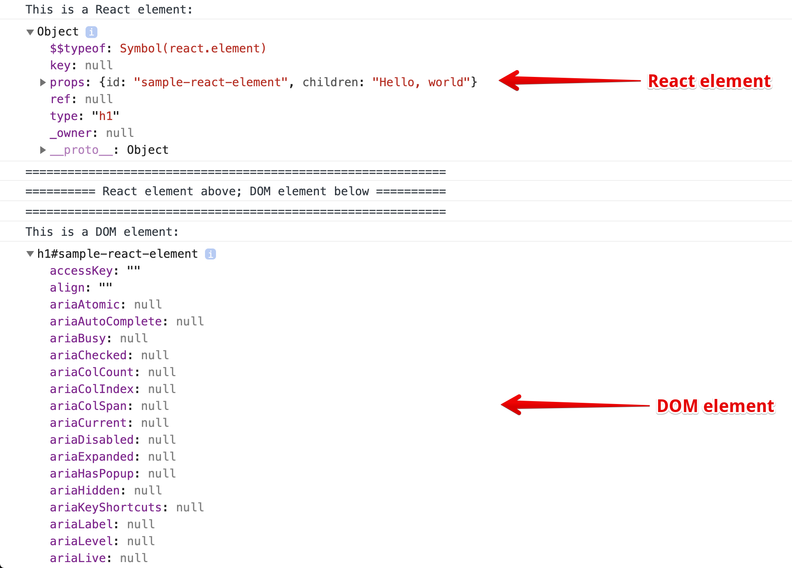

# Course Notes: React from the Beginning (with Redux and React Router)

<details><summary> <strong>Reference links for React and course</strong></summary>

- **[Course files:](https://github.com/robertbunch/reactFromTheBeginning)** These are Rob's course files that may be updated periodically as new sections are added to the course.
- **[NPM `create-react-app` entry:](https://www.npmjs.com/package/create-react-app)** This really just refers you on to some of the links below.
- **[GitHub `create-react-app` repository:](https://github.com/facebook/create-react-app)** See the latest additions/modifications to `create-react-app`. 
- **[Glossary of React Terms:](https://reactjs.org/docs/glossary.html)** Get acquainted with all of the lingo and jargon surrounding React.

---

</details>

<details><summary> <strong>Click to expand <code>create-react-app</code> docs outline</strong></summary>

+ [`create-react-app` docs homepage:](https://create-react-app.dev/docs/getting-started/)
+ **Welcome**
  * [About Docs](https://create-react-app.dev/docs/documentation-intro)
+ **Getting Started**
  * [Getting Started](https://create-react-app.dev/docs/getting-started)
  * [Folder Structure](https://create-react-app.dev/docs/folder-structure/)
  * [Available Scripts](https://create-react-app.dev/docs/available-scripts/)
  * [Supported Browsers and Features](https://create-react-app.dev/docs/supported-browsers-features/)
  * [Updating to New Releases](https://create-react-app.dev/docs/updating-to-new-releases/)
+ **Development**
  * [Editor Setup](https://create-react-app.dev/docs/setting-up-your-editor/)
  * [Developing Components in Isolation](https://create-react-app.dev/docs/developing-components-in-isolation/)
  * [Analyzing Bundle Size](https://create-react-app.dev/docs/analyzing-the-bundle-size/)
  * [HTTPS in Development](https://create-react-app.dev/docs/using-https-in-development/)
+ **Styles and Assets**
  * [Adding Stylesheets](https://create-react-app.dev/docs/adding-a-stylesheet/)
  * [Adding CSS Modules](https://create-react-app.dev/docs/adding-a-css-modules-stylesheet/)
  * [Adding Sass Stylesheets](https://create-react-app.dev/docs/adding-a-sass-stylesheet/)
  * [Adding CSS Reset](https://create-react-app.dev/docs/adding-css-reset/)
  * [Post-Processing CSS](https://create-react-app.dev/docs/post-processing-css/)
  * [Adding Images, Fonts, and Files](https://create-react-app.dev/docs/adding-images-fonts-and-files/)
  * [Loading .graphql Files](https://create-react-app.dev/docs/loading-graphql-files/)
  * [Using the Public Folder](https://create-react-app.dev/docs/using-the-public-folder/)
  * [Code Splitting](https://create-react-app.dev/docs/code-splitting/)
+ **Building your App**
  * [Install a Dependency](https://create-react-app.dev/docs/installing-a-dependency/)
  * [Importing a Component](https://create-react-app.dev/docs/importing-a-component/)
  * [Using Global Variables](https://create-react-app.dev/docs/using-global-variables/)
  * [Adding Bootstrap](https://create-react-app.dev/docs/adding-bootstrap/)
  * [Adding Flow](https://create-react-app.dev/docs/adding-flow/)
  * [Adding TypeScript](https://create-react-app.dev/docs/adding-typescript/)
  * [Adding Relay](https://create-react-app.dev/docs/adding-relay/)
  * [Adding a Router](https://create-react-app.dev/docs/adding-a-router/)
  * [Environment Variables](https://create-react-app.dev/docs/adding-custom-environment-variables/)
  * [Making a Progressive Web App](https://create-react-app.dev/docs/making-a-progressive-web-app/)
  * [Creating a Production Build](https://create-react-app.dev/docs/production-build/)
+ **Testing**
  * [Running Tests](https://create-react-app.dev/docs/running-tests/)
  * [Debugging Tests](https://create-react-app.dev/docs/debugging-tests/)
+ **Back-End Integration**
  * [Proxying in Development](https://create-react-app.dev/docs/proxying-api-requests-in-development/)
  * [Fetching Data](https://create-react-app.dev/docs/fetching-data-with-ajax-requests/)
  * [Integrating with an API](https://create-react-app.dev/docs/integrating-with-an-api-backend/)
  * [Title & Meta Tags](https://create-react-app.dev/docs/title-and-meta-tags/)
+ **Deployment**
  * [Deployment](https://create-react-app.dev/docs/deployment/)
+ **Advanced Usage**
  * [Custom Templates](https://create-react-app.dev/docs/custom-templates/)
  * [Can I Use Decorators?](https://create-react-app.dev/docs/can-i-use-decorators/)
  * [Pre-Rendering Static HTML](https://create-react-app.dev/docs/pre-rendering-into-static-html-files/)
  * [Advanced Configuration](https://create-react-app.dev/docs/advanced-configuration/)
  * [Alternatives to Ejecting](https://create-react-app.dev/docs/alternatives-to-ejecting/)
+ **Support**
  * [Troubleshooting](https://create-react-app.dev/docs/troubleshooting/)

---

</details>

<details><summary> <strong>Click to expand React docs outline</strong></summary>

+ [React docs homepage](https://reactjs.org/)
+ [Tutorial I](https://reactjs.org/tutorial/tutorial.html): Learning React by doing (building a Tic-Tac-Toe game)
+ [Tutorial II](https://reactjs.org/docs/hello-world.html): Learn React from the ground up (more conceptual than the tutorial above--these tutorials will likely be most effective in tandem)
+ **FAQ**
  * [AJAX and APIs](https://reactjs.org/docs/faq-ajax.html)
  * [Babel, JSX, and Build Steps](https://reactjs.org/docs/faq-build.html)
  * [Passing Functions to Components](https://reactjs.org/docs/faq-functions.html)
  * [Component State](https://reactjs.org/docs/faq-state.html)
  * [Styling and CSS](https://reactjs.org/docs/faq-styling.html)
  * [File Structure](https://reactjs.org/docs/faq-structure.html)
  * [Versioning Policy](https://reactjs.org/docs/faq-versioning.html)
  * [Virtual DOM and Internals](https://reactjs.org/docs/faq-internals.html)
+ **Installation**
  * [Getting Started](https://reactjs.org/docs/getting-started.html)
  * [Add React to a Website](https://reactjs.org/docs/add-react-to-a-website.html)
  * [Create a New React App](https://reactjs.org/docs/create-a-new-react-app.html)
  * [CDN Links](https://reactjs.org/docs/cdn-links.html)
  * [Release Channels](https://reactjs.org/docs/release-channels.html)
+ **Main Concepts**
  * [Hello World](https://reactjs.org/docs/hello-world.html)
  * [Introducing JSX](https://reactjs.org/docs/introducing-jsx.html)
  * [Rendering Elements](https://reactjs.org/docs/rendering-elements.html)
  * [Components and Props](https://reactjs.org/docs/components-and-props.html)
  * [State and Lifecycle](https://reactjs.org/docs/state-and-lifecycle.html)
  * [Handling Events](https://reactjs.org/docs/handling-events.html)
  * [Conditional Rendering](https://reactjs.org/docs/conditional-rendering.html)
  * [Lists and Keys](https://reactjs.org/docs/lists-and-keys.html)
  * [Forms](https://reactjs.org/docs/forms.html)
  * [Lifting State Up](https://reactjs.org/docs/lifting-state-up.html)
  * [Composition vs Inheritance](https://reactjs.org/docs/composition-vs-inheritance.html)
  * [Thinking in React](https://reactjs.org/docs/thinking-in-react.html)
+ **Advanced Guides**
  * [Accessibility](https://reactjs.org/docs/accessibility.html)
  * [Code-Splitting](https://reactjs.org/docs/code-splitting.html)
  * [Context](https://reactjs.org/docs/context.html)
  * [Error Boundaries](https://reactjs.org/docs/error-boundaries.html)
  * [Forwarding Refs](https://reactjs.org/docs/forwarding-refs.html)
  * [Fragments](https://reactjs.org/docs/fragments.html)
  * [Higher-Order Components](https://reactjs.org/docs/higher-order-components.html)
  * [Integrating with Other Libraries](https://reactjs.org/docs/integrating-with-other-libraries.html)
  * [JSX In Depth](https://reactjs.org/docs/jsx-in-depth.html)
  * [Optimizing Performance](https://reactjs.org/docs/optimizing-performance.html)
  * [Portals](https://reactjs.org/docs/portals.html)
  * [Profiler](https://reactjs.org/docs/profiler.html)
  * [React Without ES6](https://reactjs.org/docs/react-without-es6.html)
  * [React Without JSX](https://reactjs.org/docs/react-without-jsx.html)
  * [Reconciliation](https://reactjs.org/docs/reconciliation.html)
  * [Refs and the DOM](https://reactjs.org/docs/refs-and-the-dom.html)
  * [Render Props](https://reactjs.org/docs/render-props.html)
  * [Static Type Checking](https://reactjs.org/docs/static-type-checking.html)
  * [Strict Mode](https://reactjs.org/docs/strict-mode.html)
  * [Typechecking With PropTypes](https://reactjs.org/docs/typechecking-with-proptypes.html)
  * [Uncontrolled Components](https://reactjs.org/docs/uncontrolled-components.html)
  * [Web Components](https://reactjs.org/docs/web-components.html)
+ **API Reference**
  * [React](https://reactjs.org/docs/react-api.html)
    - [React.Component](https://reactjs.org/docs/react-component.html)
  * [ReactDOM](https://reactjs.org/docs/react-dom.html)
  * [ReactDOMServer](https://reactjs.org/docs/react-dom-server.html)
  * [DOM Elements](https://reactjs.org/docs/dom-elements.html)
  * [SyntheticEvent](https://reactjs.org/docs/events.html)
  * [Test Utilities](https://reactjs.org/docs/test-utils.html)
  * [Test Renderer](https://reactjs.org/docs/test-renderer.html)
  * [JS Environment Requirements](https://reactjs.org/docs/javascript-environment-requirements.html)
  * [Glossary](https://reactjs.org/docs/glossary.html)
+ **Hooks**
  * [Introducing Hooks](https://reactjs.org/docs/hooks-intro.html)
  * [Hooks at a Glance](https://reactjs.org/docs/hooks-overview.html)
  * [Use the State Hook](https://reactjs.org/docs/hooks-state.html)
  * [Using the Effect Hook](https://reactjs.org/docs/hooks-effect.html)
  * [Rules of Hooks](https://reactjs.org/docs/hooks-rules.html)
  * [Building Your Own Hooks](https://reactjs.org/docs/hooks-custom.html)
  * [Hooks API Reference](https://reactjs.org/docs/hooks-reference.html)
  * [Hooks FAQ](https://reactjs.org/docs/hooks-faq.html)
+ **Testing**
  * [Testing Overview](https://reactjs.org/docs/testing.html)
  * [Testing Recipes](https://reactjs.org/docs/testing-recipes.html)
  * [Testing Environments](https://reactjs.org/docs/testing-environments.html)
+ **Concurrent Mode (Experimental)**
  * [Introducing Concurrent Mode](https://reactjs.org/docs/concurrent-mode-intro.html)
  * [Suspense for Data Fetching](https://reactjs.org/docs/concurrent-mode-suspense.html)
  * [Concurrent UI Patterns](https://reactjs.org/docs/concurrent-mode-patterns.html)
  * [Adopting Concurrent Mode](https://reactjs.org/docs/concurrent-mode-adoption.html)
  * [Concurrent Mode API Reference](https://reactjs.org/docs/concurrent-mode-reference.html)
+ **Contributing**
  * [How to Contribute](https://reactjs.org/docs/codebase-overview.html)
  * [Codebase Overview](https://reactjs.org/docs/codebase-overview.html)
  * [Implementation Notes](https://reactjs.org/docs/implementation-notes.html)
  * [Design Principles](https://reactjs.org/docs/design-principles.html)

---

</details>

## React 101

<details><summary> <strong>Starter notes (course starter files, <code>create-react-app</code>, React docs, etc.)</strong></summary>

As we will see, [Node.js](https://nodejs.org/en/) is not *necessary* in order to use React, but you will be in for a world of pain if you don't use Node. It will make your life so much easier. In particular, once we have made sufficient progress, we will be able to use  the `create-react-app` CLI and add on numerous other packages meant for React via Node. It's really the only way to go. 

As noted at the top of this file, there are several React-specific docs to make development with React as painless as possible. Use the docs to your advantage!

---

</details>

<details><summary> <strong>What React is and why we need it</strong></summary>

Before we get into the weeds as to how to use React, it would be a good idea to know what it is, where it comes from, what problems it has tried to solve, etc. The more background we can have on it before directly using it the better. Our background knowledge can inform our use. 

In web development, 1995 was a monster year. Python (really 1991), Java, PHP, Ruby, Apache, and (prematurely) JavaScript were born. Netscape (now Mozilla) had Navigator (now Firefox) as the only real web browser at that point. They know Microsoft is coming to build their own browser so the CEO, Marc Andreessen, hires Brendan Eich to build a scripting language. That language is not meant to compete with the heavy lifters (i.e., Python, Java, PHP, Ruby, etc.) because those heavy lifters are already handling all of the back-end stuff. We want a scripting language that's accessible to amaeteurs and hobbyists and people who just want to dabble in basic programming. Why? Why not just make it a full-on language with inheritance and other features like those mentioned above? There are many reasons, but the main one is probably that in 1995 there's a grand total of about 23,000 websites. That may sound like a decent amount, but it's nothing at all--today we have *billions* of websites. So the web was in its absolute infancy in 1995. You're not going to be able to get heavy-lifter developers to migrate over to JavaScript world since the ecosystem is so small at that point. And websites were mostly inert. Think Wikipedia. You open the page and that's it. 

JavaScript came into the world to be the easy programming language while the heavy-lifters remained as they were. Fast forward to roughly 2005 and AJAX comes out. We have iOS and Android. jQuery comes out in 2006. And we hit 100 million websites. So in just 10 years, we went from around 23,000 websites to over 100 million. People are now carrying around full computers in their pocket that are able to run JavaScript. AJAX has revolutionized the web because internet connections are faster so you can send lots of little pieces of data. And in all of this jQuery was awesome. In some ways, jQuery kind of unified the DOM almost as a language across everything that used the DOM. And jQuery was awesome because it took us from web pages that hundreds of lines of JavaScript and condensed them down to just a few lines. So jQuery was great, but the web was growing at a frenetic pace.

If we hop to around 2010, then the V8 engine has come out, Node.js has come out, and Angular is born (and BackBone). This is where things really start to change for JavaScript. At this point in history, Instagram, Netflix, and Twitch go on the web, and browsers have gone from needing to serve up a tiny number of pages in 1995 to now where you have major websites like Netflix, Walmart, Amazon, etc. All of these websites have gone from being little fun marketing sites in 2000 to being really important parts of the company. They're not just little applications but major software as a service or they're a major platform in able to actually make money. 

Angular is the first UI framework, and a UI framework is a framework that seeks to simplify your life. So first we had JavaScript files that became unmanageable. jQuery was a lifesaver and condensed the code we needed. The web continued to explode and then the jQuery files got out of hand. Angular sought to reign in the chaos. In 2013 enters React, and React is almost unanimously seen as a vast improvement over Angular 1 (not necessarily Angular as it is now). It is also a UI framework. 

Basically, a UI framework is a whole bunch of JavaScript someone else has written to try and make your life easier. In what way does it make life easier? React seeks to answer the following question: "How can we modernize web development?" Because we can't have thousands of really long files of JavaScript. It becomes intractable. And if you're Facebook then you'll have a ton of those really monolithic files. So it answers this question in the following way:

- **Modularize:** It breaks up the application into a bunch of tiny little pieces. So once again the goal is to get back to the point where files are reasonably short and manageable. This is also good because it allows the files to be encapsulated. That is, we can follow some basic object-oriented programming principles and make our files easier to reuse. We can pass them around freely from one place to the next within our application (they manage their own data and all their methods are internal and so forth). 
- **Manages state effectively:** This is something that Angular did not really do. We'll talk about this a lot more later, but now you have webpages that are changing constantly in a big way, and you need someone who is in charge of it, and it's not a good approach to just let the DOM be the source of truth anymore.
- **Efficient:** If you think about Facebook, then you can think about chats, notifications, messages, etc., all happening nearly instantly and *all* of those things are tiny DOM manipulations. And jQuery was computationally very very expensive in how it manipulated the DOM. React can do this in a very efficient way. 
- **Front-end/back-end separation of concerns:** React completely separates the front-end from the back-end. There are a number of positive benefits about this, but just to name a few: You can have two separate teams (front-end people and back-end people). The front-end people can focus entirely on React and the back-end people can focus on their own thing. In the past, if you had the front-end and back-end teams tightly coupled, as was the case for many many years, then if one thing went down the other went down as well. If you wanted to change one you had to change the other. Separating them out makes everything much more modular, easier to manage and maintain, etc. 
- **Hardware increases:** Your phone may have a stronger processor than, say, what's on your `T2.micro` on AWS. The hardware is just there now to where we want to offload as much as possible to the browser because the hardware that the user is running their browser on is outstanding, and for large-scale websites this can save so much processing power.
- **Declarative instead of imperative:** We can get away from telling the computer exactly how to do something to simply say, "Hey, this is what I want you to do." 

The super short version: What is React? React is a whole bunch of JavaScript that someone else wrote (mostly Facebook) that helps your development go from being boring, small, and unsophisticated to being big, exciting, professional, and organized. If you have a tiny website or project, then React is not what you need. React is made to build buildings and cities--it is not meant to make log cabins or tents. That's what the web was in the beginning. It is no longer that way. The web grew up. It is no longer boring with unsophisticated progammers. It is now professional programmers, large teams, huge companies (e.g., Amazon, Facebook, Google, etc.), and it allows you to make your UI (i.e., your front-end or your stuff inside the browser) really well.

---

</details>

<details><summary> <strong>First React program (and touching on JSX and Babel)</strong></summary>

Without `create-react-app`, it's not exactly extremely straightforward to get an application going with React. Remember that React is meant to build large websites. Here is what you get when professionally developing with React:

- React
  + JSX
  + ES6
    * Babel
    * Webpack/Node

At the beginning, where we will start without using `create-react-app`, we could certainly go the Express route (where we statically load one big folder and then load up the `index.html` in whatever subfolder as we want), but we can just as well use the [live server](https://marketplace.visualstudio.com/items?itemName=ritwickdey.LiveServer) extension in VSCode to launch our local `index.html` file instead. Whatever is most comfortable.

No matter what we do, we will need the following through the [React CDN links](https://reactjs.org/docs/cdn-links.html) as well as [cdnjs](https://cdnjs.com/libraries/babel-standalone) for `babel-standalone`:

- **React:** `<script crossorigin src="https://unpkg.com/react@16/umd/react.production.min.js"></script>`
- **ReactDOM:** `<script crossorigin src="https://unpkg.com/react-dom@16/umd/react-dom.production.min.js"></script>`
- **
- **Babel:** `<script src="https://cdnjs.cloudflare.com/ajax/libs/babel-standalone/6.26.0/babel.min.js"></script>`

These links will give us access to React proper, ReactDOM (React can be used in contexts without a DOM, but we will be working in the contet where there is a DOM), and Babel (`babel-standalone` is a standalone build of Babel for use in non-Node.js environments.) The skeleton for our `index.html` file might look like the following:

``` HTML
<!DOCTYPE html>
<html lang="en">

<head>
  <meta charset="UTF-8">
  <meta name="viewport" content="width=device-width, initial-scale=1.0">
  <title>First React Program</title>
  <script crossorigin src="https://unpkg.com/react@16/umd/react.production.min.js"></script>
  <script crossorigin src="https://unpkg.com/react-dom@16/umd/react-dom.production.min.js"></script>
  <script src="https://cdnjs.cloudflare.com/ajax/libs/babel-standalone/6.26.0/babel.min.js"></script>
</head>

<body>

<!-- What goes in here now? -->
  
</body>

</html>
```

What goes in the `body`? This is where the particulars of React will come into play. We will first have `<div id="root"></div>` which is to serve as the "root" of our application. This is where our content will get dumped. Then below this `div` we will want to drop a `script` tag with `type="text/babel"` so whatever we place within the `script` tag can be processed properly:

``` HTML
<body>
  
  <div id="root"></div>

  <script type="text/babel">
    ReactDOM.render(
      <h1>Sanity Check</h1>,
      document.getElementById('root')
    )
  </script>
  
</body>
```

All in all we end up with the following most basic first React program:

<p align='center'>
  
</p>

Let's go through this in more detail than we did above:

1\. **React:** This is React proper. It is React itself. You can see [the non-minified version of React](https://unpkg.com/react@16/umd/react.development.js) and at least as of this time of writing (April 25, 2020) it's 3,318 lines of code. 

2\. **ReactDOM:** This is ReactDOM. And we can see we make use of ReactDOM in our program by literally using `ReactDOM` and calling the `render` method on it. You can see [the non-minified version of ReactDOM](https://unpkg.com/react-dom@16/umd/react-dom.development.js) if you want and at least as of this time of writing (April 25, 2020) it's 25,147 lines of code. The heart of our program is lines 18-21, and this is where we make use of `ReactDOM`, specifically the `render` method. In our example we supplied `render` with two arguments: 

1. Some HTML (our `h1` tag)
2. A container (a `div` in our case which we selected using basic JavaScript)  

In fact, [the docs](https://reactjs.org/docs/react-dom.html#render) note the following syntax for `render`:

```javascript
ReactDOM.render(element, container[, callback])
```

And we get the following basic description: "Render a React element into the DOM in the supplied `container` [...]. If the optional callback is provided, then it will be executed after the component is rendered or updated."


3\. **Babel:** This is Babel. And we can see we make use of Babel in our program via the `script` tag with the attribute `type="text/babel"`. You can see [the non-minified version of Babel](https://cdnjs.cloudflare.com/ajax/libs/babel-standalone/6.26.0/babel.js) if you want and at least as of this time of writing (April 25, 2020) it's 61,686 lines of code. Check out [babeljs.io](https://babeljs.io/) to [experiment](https://babeljs.io/repl) and find out what it's really doing behind the scenes. As the website notes, Babel is a JavaScript compiler. We'll explore what this means further momentarily.

4\. **JSX:** What is JSX? As always. [the docs](https://reactjs.org/docs/introducing-jsx.html) give us a clue, but the basic gist is this: JSX is a syntax extension to JavaScript, and it is recommended to use with React so we can *describe* what the UI should look like (declarative vs. imperative). And JSX goes hand in with Babel which is also working with React. 

**What does all of this mean?** Well, let's first explore what Babel does even without React first. It's a JavaScript compiler. It basically does two things:

1. It makes the fancy new ES6+ JavaScript we use reverse-compatible so browsers can understand it (many browsers have not completely updated to support ES6+). As an example, something really simple like `() => 2` in ES6+ speak would be turned into 

```javascript
(function () {
  return 2;
});
```

which any browser can understand. 

2. The second thing Babel will do (if we have `react` checked in the left sidebar presets when [trying it out](https://babeljs.io/repl#?browsers=&build=&builtIns=false&spec=false&loose=false&code_lz=Q&debug=false&forceAllTransforms=false&shippedProposals=false&circleciRepo=&evaluate=false&fileSize=false&timeTravel=false&sourceType=module&lineWrap=true&presets=es2015%2Creact%2Cstage-2&prettier=false&targets=&version=7.9.0&externalPlugins=)) is *transpile* our JSX into code React proper can work with (*this* is where React itself comes into play, among others). So something like `() => <h1>Sanity Check</h1>` gets transpiled by Babel into

```javascript
(function () {
  return React.createElement("h1", null, "Sanity Check");
});
```

As you can see, we are directly making use of `React`; specifically, we are making use of the `createElement` method and passing arguments to it. As [the docs](https://reactjs.org/docs/react-api.html#creating-react-elements) note, each JSX element is just syntactic sugar for calling `React.createElement()`. How does `createElement` work? [The docs](https://reactjs.org/docs/react-api.html#createelement) give us an example:

```javascript
React.createElement(
  type,
  [props],
  [...children]
)
```

And they note: "This creates and returns a new [React element](https://reactjs.org/docs/rendering-elements.html) of the given type. The type argument can be either a tag name string (such as `'div'` or `'span'`), a [React component](https://reactjs.org/docs/components-and-props.html) type (a class or a function), or a [React fragment](https://reactjs.org/docs/react-api.html#reactfragment) type. Code written with [JSX](https://reactjs.org/docs/introducing-jsx.html) will be converted [using Babel!!!] to use `React.createElement()`. You will not typically invoke `React.createElement()` directly if you are using JSX. See [React Without JSX](https://reactjs.org/docs/react-without-jsx.html) to learn more."

Returning to our first program, our `script` tag on line 17 with `type="text/babel"` indicates that we want Babel to compile our code into something the browser can understand. If what we use in our `script` is just JavaScript, then it will simply make the JavaScript ES6+ reverse-compatible. But if it's JSX, then it will *transpile* our code into something React knows how to handle. In our own case, Babel took `() => <h1>Sanity Check</h1>` and turned this into

```javascript
(function () {
  return React.createElement("h1", null, "Sanity Check");
});
```

From above, we see that the `type` we gave it was an `h1`, `null` for `[props]` (we'll get to props and all that good stuff soon enough, but right now you can think of `props` as basically attributes on a normal HTML element), and `"Sanity Check"` for `[...children]`. Of course, we may have cases where we have a lot more than a single child. Consider something still rather basic but that could be a nightmare to deal with without Babel:

```javascript
() => (
<div>
  <h1>Heading</h1>
  <h2>First Subsection</h2>
  <p>
    Little paragraph in subsection and we may link to <a href="google.com">Google</a> or something like that.
  </p>
  <p>Another <span>little</span> paragraph</p>
</div>
)
```

Babel will turn this into the following:

```javascript
(function () {
  return React.createElement("div", null, React.createElement("h1", null, "Heading"), React.createElement("h2", null, "First Subsection"), React.createElement("p", null, "Little paragraph in subsection and we may link to ", React.createElement("a", {
    href: "google.com"
  }, "Google"), " or something like that."), React.createElement("p", null, "Another ", React.createElement("span", null, "little"), " paragraph"));
});
```

You can easily see how children of the single `div` can have multiple children themselves and things can quickly spiral out of control. 

---

</details>

<details><summary> <strong>More JSX and Babel</strong></summary>

Facebook made JSX and you can see [the GitHub repository for JSX](https://github.com/facebook/jsx) if you're really into that. As they note in the description for the repository: The JSX specification is a XML-like syntax extension to ECMAscript. JSX is made basically for React. Because using React without JSX quickly becomes impossible as the end of the note above started to hint towards but which we will quickly see even more soon. 

Returning to the basics, we see that Babel will take something like

``` HTML
<div id="root">I love React!</div>
```

and turn it into 

```javascript
React.createElement("div", {
  id: "root"
}, "I love React!");
```

So what *looks* like HTML to us is not that at all when Babel is looking at it (especially in the context of using React). It's pure JavaScript. We could maybe add a class to our HTML element like so:

``` HTML
<div id="root" class="container">I love React!</div>
```

But we cannot do this! Why? Because `class` is a *keyword* in JavaScript. In fact, Babel will take a silly `class` like

```javascript
class Car {
  constructor(color, mileage) {
    this.color = color;
    this.mileage = mileage;
  }
  
  showMileage() {
    return this.milage;
  }
}
```

and compile it into 

```javascript
var Car = function () {
  function Car(color, mileage) {
    _classCallCheck(this, Car);

    this.color = color;
    this.mileage = mileage;
  }

  _createClass(Car, [{
    key: "showMileage",
    value: function showMileage() {
      return this.milage;
    }
  }]);

  return Car;
}();
```

Hence, in React, we do not use `class` for a `class` attribute we might normally put on an HTML element. Instead, we use `className`:

``` HTML
<div id="root" className="container">I love React!</div>
```

And Babel turns this into 

```javascript
React.createElement("div", {
  id: "root",
  className: "container"
}, "I love React!");
```

So every attribute that we add in JSX will be added as a prop(erty) in the second argument to `React.createElement`. Another "gotcha" to remember in React is we *always* need to close our elements even if they may be conventionally self-closing. For example, we need `<br />` not `<br>`, `` not ``, etc. 

We can create a more interesting React program (though still tiny in the grand scheme of things) in the following manner:

``` HTML
<!DOCTYPE html>
<html lang="en">

<head>
  <meta charset="UTF-8">
  <meta name="viewport" content="width=device-width, initial-scale=1.0">
  <title>First React Program</title>

  <link rel="stylesheet" href="https://cdnjs.cloudflare.com/ajax/libs/materialize/1.0.0/css/materialize.min.css">
  <script crossorigin src="https://unpkg.com/react@16/umd/react.production.min.js"></script>
  <script crossorigin src="https://unpkg.com/react-dom@16/umd/react-dom.production.min.js"></script>
  <script src="https://cdnjs.cloudflare.com/ajax/libs/babel-standalone/6.26.0/babel.min.js"></script>
</head>

<body>

  <div id="root"></div>

  <script type="text/babel">

    const markup = <div className="row">
                    <div className="col s2">
                      <div className="card hoverable small">
                        <div className="card-image">
                          
                        </div>
                        <div className="card-content">
                          <p>React From the Beginning</p>
                          <p>Robert Bunch</p>
                        </div>
                        <div className="card-action">
                          <a href="#">$9.99</a>
                        </div>
                      </div>
                    </div>
                  </div>

    ReactDOM.render(
      markup,
      document.getElementById('root')
    )
  </script>
  
</body>

</html>
```

Not the addition of the materialize link: `<link rel="stylesheet" href="https://cdnjs.cloudflare.com/ajax/libs/materialize/1.0.0/css/materialize.min.css">`. Of course, the real addition is the `markup` variable. The entire thing looks like HTML, but it isn't. It's JSX. If we throw everything in the `markup` variable into Babel, we will see what is really being done underneath the hood:

```javascript
React.createElement("div", {
  className: "row"
}, React.createElement("div", {
  className: "col s2"
}, React.createElement("div", {
  className: "card hoverable small"
}, React.createElement("div", {
  className: "card-image"
}, React.createElement("img", {
  src: "http://lorempixel.com/400/400/nature/"
})), React.createElement("div", {
  className: "card-content"
}, React.createElement("p", null, "React From the Beginning"), React.createElement("p", null, "Robert Bunch")), React.createElement("div", {
  className: "card-action"
}, React.createElement("a", {
  href: "#"
}, "$9.99")))));
```

What an unholy mess! Imagine having to do this every single time instead of just using JSX. The real power of all of this isn't just the fact that Babel does a bunch of compiling/transpiling underneath the hood. The power comes from how modular everything can be when we note that all of this is just JavaScript. So we can make variables and the like, perform computations, etc., and place the *results* in our JSX *dynammically*. The result can eventually be a bunch of dynamically rendered HTML. So how do insert variables and the like into JSX?

A decent way of thinking about JSX is that it is in "HTML mode" by default, where nothing is dynamic. But we can use curly braces `{ javascrpt-mode }` to enter "JavaScript mode." So when Babel gets to a curly brace it expects whatever is inside to be an expression in JavaScript that can be evaluated. The expression is evaluated and placed and when the closing curly brace is encountered, HTML mode resumes. So when Babel encounters something like `{title}` it knows you mean the *variable* `title` as opposed to the string `'title'`. We can run almost anything we want inside of the curly braces except for a full-blown statement like an `if...else` statement, a `for` loop, etc. But this is also where the power of the ternary `?` in JavaScript comes into play. We can make a more dynamic HTML file like the following:

``` HTML
<!DOCTYPE html>
<html lang="en">

<head>
  <meta charset="UTF-8">
  <meta name="viewport" content="width=device-width, initial-scale=1.0">
  <title>First React Program</title>

  <link rel="stylesheet" href="https://cdnjs.cloudflare.com/ajax/libs/materialize/1.0.0/css/materialize.min.css">
  <script crossorigin src="https://unpkg.com/react@16/umd/react.production.min.js"></script>
  <script crossorigin src="https://unpkg.com/react-dom@16/umd/react-dom.production.min.js"></script>
  <script src="https://cdnjs.cloudflare.com/ajax/libs/babel-standalone/6.26.0/babel.min.js"></script>
</head>

<body>

  <div id="root"></div>

  <script type="text/babel">

    const title = 'React From the Beginning';
    const name = 'Robert Bunch';
    // const saleOn = false;
    function saleOn() {
      return true;
    }

    const markup = <div className="row">
                    <div className="col s2">
                      <div className="card hoverable small">
                        <div className="card-image">
                          
                        </div>
                        <div className="card-content">
                          <p>{title}</p>
                          <p>{name}</p>
                        </div>
                        <div className="card-action">
                          <a href="#">${saleOn() ? 9.99 : 59.99}</a>
                        </div>
                      </div>
                    </div>
                  </div>

    ReactDOM.render(
      markup,
      document.getElementById('root')
    )
  </script>
  
</body>

</html>
```

If we dumped everything within the `script` tags in the `body`, we would end up with the following via Babel: 

```javascript
var title = 'React From the Beginning';
var name = 'Robert Bunch';

function saleOn() {
  return true;
}

var markup = React.createElement("div", {
  className: "row"
}, React.createElement("div", {
  className: "col s2"
}, React.createElement("div", {
  className: "card hoverable small"
}, React.createElement("div", {
  className: "card-image"
}, React.createElement("img", {
  src: "http://lorempixel.com/400/400/nature/"
})), React.createElement("div", {
  className: "card-content"
}, React.createElement("p", null, title), React.createElement("p", null, name)), React.createElement("div", {
  className: "card-action"
}, React.createElement("a", {
  href: "#"
}, "$", saleOn() ? 9.99 : 59.99)))));
ReactDOM.render(markup, document.getElementById('root'));
```

Yikes! Definitely use JSX. Apart from the ease, JSX [also prevents injection attacks](https://reactjs.org/docs/introducing-jsx.html#jsx-prevents-injection-attacks). So it is safe to embed user input in JSX. 

---

</details>

<details><summary> <strong>Understanding React elements as opposed to DOM elements</strong></summary>

What is a React element? [The docs](https://reactjs.org/docs/rendering-elements.html) note that an element describes what you want to see on the screen:

```javascript
const element = <h1>Hello, world</h1>;
```

And that unlike browser DOM elements, React elements are plain objects and are cheap to create. React DOM takes care of updating the DOM to match the React elements. To get a sense of how much cheaper it is to create a React element than a DOM element, consider the following basic HTML file:

``` HTML
<!DOCTYPE html>
<html lang="en">

<head>
  <meta charset="UTF-8">
  <meta name="viewport" content="width=device-width, initial-scale=1.0">
  <title>Sample React Element</title>

  <script crossorigin src="https://unpkg.com/react@16/umd/react.production.min.js"></script>
  <script crossorigin src="https://unpkg.com/react-dom@16/umd/react-dom.production.min.js"></script>
  <script src="https://cdnjs.cloudflare.com/ajax/libs/babel-standalone/6.26.0/babel.min.js"></script>
</head>

<body>

  <div id="root"></div>

  <script type="text/babel">

    const element = <h1 id="sample-react-element">Hello, world</h1>;

    console.log('This is a React element:');
    console.dir(element);
    console.log('============================================================');
    console.log('========== React element above; DOM element below ==========');
    console.log('============================================================');

    ReactDOM.render(
      element,
      document.getElementById('root')
    )

    const sampleElement = document.getElementById('sample-react-element');

    console.log('This is a DOM element:');
    console.dir(sampleElement);
  </script>

</body>

</html>
```

What's happening here? First, we create a React element with the JSX `const element = <h1 id="sample-react-element">Hello, world</h1>;` which is converted to the following using Babel: 

```javascript
var element = React.createElement("h1", {
  id: "sample-react-element"
}, "Hello, world");
```

*Before* this React element is created in the DOM, we display an interactive list of the properties of this object in the console via [console.dir](https://developer.mozilla.org/en-US/docs/Web/API/Console/dir). *After* React has updated the DOM, by transforming our `element` React element into an actual DOM element by placing it in the DOM, we select our "now actual DOM element" by using basic JavaScript: `const sampleElement = document.getElementById('sample-react-element');`, and then we display an interactive list of the properties of our "now actual DOM element". The beginning of the output will look like this:

<p align='center'>
  
</p>

To fully appreciate the difference, *watch* what happens when you view and expand some of the React element's properties as opposed to the actual DOM element's properties:

<p align='center'>
  
</p>

Talk about the DOM element not being cheap! That object is *huge* with all sorts of properties on it. The React object is just a plain old JavaScript object (POJO) with only a few properties. It's when React injects into the actual DOM that it becomes a real DOM element with all of crazy extensive properties one might expect of a DOM element. 

---

</details>

<details><summary> <strong><code>ReactDOM.render()</code> and the virtual DOM</strong></summary>

`ReactDOM.render` takes two arguments ([really three](https://reactjs.org/docs/react-dom.html#reference), with the third one being *optional* as a callback):

1. What we want to render. (a React element; that is, probably some JSX)
2. Where we want to render it. (this will be an actual DOM element, something that already exsists in our markup as of page load)

Let's return to our example from earlier where we were dropping some variables in our JSX:

``` HTML
<!DOCTYPE html>
<html lang="en">

<head>
  <meta charset="UTF-8">
  <meta name="viewport" content="width=device-width, initial-scale=1.0">
  <title>First React Program</title>

  <link rel="stylesheet" href="https://cdnjs.cloudflare.com/ajax/libs/materialize/1.0.0/css/materialize.min.css">
  <script crossorigin src="https://unpkg.com/react@16/umd/react.production.min.js"></script>
  <script crossorigin src="https://unpkg.com/react-dom@16/umd/react-dom.production.min.js"></script>
  <script src="https://cdnjs.cloudflare.com/ajax/libs/babel-standalone/6.26.0/babel.min.js"></script>
</head>

<body>

  <div id="root"></div>

  <script type="text/babel">

    const title = 'React From the Beginning';
    const name = 'Robert Bunch';
    // const saleOn = false;
    function saleOn() {
      return true;
    }

    const markup = <div className="row">
                    <div className="col s2">
                      <div className="card hoverable small">
                        <div className="card-image">
                          
                        </div>
                        <div className="card-content">
                          <p>{title}</p>
                          <p>{name}</p>
                        </div>
                        <div className="card-action">
                          <a href="#">${saleOn() ? 9.99 : 59.99}</a>
                        </div>
                      </div>
                    </div>
                  </div>

    ReactDOM.render(
      markup,
      document.getElementById('root')
    )
  </script>
  
</body>

</html>
```

We can now start to see where the full power of React comes into play: On the first go around, React has to build out the entire DOM (of course, this is quite expensive, as we through the note above when we looked at actual DOM elements). BUT from here on out (i.e., after React has built and rendered the DOM on the initial page load), any time something inside of `<div id="root"></div>` changes, instead of it being an actual DOM element, it's a React element, and React in the background keeps track of the old as well of the new. So it compares the two objects. Again, they're not DOM objects. They're React elements which are regular JavaScript objects which are cheap and small. It compares the two and sees what's actually different. 

Here's a clearer verbal description of what React does behind the scenes: When `ReactDOM.render` is *first* called, React builds the *virtual* DOM which consists only of React elements (i.e., plain old JavaScript objects or POJOs that are cheap and small). Then React builds out the actual DOM (which consists of all of the very expensive objects that have tons of properties and prototypes) from the virtual DOM it just created. Now suppose something happens in your application where something is supposed to be updated on the page (e.g., someone types something in). Instead of just automatically updating the DOM, what React will do is create a completely *new* virtual DOM and *compare* this new virtual DOM with the *old* virtual DOM, comparing everything in both virtual DOMs. When it comes across any differences in the new DOM compared to the old DOM, instead of updating the entire DOM tree (which is very common and incredibly expensive computationally), React will only update the thing(s) that changed. The next time something happens that is supposed to update the page will result in React again making a new virtual DOM, comparing it to the old virtual DOM, and updating the actual DOM with any differences that occurred, and so on and so forth:

<p align='center'>
  
</p>


So the speed is not only in that you are changing/updating only what needs to be changed/updated but also that you are comparing regular JavaScript objects with regular JavaScript objects instead of DOM elements with DOM elements. That is what makes all of this worth it and what makes React so fast. 

---

</details>

<details><summary> <strong>Components</strong></summary>

So far we have rendered things two ways via `ReactDOM.render`. First, we put our JSX directly in the `render`:

``` HTML
...
  <script type="text/babel">
    ReactDOM.render(
      <h1>Sanity Check</h1>,
      document.getElementById('root')
    )
  </script>
...
```

Second, we assigned our JSX to a variable and then passed that variable to `render`:

``` HTML
...
<script type="text/babel">

  const title = 'React From the Beginning';
  const name = 'Robert Bunch';
  
  function saleOn() {
    return true;
  }

  const markup = <div className="row">
                  <div className="col s2">
                    <div className="card hoverable small">
                      <div className="card-image">
                        
                      </div>
                      <div className="card-content">
                        <p>{title}</p>
                        <p>{name}</p>
                      </div>
                      <div className="card-action">
                        <a href="#">${saleOn() ? 9.99 : 59.99}</a>
                      </div>
                    </div>
                  </div>
                </div>

  ReactDOM.render(
    markup,
    document.getElementById('root')
  )
</script>
...
```

As fate would have it, neither of these ways is the preferred React way. Of course these ways *work*, but React is meant to be component-based. Everything in React is meant to be a component. It's just a bunch of little Lego pieces or modules pieced together to actually formulate your UI. 

How will this actually work? We will create a `Card` component by creating a `Card.js` file with the following as its contents:

```javascript
// Card.js
function Card() {
  const title = 'React From the Beginning';
  const name = 'Robert Bunch';
  function saleOn() {
    return true;
  }
  
  return (
    <div className="row">
      <div className="col s2">
        <div className="card hoverable small">
          <div className="card-image">
            
          </div>
          <div className="card-content">
            <p>{title}</p>
            <p>{name}</p>
          </div>
          <div className="card-action">
            <a href="#">${saleOn() ? 9.99 : 59.99}</a>
          </div>
        </div>
      </div>
    </div>
  )
}
```

It is worth noting here that *everything* that happens above the `return` in the `Card` function is just plain JavaScript. That is, structurally, we will have the following for components:

```javascript
function Card(props) {
  // a bunch of pure JavaScript

  return (
    // a bunch of JSX to be processed by Babel
  )
}
```

Now we can create our `index.html` to use this `Card` component in the following manner:

``` HTML
<!DOCTYPE html>
<html lang="en">

<head>
  <meta charset="UTF-8">
  <meta name="viewport" content="width=device-width, initial-scale=1.0">
  <title>First Component</title>

  <link rel="stylesheet" href="https://cdnjs.cloudflare.com/ajax/libs/materialize/1.0.0/css/materialize.min.css">
  <script crossorigin src="https://unpkg.com/react@16/umd/react.production.min.js"></script>
  <script crossorigin src="https://unpkg.com/react-dom@16/umd/react-dom.production.min.js"></script>
  <script src="https://cdnjs.cloudflare.com/ajax/libs/babel-standalone/6.26.0/babel.min.js"></script>
  <script src="./Card.js" type="text/babel"></script>
</head>

<body>

  <div id="root"></div>

  <script type="text/babel">

    ReactDOM.render(
      <Card />,
      document.getElementById('root')
    )
  </script>
  
</body>

</html>
```

Two things to note right out of the gate:

1. `type="text/babel"`: This will not work: `<script src="./Card.js"></script>`. It is imperative that this script have an attribute of `type="text/babel"` so Babel will know to process it. So we need `<script src="./Card.js" type="text/babel"></script>`, as indicated above.
2. `<Card />`: This is essentially going to invoke the `Card` function in `Card.js` and will get the return value, which is a bunch of JSX, from the `Card` function living in `Card.js`. If you use a different name for your component such as `<Different />`, then this will not work. We need `<ComponentName />` to match the function `ComponentName` in whatever file the `ComponentName` function is located in. Often a file's name will reflect what component lives within it, but we could just as well have named `Card.js` as `Honk.js` and the function inside `Craziness` and then we would need to have `<script src="./Honk.js" type="text/babel"></script>` and use `<Craziness />`. The point is that `<ComponentName />` needs to match the function name returning a component in whatever file that component lives in. As stated previously, your file name will generally be named to reflect what component lives within it and that component will be used as such within your application. 


Recapping, our `script` tag must have `type="text/babel"` because what the `script` tag points to (e.g., the `Card` function) needs to be processed by Babel. That way, when the `Card` function is invoked within our code by `<Card />`, what we are getting is *processed* JSX by Babel instead of just a bunch of gibberish that JavaScript won't understand. Hence, something like

```javascript
ReactDOM.render(
  <Card />,
  document.getElementById('root')
)
```

will actually make sense because `<Card />` is effectively being replaced by what the `Card` function returns from `Card.js` (a bunch of JSX that, thanks to `type="text/babel"`, has been processed by Babel into JavaScript the browser will understand). 

Of course, at this point, we're not so much improving how anything looks, but we are getting closer and closer to how React is *meant* or *intended* to function. Now, `<Card />` is a component, and this component *looks* like an HTML tag, but it *always* starts with an uppercase letter. The reason for that is because when React is parsing through our code, if it runs into lowercase stuff, it's going to assume it's either an HTML tag or it's an XML tag. If, however, it seens an uppercase letter, it will assume it's actually a component. As [the docs](https://reactjs.org/docs/components-and-props.html) note: "Always start component names with a capital letter. React treats components starting with lowercase letters as DOM tags. For example, `<div />` represents an HTML `div` tag, but `<Welcome />` represents a component and requires `Welcome` to be in scope. To learn more about the reasoning behind this convention, please read [JSX In Depth](https://reactjs.org/docs/jsx-in-depth.html#user-defined-components-must-be-capitalized)."

Components are not just the backbone of React but really React in its entirety. As we get to do cooler and cooler things with React, we'll quickly start to notice that the entire UI or entire front-end is really just a whole bunch of components. We're always going to start with one (probably something like `<App />`) that has a whole bunch of components in it where the components inside have components in them, etc. It really is like a bunch of Legos that fit together to make up something awesome.

---

</details>

<details><summary> <strong>Props</strong></summary>

Anytime you have a component in React you have the option of adding attributes to that component. Before we just had `<Card />` but we could also have something like `<Card name="Daniel Farlow" job="Developer"/>`. Of course, attributes in HTML are typically things like `id`, `class`, `width`, etc., but now we are making up our own "attributes". What will happen to the attributes we put on our component is that when the component is called (i.e., think previously about how `<Card />` *invoked* or *called* the `Card` function in `Card.js` that returned a bunch of processed JSX), the component is handed an argument which is always called `props` (since it's a local variable you can call it whatever you want, but convention is to call it `props` so you should always do that). So in our `Card.js` file our `Card` function really should have `function Card(props) { ... }`. 

Suppose our `Card.js` file looked like this:

```javascript
function Card(props) {
  console.log('The props: ', props);

  const title = 'React From the Beginning';
  const name = 'Robert Bunch';
  
  function saleOn() {
    return true;
  }
  
  return (
    <div className="row">
      <div className="col s2">
        <div className="card hoverable small">
          <div className="card-image">
            
          </div>
          <div className="card-content">
            <p>{title}</p>
            <p>{name}</p>
          </div>
          <div className="card-action">
            <a href="#">${saleOn() ? 9.99 : 59.99}</a>
          </div>
        </div>
      </div>
    </div>
  )
}
```

And our `index.html` file was this:

``` HTML
<!DOCTYPE html>
<html lang="en">

<head>
  <meta charset="UTF-8">
  <meta name="viewport" content="width=device-width, initial-scale=1.0">
  <title>First Component</title>

  <link rel="stylesheet" href="https://cdnjs.cloudflare.com/ajax/libs/materialize/1.0.0/css/materialize.min.css">
  <script crossorigin src="https://unpkg.com/react@16/umd/react.production.min.js"></script>
  <script crossorigin src="https://unpkg.com/react-dom@16/umd/react-dom.production.min.js"></script>
  <script src="https://cdnjs.cloudflare.com/ajax/libs/babel-standalone/6.26.0/babel.min.js"></script>
  <script src="./Card.js" type="text/babel"></script>
</head>

<body>

  <div id="root"></div>

  <script type="text/babel">

    ReactDOM.render(
      <Card name="Daniel Farlow" job="Developer"/>,
      document.getElementById('root')
    )
  </script>
  
</body>

</html>
```

Then upon firing up everything and looking in the console, we would see the following:

<p align='center'>
  
</p>

Note that `props` is just an object and that every attribute that you give your component is sent over as `props`. The `props` naming convention is sensible and conventional because `props` is actually a JavaScript object that will have a property for every attribute that you set on your component. The attribute name itself will be a *key* on the `props` object while what you assign to the named attribute will be the key's *value*. So something like `<Card name="Daniel Farlow" job="Developer"/>` results in `props` looking like `{ name: 'Daniel Farlow', job: 'Developer' }`. The upshot of all of this is that you can use `props` within your components to make the components dynamic and reusable. 

For example, if our HTML looks like this:

``` HTML
...
<script type="text/babel">

  ReactDOM.render(
    <Card title="React From the Beginning" name="Robert Bunch"/>,
    document.getElementById('root')
  )
</script>
...
```

Then our `Card.js` file can look like this:

```javascript
function Card(props) {

  const { title: courseTitle, name: courseInstructor } = props;

  function saleOn() {
    return true;
  }
  
  return (
    <div className="row">
      <div className="col s2">
        <div className="card hoverable small">
          <div className="card-image">
            
          </div>
          <div className="card-content">
            <p>{courseTitle}</p>
            <p>{courseInstructor}</p>
          </div>
          <div className="card-action">
            <a href="#">${saleOn() ? 9.99 : 59.99}</a>
          </div>
        </div>
      </div>
    </div>
  )
}
```

How awesome is that! What does this accomplish? Essentially, it lets us create a single `Card` component that could be used *numerous* times in different contexts:

```javascript
  <script type="text/babel">
    ReactDOM.render(
      <React.Fragment>
        <Card title="React From the Beginning" name="Robert Bunch"/>
        <Card title="Apache Kafka Series" name="Stephane Maarek"/>
      </React.Fragment>,
      document.getElementById('root')
    )
  </script>
```

Two things to note here:

1. `React.Fragment`: See [the docs](https://reactjs.org/docs/fragments.html) for more on fragments. The basic idea is that fragments let you group a list of children without adding extra nodes to the DOM. There is also a [shorter](https://reactjs.org/docs/fragments.html#short-syntax) way to use them with `<>` and `</>`, but note that this does not support the use of keys or attributes. You can see more about [keyed fragments](https://reactjs.org/docs/fragments.html#keyed-fragments) and why that might be a good idea (think of creating a description list).
2. We just created two `Card` components very easily by only passing what was different to the cards. That is, we want the cards to look the same but obviously have only the content that's relevant or specific to them. 

This is the power of components! The fact that we can send data down to them makes it almost like a function where instead of passing arguments we are passing `props`. One thing to note is that props are immutable. They are managed by the parent and never managed by the component itself (of course, you could change this behavior by hijacking things with JavaScript within your component, but that's a big no-no and defeats the whole point of components). All components with their props are meant to be pure; that is, given the same props, the component should always look the same. So you never manually mutate or change props. They're meant to be pure.

We can even use the `data` object we have in `data.js`:

```javascript
const data = [
  {
    course: "React From the Beginning",
    instructor: "Robert Bunch"
  },
  {
    course: "Apache Kafka Series",
    instructor: "Stephane Maarek"
  },
  {
    course: "Music Production in Logic Pro X",
    instructor: "Tomas George"
  },
  {
    course: "Unity Game Development",
    instructor: "Jonathan Weinberger"
  }
]
```

And we can use this via `<script src="./data.js"></script>` in our `index.html` file to make several cards dynamically:

```HTML
<!DOCTYPE html>
<html lang="en">

<head>
  <meta charset="UTF-8">
  <meta name="viewport" content="width=device-width, initial-scale=1.0">
  <title>First Component</title>

  <link rel="stylesheet" href="https://cdnjs.cloudflare.com/ajax/libs/materialize/1.0.0/css/materialize.min.css">
  <script crossorigin src="https://unpkg.com/react@16/umd/react.production.min.js"></script>
  <script crossorigin src="https://unpkg.com/react-dom@16/umd/react-dom.production.min.js"></script>
  <script src="https://cdnjs.cloudflare.com/ajax/libs/babel-standalone/6.26.0/babel.min.js"></script>
  <script src="./Card.js" type="text/babel"></script>
  <script src="./data.js"></script>
</head>

<body>

  <div id="root"></div>

  <script type="text/babel">
    ReactDOM.render(
      <div className="row">
        <Card title={data[0].course} name={data[0].instructor}/>
        <Card title={data[1].course} name={data[1].instructor}/>
        <Card title={data[2].course} name={data[2].instructor}/>
        <Card title={data[3].course} name={data[3].instructor}/>
      </div>,
      document.getElementById('root')
    )
  </script>
  
</body>

</html>
```

Of course, we will get to the point soon where we can easily loop through everything and create it even more dynamically. 

---

</details>

<details><summary> <strong>Multiple components in an array (and <code>"key" prop</code> warning)</strong></summary>

One thing that is super cool in React is that you can build your components in an iterative fashion. Consider the following code: 

```javascript
let cards = data.map(courseData => (
  <Card data={courseData}/>
))

console.log(cards)

ReactDOM.render(
  <div className="row">
    {cards}
  </div>,
  document.getElementById('root')
)
```

If we do something like this, then currently we will get a warning like the following:

<p align='center'>
  
</p>

What this means is that `cards` is an array of React elements, the type is a function, and it has a `key` with a value of `null` (also has `ref` with value of `null`, etc.). The problem is that you can basically think of this as a linked list in the context of the virtual DOM. React wants these elements in the array to have keys so that if the state of the application changes React knows which thing changes so that it doesn't have to update the entire thing. If you don't provide a key, then it won't know what it actually needs to change and will have to rebuild the whole array which is expensive which is against the whole ethos of React. The gist: Whenever you build an array of React elements, if you give a key, then React will be a lot faster. When using `map` to build an array, you could just make each `key` the value of the `index`. Hence, our code becomes:

```javascript
let cards = data.map((courseData, index) => (
  <Card data={courseData} key={index}/>
))

console.log(cards)

ReactDOM.render(
  <div className="row">
    {cards}
  </div>,
  document.getElementById('root')
)
```

And the warning goes away.

---

</details>

<details><summary> <strong>Components as classes</strong></summary>

Up until now the only type of component we have made is a regular JavaScript function. For example:

```javascript
function Card(props) { ... }
```

This is a great and common way to make functions that are simply presentational or stateless. It means they don't need to make any decisions. But there is another very important way to make components. And this way is with classes. (The introduction of Hooks has made it possible to use stateful components with functions, and we'll get to all of that much later.)

The way we have kind of done things before is like the following:

```javascript
class Card {
  return (
    <h1>Sanity Check</h1>
  )
}
```

But this is not okay anymore because inside of a `class` in JavaScript the only thing you are allowed to define are properties and methods. We can't just run JavaScript code. We need to put the JSX that we want to return inside a method in order to properly adhere to how `class`es work in JavaScript. What method should we use? It turns out there is a convention/mandate from React and [the docs](https://reactjs.org/docs/react-component.html) spell this out in more detail: "The only method you *must* define in a `React.Component` subclass is called `render()`. All the other methods are optional." Seems important! If you use a class then, you *must* have a `render` method:

```javascript
class Card {
  render() {
    return (
      <h1>Sanity Check</h1>
    )
  }
}
```

It turns out the code above is *still* not good enough. It's not enough to just define the component using a `class`. In order to get all the goodness of a React component, we actually need too *extend* the React component:

```javascript
class Card extends React.Component {
  render() {
    return (
      <h1>Sanity Check</h1>
    )
  }
}
```

What this does is it makes our class, `Card`, a subclass of `React.Component`. So `React.Component` has a bunch of stuff we are going to "inherit". All the cool stuff that belongs with being a React component can now be used as part of our `Card` component. A couple things to note here. This 

```javascript
function Card(props) {
  return (
    <h1>Sanity Check</h1>
  )
}
```

is exactly the same as

```javascript
class Card extends React.Component {
  render() {
    return (
      <h1>Sanity Check</h1>
    )
  }
}
```

right now. They're functionally the same although syntactically different. A class gives you all sorts of power that you do not have with a function. From [the docs](https://reactjs.org/docs/react-component.html#overview): "React lets you define components as classes or functions. Components defined as classes currently provide more features which are described in detail on this page. To define a React component class, you need to extend `React.Component`." So more often than not you will be making components as classes instead of functions. Again, if you make a class component, then it *must* have a `render` method; otherwise, the component is totally useless. It's the only method that a class must have in React. So don't forget to add it! And we have to `extends React.Component` for class components; otherwise, the class is just a regular garden-variety class. And sometimes you'll make classes that you don't extend (e.g., utility classes that don't have anything to do with React just to clean up your JavaScript). 

If you've done much with classes before in JavaScript, then you will know that the `constructor` is another method available to classes (*every* `class` in JavaScript gets this method whether or not the class in question is a React component or just a garden-variety class). The `constructor` method will run when an instance of the `class` (or in our case a React component instance) is created. This gives us the ability to initialize instance variables and initialize state (the notion of state in React is a very important one we will get to momentarily).

Per [the docs](https://reactjs.org/docs/react-component.html#constructor) on `constructor(props)`: "If you dont initialize state and you dont bind methods, you dont need to implement a constructor for your React component. The constructor for a React component is called before it is mounted. When implementing the constructor for a `React.Component` subclass, you should call `super(props)` [within `constructor(props)`] before any other statement. Otherwise, `this.props` will be undefined in the constructor, which can lead to bugs. Typically, in React constructors are only used for two purposes: Initializing local state by assigning an object to `this.state` and binding event handler methods to an instance."

The upshot of all of this is that, in order for us to use state, we need to call the `super(props)` method within our `constructor`:

```javascript
class Card extends React.Component {
  constructor(props) {
    super(props);
    // more stuff to come
  }

  render() {
    return (
      <h1>Sanity Check</h1>
    )
  }
}
```

The `constructor` will run every time a new `Card` is created. And every time the `constructor` is called the first thing that should get called is `super`, which is the `constructor` method of the *parent* class. So every time we create a new `Card` our own `constructor` will run, but we will first call `super` in order to run the `constructor` of the part/super class (i.e., `React.Component`). As the docs noted, the constructor is really only necessary if we are trying to initialize state and/or trying to bind methods to a class instance. 

One last thing to note right off the bat is how `props` are accessed within classes. For a regular JavaScript class, how do you refer to properties of the class? With the `this` keyword:

```javascript
class Dog {
  constructor(name, friends, legs) {
    this.name = name;
    this.friends = friends;
    this.legs = 4;
  }

  sayName() {
    return this.name;
  }
}
```

In the silly example above, how did we refer to the `name` property of the class instance within the `sayName` method? Not by `name` but by `this.name`. Why? Because, [as MDN notes](https://developer.mozilla.org/en-US/docs/Web/JavaScript/Reference/Classes) (under the "Instance properties") subsection, instance properties must be defined inside of class methods (they give the following example with the simple `Rectangle` class):

```javascript
class Rectangle {
  constructor(height, width) {    
    this.height = height;
    this.width = width;
  }
}
```

The `name` instance property for `Dog` is defined inside of the `constructor` class method. For example, something like `let myDog = new Dog('Archie', ['Felix', 'Bruno']);` will result in the `myDog` *instance* of `Dog` having instance properties of

- `name`: `'Archie'`
- `friends`: `['Felix', 'Bruno']`
- `legs`: `4`

And we access these instance properties in methods within the class using the `this` keyword. So something like `myDog.sayName()` results in the `sayName` method of the `Dog` class being called on the `Dog` instance of `myDog`. Hence, `this` points to `myDog` in this case so `myDog.sayName()` would result in `'Archie'`. 

In the exact same manner (albeit more complicated fashion), in a React class component, we do not refer to `props` within the `render` method simply as `props` but by `this.props`. Where do our class instance properties get defined? When we create the component in question and pass props to them; for example, if `PlayingCard` were a class component, then something like `<PlayingCard value="12" suit="Spades" />` would result in implicitly having `this.props.value = "12"` and `this.props.suit = "Spades"` underneath the hood:

```javascript
class PlayingCard extends React.Component {
  constructor(props) {
    super(props);
    console.log(props); // { value: "12", suit: "Spades" }
  }

  render() {
    const cardValueMap = {
      '1': 'ace',
      '2': 'two',
      '3': 'three',
      '4': 'four',
      '5': 'five',
      '6': 'six',
      '7': 'seven',
      '8': 'eight',
      '9': 'nine',
      '10': 'ten',
      '11': 'jack',
      '12': 'queen',
      '13': 'king'
    }

    const { suit, value } = this.props;
    const translatedValue = cardValueMap[value];
    const phrase = translatedValue.slice(0,1).toUpperCase() 
    + translatedValue.slice(1) 
    + ' of ' + suit;

    return(
      <p>This card is a {phrase}</p>
    )
  }
}
```

If we throw `<script type="text/babel" src="PlayingCard.js"></script>` into our `index.html` and `<PlayingCard value="12" suit="Spades"/>` into our `app.js`, we will get `This card is a Queen of Spades` placed in the DOM. 

Returning to our original `Card` example, the once functional component

```javascript
function Card(props) {
  console.log(props)
  const { course: courseTitle, instructor: courseInstructor, image: courseImage } = props.data;

  return (
      <div className="col s2">
        <div className="card hoverable small">
          <div className="card-image">
            
          </div>
          <div className="card-content">
            <p>{courseTitle}</p>
            <p>{courseInstructor}</p>
          </div>
          <div className="card-action">
            <a href="#">$9.99</a>
          </div>
        </div>
      </div>
  )
}
```

can become the functionally equivalent (albeit imbued with many more potential powers now) class component:

```javascript
class Card extends React.Component {
  constructor(props) {
    super(props);
  }
  
  render() {
    const { course: courseTitle, instructor: courseInstructor, image: courseImage } = this.props.data;
    
    return (
      <div className="col s2">
        <div className="card hoverable small">
          <div className="card-image">
            
          </div>
          <div className="card-content">
            <p>{courseTitle}</p>
            <p>{courseInstructor}</p>
          </div>
          <div className="card-action">
            <a href="#">$9.99</a>
          </div>
        </div>
      </div>
    )
  }
}
```

Worth noting is that for functional components we could run any plain JavaScript we wanted before we `return`ed the JSX we wanted to. Similarly, in a class component, **within the render method**, we can run any plain JavaScript we want *before* we `return` the JSX we want, as indicated above and also in the `PlayingCard` example.

Using classes is actually rather helpful in general when thinking about your React components because it almost enforces the concept of encapsulation on the developer. That is, a given object should not only contain all of its own data but should also contain all the methods that change and effect that data. So we are going to try to make our components as self-sufficient as possible. They'll carry their data around with them, and they'll also carry their `render` around with them. They'll carry other methods around with them as well so that ideally you'll be able to move these components across applications or parts of applications and it should be as seamless as possible. 

---

</details>

<details><summary> <strong>React Essentials: Recap</strong></summary>

#### What Is React and Why Do We Need It?

React is a bunch of JavaScript that someone else wrote that makes it easier to do front-end web development. React modernizes front-end web development by doing the following:

- Making the front-end modular via components (components are encapsulated, meaning they manage themselves)
- Making it much easier to maintain across teams and even years
- Simplifying state changes in an application
- Getting front-end applications to run very, very fast
- Separating front-end from back-end

#### React in Its Simplest Form

Recall our first React program:

``` HTML
<!DOCTYPE html>
<html lang="en">

<head>
  <meta charset="UTF-8">
  <meta name="viewport" content="width=device-width, initial-scale=1.0">
  <title>First React Program</title>
  <!-- This is React proper -->
  <script crossorigin src="https://unpkg.com/react@16/umd/react.production.min.js"></script>
  <!-- This is ReactDOM -->
  <script crossorigin src="https://unpkg.com/react-dom@16/umd/react-dom.production.min.js"></script>
  <!-- This is Babel -->
  <script src="https://cdnjs.cloudflare.com/ajax/libs/babel-standalone/6.26.0/babel.min.js"></script>
</head>

<body>

  <div id="root"></div>

  <script type="text/babel">
    ReactDOM.render(
      <h1>Sanity Check</h1>, // <-- This is JSX
      document.getElementById('root')
    )
  </script>
  
</body>

</html>
```

Here's the breakdown from the comments above:

- **React:** Everything we make is a "React" element, not a DOM element.
- **ReactDOM:** `ReactDOM` uses its `render` method to take our React elements and inject them into the actual DOM (on the webpage).
- **JSX:** Allows us to commingle HTML and JavaScript. This saves us from having to write TONS of JavaScript. 
- **Babel:** Converts our JSX into something the browser can read.

More explicitly, [React](https://unpkg.com/react@16/umd/react.development.js) allows us to create React elements via `React.createElement`. [ReactDOM](https://unpkg.com/react-dom@16/umd/react-dom.development.js) allows us to use `ReactDOM`'s `render` method to get React elements into the actual DOM from the React's virtual DOM (i.e., onto the actual webpage). [JSX](https://reactjs.org/docs/introducing-jsx.html), via [Babel](https://cdnjs.cloudflare.com/ajax/libs/babel-standalone/6.26.0/babel.js), makes it possible for us to write

``` HTML
<h1 className='root'>Sanity Check</h1>
```

instead of writing

```javascript
React.createElement("h1", { className: "root" }, "Sanity Check");
```

as you can see through an [interactive session on babeljs.io](https://babeljs.io/repl#?browsers=&build=&builtIns=false&spec=false&loose=false&code_lz=MYewdgzgLgBApgGzgWzmWBeGAeAFgRhgEsATDAIggENkAHJAWgCc4rgoHEU0pyA-ABKIEIADQwA7iCYIS2APQE-AbiA&debug=false&forceAllTransforms=false&shippedProposals=false&circleciRepo=&evaluate=false&fileSize=false&timeTravel=false&sourceType=module&lineWrap=true&presets=es2015%2Creact%2Cstage-2&prettier=false&targets=&version=7.9.0&externalPlugins=). We are also allowed to [embed JavaScript expressions in JSX](https://reactjs.org/docs/introducing-jsx.html#embedding-expressions-in-jsx) using the so-called wax-on/wax-off technique: `{ <-- wax-on | expression here | wax-off --> }`:

```javascript
const name = 'Josh Perez';
const element = <h1>Hello, {name}</h1>;

ReactDOM.render(
  element,
  document.getElementById('root')
);
```

#### ReactDOM and the virtual DOM

React keeps track of all React elements in a "virutal DOM" object. Whenever something changes, React builds a new "virtual DOM" object and ReactDOM compares them:

<p align='center'>
  
</p>

Because React elements are just plain JavaScript objects, React is very, very fast with its ability to update only what is necessary in the real DOM (where objects are far more weighted and computationally expensive to create); that is, ReactDOM updates *only* the part of the DOM that needs to change.

#### Component Basics

- Components are the backbone of React.
- They are little pieces that make up the entire UI.
- They always start with a capital letter.
- They *must* close along with all other React elements (i.e., neither `<br>` nor `<Card something"else">` will do; instead, we must use `<br />` and `<Card something="else" />`, as an example).
- Components *look* like HTML tags in JSX (but uppercase): `<Card />`.
- Components always return some HTML so ReactDOM has something to put on the page. Remember that React is a front-end UI so every component we make has to have something for the UI in it. So every component has to return some HTML (technically JSX is what gets returned, which is processed by Babel and subsequently React uses what was processed to create React elements which subsequently get created as *actual* DOM elements via ReactDOM).
- Components can be pure functions (stateless or simple).
- Components can be classes (stateful or complex).
- Note: Hooks make it possible to use stateful functions but we'll get to that later.

#### Prop Basics

- Components are a lot like JavaScript functions.
- They can be rendered as many times as needed.
- In order to change when they render, components can be sent any data you wish (like an argument in a function). The data that gets passed to a component is called `props`.
- A prop is anything inside a Component call after the Component name and looks like an HTML attribute:

<p align='center'>
  
</p>

- A prop's value comes after the `=`, just like an HTML attribute.
- A prop value can be accessed inside the component. `props` is always an object.
- The `props` object will have a property for each prop that was passed when the component was created.
- The value of the property will be the value of that prop:

<p align='center'>
  
</p>

#### Components in an Array

- React allows us to put components in an array.
- JSX can unpack that array.
- We typically use `.map()` to build the array of components.
- `map()` builds a new array and expects a return value.

#### Components as Classes

- Aside from regular JavaScript functions, components can also be made as classes.
- Classes themselves do not return JSX; they have a `render` method that returns JSX.
- Classes always extend `React.Component` (unless you have a utility class you are using that has nothing to do with React) so that your custom class, which via `extends` is a subclass of React's `Component` superclass, inherits all the goodness that comes from being a React component. When initializing state or binding methods, `constructor(props) {super(props); ... }` will need to be used at the top of your class.
- Props work the same way in a class as they do in a function except we refer to the props in a class by `this.props` instead of simply `props`.
- Classes (currently) come with more powers than plain JavaScript functions, [as noted in the docs](https://reactjs.org/docs/react-component.html#overview).

#### Breaking Down Components into Smaller Parts (i.e., subcomponents)

- Components can contain other components.
- Think of it like the DOM:
  + A `div` often lives inside another `div`.
  + A `<City />` can live inside a `<CitiesContainer />`.

#### JavaScript Inside Components

Recall that you can [embed JavaScript expressions in JSX](https://reactjs.org/docs/react-component.html#overview) by putting any valid [JavaScript expression](https://developer.mozilla.org/en-US/docs/Web/JavaScript/Guide/Expressions_and_Operators#Expressions) (simply: any valid unit of code that resolves to a value) inside curly braces in JSX: `{ JavaScriptExpression }`. Importantly, we *cannot* use non-expression JavaScript code inside of JSX. So a question becomes: Where can you perform "normal" or "heavy duty" JavaScript within components before returning your desired JSX? This depends on whether or not you have a function or a class:

- **Function:** In functional components, regular JavaScript can be used *before* you `return` your JSX:

```javascript
function FunctionComponent(props) {

  // Do all non-expression or "heavy-lifting"
  // JavaScript stuff here before returning JSX below

  return (
    // JSX
  )
}
```

- **Class:** In class components, regular JavaScript can be used *before* you `return` your JSX in the `render` method (as with regular JavaScript `class`es, plain JavaScript *cannot* be left outside of a method, whether it be the `constructor` method or a custom method):

```javascript
class ClassComponent extends React.Component {
  constructor(props) {
    super(props);
    // initialize state; bind methods
  }

  // JavaScript CANNOT go here

  render() {

  // Do all non-expression or "heavy-lifting"
  // JavaScript stuff here before returning JSX below

    return(
      // JSX
    )
  }
}
```

---

</details>

## State and Events (and create-react-app)

<details><summary> <strong><code>npx</code> vs. <code>npm</code> in regards to <code>create-react-app</code> (use <code>npx</code>!)</strong></summary>

[This answer on Stack Overflow](https://stackoverflow.com/a/52018825/5209533) does an *excellent* job of making clear what `npm` and `npx` actually are and why we might want to use one over the other. Some key takeaways: 

- `npm`: *Manages* packages *but* doesn't make life easy *executing* any.
- `npx`: A tool for *executing* Node packages.
- `npx` comes bundled with `npm` version `5.2+`.
- The major advantage of `npx` is the ability to execute a package which wasn't previously installed:

  ``` BASH
  $ npx create-react-app my-app
  ```

  The above example will generate a `react` app boilerplate *within* the path the command had run in, and **ensures that you always use the latest version** of a generator or build tool without having to upgrade each time youre about to use it.

Hence, for what we are about to learn, instead of doing something like

``` BASH
$ sudo npm install create-react-app -g
```

you will want to do

``` BASH
$ npx create-react-app my-app
```

every time you want to make a new `react` application using `create-react-app`. Using `npx` in this fashion ensures you are getting the latest version of `create-react-app` instead of installing `create-react-app` globally and subsequently possibly using an outdated version.

---

</details>

<details><summary> <strong>Modernizing our web development with <code>create-react-app</code></strong></summary>

Up until now, we have used actual `.html` files and actual `.js` files and we connected the JavaScript to our HTML by means of `script` tags. Nothing is wrong with this, and it's probably rather important to start learning React this way; otherwise, you risk it being *very* mystical how React is actually working under the hood. But this is not how modern React development is done. Instead, Facebook has made (and maintains) [create-react-app](https://github.com/facebook/create-react-app) which is a node module [available through NPM](https://www.npmjs.com/package/create-react-app). And this thing does a crazy good job of kicking out everything you could possibly need to build out a great React application from scratch. Building production applications before this came out was highly frustrating (due to the amount of configuration that was needed in so many respects). 

We are now going to fire off a React application from a scaffold using `create-react-app`. And if you've used, say, Rails before, Rails creates a scaffold for you when you do [rails g](https://guides.rubyonrails.org/command_line.html#rails-generate), Laravel [is similar](https://github.com/JeffreyWay/Laravel-4-Generators) with `php artisan`, the [Express generator](http://expressjs.com/en/starter/generator.html) is similar with `express-generator`, and so on. Most frameworks and platforms have something like this where it will just create a whole bunch of files for you (i.e., a "scaffolding"). It's kind of like saying, "Developers need this to make almost anything so we'll just give you what you probably need and you can take it from there." 

We will run 

``` BASH
$ npx create-react-app first-cra
```

where `first-cra` simply stands for "First Create-React-App." This process will probably take a decent bit of time because a *ton* of dependencies are being installed. We can then `cd first-cra` and run `npm start` as we are informed in the terminal and we'll get a boilerplate React application launched on `localhost:3000` (or we will be prompted for another port on which to listen if that port is already in use). Now, if you look at the `node_modules` folder, you will see hundreds of node modules. The `webpack` node module is what creates the development server for us. We also see a whole bunch of `jest` node modules. And `jest` is a [unit-testing framework](https://jestjs.io/) for JavaScript, and React has been kind enough to install everything to get that up and running if we choose to do testing (as we should!). We also see a whole bunch of `eslint` node modules. And those are meant to make error messages when we run our code to be much friendlier and much more helpful. 

Now let's inspect our `package.json` for a moment:

```JSON
{
  "name": "first-cra",
  "version": "0.1.0",
  "private": true,
  "dependencies": {
    "@testing-library/jest-dom": "^4.2.4",
    "@testing-library/react": "^9.5.0",
    "@testing-library/user-event": "^7.2.1",
    "react": "^16.13.1",
    "react-dom": "^16.13.1",
    "react-scripts": "3.4.1"
  },
  "scripts": {
    "start": "react-scripts start",
    "build": "react-scripts build",
    "test": "react-scripts test",
    "eject": "react-scripts eject"
  },
  "eslintConfig": {
    "extends": "react-app"
  },
  "browserslist": {
    "production": [
      ">0.2%",
      "not dead",
      "not op_mini all"
    ],
    "development": [
      "last 1 chrome version",
      "last 1 firefox version",
      "last 1 safari version"
    ]
  }
}
```

Recall that the `package.json` file gives metadata about our application; that is, it tells the world about our application. And one of the most important things the `package.json` file does is it determines your dependencies, meaning if someone downloads your app and wants to use it, you have to have the node modules listed in the dependencies:

```JSON
"dependencies": {
  "@testing-library/jest-dom": "^4.2.4",
  "@testing-library/react": "^9.5.0",
  "@testing-library/user-event": "^7.2.1",
  "react": "^16.13.1",
  "react-dom": "^16.13.1",
  "react-scripts": "3.4.1"
}
```

As for why `npm start` worked to launch our development server, we can see this from the `scripts` part in our `package.json`:

```JSON
"scripts": {
  "start": "react-scripts start",
  "build": "react-scripts build",
  "test": "react-scripts test",
  "eject": "react-scripts eject"
}
```

And we can actually check these scripts out for ourselves if we want:

```
node_modules -> react-scripts -> scripts -> build.js | eject.js | init.js | start.js | test.js
```

So the `scripts` folder in the `react-scripts` node module is where all these little scripts live. When we type `npm start`, `npm` is going to go check out our `package.json` file and see if there is a `start` command. There is! So it's going to call the `react-scripts` node module and it's going to grab the `start` script that lives in `start.js`. Basically, this is where Babel, Webpack, and basically all of the development stuff is going to get started. And you can check out `build.js` for the `build` script as well. And in `react-scripts` we see a `package.json` file which details that node module's dependencies, several of which have their own dependencies, and so forth (that is how we end up with a huge folder of node modules at the root of our application).

Apart from the testing modules, React needs `react`, `react-dom`, and `react-scripts`, the last of which actually creates our entire development environment for us. 

---

</details>

<details><summary> <strong>Understanding the file structure given to us by <code>create-react-app</code></strong></summary>

As of this writing (April 26, 2020), this is the file structure you will get when running `create-react-app` on `cra-app-name`:

```
cra-app-name
  node_modules
  public
   favicon.ico
   index.html
   logo192.png
   logo512.png
   manifest.json
   robots.txt
  src
   App.css
   App.js
   App.test.js
   index.css
   index.js
   logo.svg
   serviceWorker.js
   setupTests.js
  .gitignore
  README.md
  package-lock.json
  package.json
```

We are going to spend almost all of our time in the `src` folder. The entry point for the entire application is `index.js` inside of `src`:

```javascript
import React from 'react';
import ReactDOM from 'react-dom';
import './index.css';
import App from './App';
import * as serviceWorker from './serviceWorker';

ReactDOM.render(
  <React.StrictMode>
    <App />
  </React.StrictMode>,
  document.getElementById('root')
);

// If you want your app to work offline and load faster, you can change
// unregister() to register() below. Note this comes with some pitfalls.
// Learn more about service workers: https://bit.ly/CRA-PWA
serviceWorker.unregister();
```

This is where everything is going to start. And some of it may look a little funky, but at least one bit should look very familiar (read more about `React.StrictMode` [on Medium](https://medium.com/nmc-techblog/wait-youre-not-using-react-strictmode-a9713927a33b) or [directly from the docs](https://reactjs.org/docs/strict-mode.html); the gist is that `StrictMode` is a tool for highlighting potential problems in the application and, like `Fragment`, `StrictMode` does not render any visible UI--it simply activates additional checks and warnings for descendants):

```javascript
ReactDOM.render(
  <React.StrictMode>
    <App />
  </React.StrictMode>,
  document.getElementById('root')
);
```

Above, we are rendering a component call `App` (in `StrictMode`) and we are putting in whatever HTML element has an `id` of `root`. But where is React actually getting `root` at? It is getting it from `index.html` which appears in the `public` folder. Note that anything placed in the `public` folder will be publicly accessible. All of its contents will be statically served--it won't be part of your React application (unless it's a link or something like that). This is where you would typically place files like images, audio clips, videos, JavaScript that is not part of React (like a library or your own utility files), CSS files, etc. The point, however, is that `index.html` is located in this `public` folder and we see `<div id="root"></div>` contained therein so *that* is where everything is going from `ReactDOM.render` in our `index.js` file in the `src` folder.

At the top of our `index.js` file we see the following:

```javascript
import React from 'react';
import ReactDOM from 'react-dom';
import './index.css';
import App from './App';
import * as serviceWorker from './serviceWorker';
```

These are all `import` statements and this is an ES6+ feature which is not supported by any browser (at least as of this writing). `import` makes it very easy to modularize your stuff. The point is that `import` is kind of like doing

```javascript
import React from 'react';
```

instead of

``` HTML
<script crossorigin src="https://unpkg.com/react@16/umd/react.production.min.js"></script>
```

as we have been doing previously. Using `import React from 'react';` indicates we are fetching the `React` object from the `react` node module. So the `react` node module had better exist! The same thing applies to `ReactDOM` coming from `react-dom`. We brought these in before by adding `React` and `ReactDOM` to the `window` object by our `script` tags, but now they're being added by Node.js through Webpack. We can also import our `index.css` easily with one line. And we can import `App` from `./App` exactly as we just described instead of doing something like

``` HTML
<script src="./App.js"></script>
```

as before. Well, what actually lives in `App.js`? Let's see: 

```javascript
import React from 'react';
import logo from './logo.svg';
import './App.css';

function App() {
  return (
    <div className="App">
      <header className="App-header">
        
        <p>
          Edit <code>src/App.js</code> and save to reload.
        </p>
        <a
          className="App-link"
          href="https://reactjs.org"
          target="_blank"
          rel="noopener noreferrer"
        >
          Learn React
        </a>
      </header>
    </div>
  );
}

export default App;
```

---

</details>

<details><summary> <strong>What is state?</strong></summary>

Previously, we talked about components and about props. Components form the bedrock of React and props is how we pass data to components. The third main staple or backbone element of React is the concept of "state." As discussed previously, React came onto the web development scene with a couple of goals in mind, the first being to modularize web development because modern web development has massive front-ends that are getting totally out of control. The codebases are *huge* and have to be modularized. Components solve that. We need to speed up the front-end in the browser, and the virtual DOM solves that by minimizing the things that actually need to change. The other really big thing that Facebook wanted to do when they made React was create some kind of state management tool.

State is a fairly universal concept in programming. An oversimplified definition might be that state is the value of a variable or variables at any given time. And the whole issue of state management is really a problem in modern web development. An example to illustrate this might be by imagining your daily vist to Amazon's website. We can describe the process in different states:

- **State 1:** What happens when you order a product on their site? What are the different steps of the process? Maybe you start by having an empty cart. You've never been there before and maybe we say that you have a *pristine* empty cart.
- **State 2:** You place an item in your cart. Suppose you add a super cool book about gardening to your cart, but then soon after decide you don't want the book so you *remove* the book from your cart. Does that take you back to State 1 where you had a *pristine* empty cart? No. It does not. It does not take you back to State 1. Why not? Because, in Amazon's eyes, you now have a *dirty* empty cart.
- **State 3:** By *dirty* empty cart what is meant is that something *used to be* in the cart and is no longer there. The difference between a *pristine empty cart* and a *dirty empty cart* is very important to Amazon. Why? Because they will want to market to you as you cruise around the site (e.g., "Hey, remember that gardening book you were thinking about buying? You should buy that! Or maybe these related books."). They are going to want to keep track of what you put in and take out of your cart.
- **State 4:** Maybe this time you add a book to your cart on woodworking because gardening just wasn't doing it to you. Are we now in the same situation we were in during State 2? No, of course not. The books are different. 
- **Other States:** You can imagine other states being things such as maybe you go to the checkout, the payment section, the delivery phase, the customer service phase, etc. And maybe at some point you need to return something. The idea is that there's any number of things that can happen during this whole process, and Amazon whats to track this carefully. 

If you think about a simple web form, the same thing will be true. Maybe you have a super simple form with a `username` entry, a `password` enty, and a `submit` button. As soon as you type something into the `username` or `password` fields, something has just happened. The DOM has just changed, however slightly. The `value` of an `input` box in the DOM has just changed. Every time we have changed something in the DOM we have *mutated* the DOM. For a tiny form, the changes might be totally nominal. Maybe we have *two* password fields, the second to verify the first and vice-versa. Another thing we might want to know is how many times this particular form has been changed: does it seem like human behavior or robot behavior? Have they submitted the form several times? And so on. So there's lots of options and there's lots of reasons to be interested in how the page is actually changing. 

Another example would be something like playing Tic-Tac-Toe in JavaScript (in fact, one of the [main tutorials](https://reactjs.org/tutorial/tutorial.html) on first learning React uses this as an example of highlighting all of the key concepts in React). This would also have state. What is the state of the game right now? What place is occupied by which player? Whose turn is it? And so on.

The bottom line is that there needs to be some state management tool so that we can figure out where certain things are in a process because the application needs to make decisions about what the current state is, and we want to avoid making mutations (i.e., updating the DOM) when they're not necessary. 

Instead of manipulating the DOM directly, we will allow components to manage their themselves, and we can pass that around as needed to other components. We will use functional programming to update the state which means we won't ever change state directly--we will let React know that something happens that way React can go through all of its paces and all the right channels to make sure that whoever needs to know or whatever needs to happen can happen in the appropriate order.

---

</details>

<details><summary> <strong>A note about <code>React.StrictMode</code> double-invoking functions (<code>constructor</code>, <code>render</code>, etc.)</strong></summary>

Since

```javascript
ReactDOM.render(
  <React.StrictMode>
    <App />
  </React.StrictMode>,
  document.getElementById('root')
);
```

is part of the new boilerplate code added to `index.js` in the `src` folder when scaffolding out a project using `create-react-app`, it's good to know that some mildy funky or unexpected behavior can result from using `React.StrictMode`. Specifically, if we make a dummy component like

```javascript
import React, { Component } from 'react';

class StateInAction extends Component {
  constructor(props) {
    super(props);
    console.log('Constructor is running')
  }
  render() { 
    return ( 
      <h1>State in Action</h1>
     );
  }
}
 
export default StateInAction;
```

and drop this in `App.js` like so:

```javascript
import React from 'react';
import './App.css';
import StateInAction from './components/StateInAction/StateInAction.component';

class App extends React.Component {
  render() {
    return (
      <div className="App">
        <StateInAction />
      </div>
    );
  }
}

export default App;
```

Then we will actually see `Constructor is running` logged to the console *twice*. And if we change our `index.js` to only have

```javascript
ReactDOM.render(
  <App />,
  document.getElementById('root')
);
```

as used to be the case when creating projects with `create-react-app`, then `Constructor is running` will only be logged once. What accounts for this behavior? 

[This answer](https://stackoverflow.com/a/60986044/5209533) on Stack Overflow succinctly answers this question and points us to [the docs](https://reactjs.org/docs/strict-mode.html#detecting-unexpected-side-effects) for more information. Essentially (from the SO post), in recent versions of React, rendering uses [strict mode](https://reactjs.org/docs/strict-mode.html) when running in development. Strict mode intentionally double-calls the `constructor` and `render` functions [to better detect unexpected side effects](https://reactjs.org/docs/strict-mode.html#detecting-unexpected-side-effects). From the docs: Strict mode cant automatically detect side effects for you, but it can help you spot them by making them a little more deterministic. **This is done by intentionally double-invoking the following functions**:

- Class component `constructor`, `render`, and `shouldComponentUpdate` methods
- Class component static getDerivedStateFromProps method
- Function component bodies
- State updater functions (the first argument to setState)
- Functions passed to useState, useMemo, or useReducer

Running in [production build](https://reactjs.org/docs/optimizing-performance.html#use-the-production-build) at least in one use case did *not* result in the same double render of the class component. 

---

</details>

<details><summary> <strong>Getting started with state (where to initialize, do's and don'ts, etc.)</strong></summary>

You will want to initialize state in the `constructor` method of your class component underneath `super`:

```javascript
constructor(props) {
  super(props);
  this.state = {
    // ...
  }
}
```

The `this` in our case is the class itself because we are inside of the `constructor`. And `state` is an instance variable or it's like a variable for this particular object. State is very special. You can make anything you want inside of your constructor just like you can in any other language. But the `state` variable is very very special and unique to React. We can start by defining a property for our `state` object:

```javascript
this.state = {
  text: 'Stat in Action!'
}
```

And we can use it like so:

```javascript
import React, { Component } from 'react';

class StateInAction extends Component {
  constructor(props) {
    super(props);
    this.state = {
      text: 'Stat in Action!',
    };
  }

  render() {
    const { text } = this.state;

    return <h1>{text}</h1>;
  }
}

export default StateInAction;
```

Just to illustrate how to update state for the moment, even though we will probably never do this in the future (a whole new world will open up once we start exploring events), we can set up a `setTimeout` in our `constructor`:

```javascript
constructor(props) {
  super(props);
  this.state = {
    text: 'Stat in Action!',
  };
  setTimeout(() => {
    this.setState({
      text: 'State Changed!'
    })
  }, 2000)
}
```

This method will run one time (when the component is created). We'll run `super` which will get us everything great about being a React component, `this.state` will set up our local `state` variable, and `setTimeout` will get called. Note how we don't try to *manually* change state by doing something like `this.state.text = 'State Changed'!`. We *never* mutate state manually. As [the docs](https://reactjs.org/docs/state-and-lifecycle.html#using-state-correctly) note in the context of certain things we should know about `setState`:

- Do not modify state directly. [Read more.](https://reactjs.org/docs/state-and-lifecycle.html#do-not-modify-state-directly)
- State updates may be asynchronous. That is, React may batch mulitple `setState` calls into a single update for performance--because `this.props` and `this.state` may be updated asynchronously, you should not rely on their values for calculating the next state. To account for this, you should use a second form of `setState` that accepts a function rather than an object, and that function will receive the previous state as the first argument and the props at the time the update is applied as the second argument. See [the docs](https://reactjs.org/docs/state-and-lifecycle.html#state-updates-may-be-asynchronous) for more, [this Medium post](https://medium.com/@wisecobbler/using-a-function-in-setstate-instead-of-an-object-1f5cfd6e55d1), [this Stack Overflow thread](https://stackoverflow.com/q/48209452/5209533), and the bottom of [this article](https://tylermcginnis.com/react-interview-questions/) by Tyler McGinnis where he notes that, "It's rarely used (i.e., the second form of `setState` where you pass a function) and not well known, but you can also pass a function to setState that receives the previous state and props and returns a new state, just as we're doing above. And not only is nothing wrong with it, but **it's also actively recommended if you're setting state based on the previous state**." So if you are setting state *based on* previous state (e.g., counters and the like or a whole host of other things), then passing a function to `setState` instead of just an object is what you will want to do. [Read more.](https://reactjs.org/docs/state-and-lifecycle.html#state-updates-may-be-asynchronous)
- State updates are merged. [Read more.](https://reactjs.org/docs/state-and-lifecycle.html#state-updates-are-merged)

As alluded to above, even though something like `this.state.text = 'State changed'` looks fine with regular old JavaScript, this is something with *never* do in React (i.e., never set `state` manually via an assignment like the above). The only time you should be doing `this.state = ...` is inside of the class `constructor`. The reason for that (some of which is mentioned above in the three different points) is because React needs to do a whole bunch of stuff when the state changes. So instead of changing the state ourselves, we can hand it to React and React can run its own method (i.e., `setState`), do a whole bunch of stuff, and ultimately change it for us. Why all this rigmarole? In object-oriented programming, something like `setState` is called a `setter` (the companion to a `getter`; read more about [setters](https://developer.mozilla.org/en-US/docs/Web/JavaScript/Reference/Functions/set) and [getters](https://developer.mozilla.org/en-US/docs/Web/JavaScript/Reference/Functions/get) on MDN). A setter is a function whose job is to mutate something else (i.e., *set* something; in this context, we want to *set* the `state` in some fashion). So `setState` is basically saying, "Hey, if you want to change a `state` variable, then you tell me, and I will change it for you. Don't change it yourself."

On a different note, one slight "gotcha" you will almost certainly encounter is how `this` is handled/treated in a class and the effect using the normal `function` keyword can have as opposed to using an ES6+ rocket function `=>`:

```javascript
constructor(props) {
  super(props);
  this.state = {
    text: 'Stat in Action!',
  };
  setTimeout(() => {
    this.setState({
      text: 'State Changed!'
    })
  }, 3000)
}
```

is different than

```javascript
constructor(props) {
  super(props);
  this.state = {
    text: 'Stat in Action!',
  };

  setTimeout(function() {
    this.setState({
      text: 'State Changed!'
    })
  }, 3000)
}
```

You will get `TypeError: this.setState is not a function` in the second case. Why? The difference between `function` and `=>` is that `=>` does not create a new `this` context. So inside of the rocket function the `this` will still point to what it was when we entered the body of the rocket function, namely the class instance. The *class* has a method called `setState`. If, instead, we use the `function` keyword, then this syntax will create a new `this` and that `this` will not have a `setState` method. It's very important to note the difference because this can cause a lot of unnecessary headaches in the future if you aren't careful. 

One really hacky way (read: not recommended) of getting around this in this instance is something like the following:

```javascript
constructor(props) {
  super(props);
  this.state = {
    text: 'Stat in Action!',
  };

  let self = this;

  setTimeout(function() {
    self.setState({
      text: 'State Changed!'
    })
  }, 3000)
}
```

#### Handling Events (focusing on the "this" keyword)

In any case, handling events in React is where a lot of the issues involving `this` can crop up. [The docs](https://reactjs.org/docs/handling-events.html) give us a couple examples of how to handle situations involving `this`, where one approach involves using `bind` in the `constructor` for any event handlers we might have and the other approach involves using rocket functions. 

##### First Approach

```javascript
class Toggle extends React.Component {
  constructor(props) {
    super(props);
    this.state = {isToggleOn: true};

    // This binding is necessary to make `this` work in the callback
    this.handleClick = this.handleClick.bind(this);
  }

  handleClick() {
    this.setState(state => ({
      isToggleOn: !state.isToggleOn
    }));
  }

  render() {
    return (
      <button onClick={this.handleClick}>
        {this.state.isToggleOn ? 'ON' : 'OFF'}
      </button>
    );
  }
}

ReactDOM.render(
  <Toggle />,
  document.getElementById('root')
);
```

Note how the `handleClick` event handler is a class method, where `handleClick` behaves like a normal `function` (i.e., it creates its own `this` context). Hence, inside the `constructor`, it is necessary for us to `bind` the `this` for `handleClick` to the class instance like so: 

```javascript
this.handleClick = this.handleClick.bind(this);
```

Other class methods defined in this manner should be similarly bound in the `constructor`. See [this article](https://www.smashingmagazine.com/2014/01/understanding-javascript-function-prototype-bind/) for more about how `bind` works as well as [this Tyler McGinnis article](https://tylermcginnis.com/this-keyword-call-apply-bind-javascript/) for understanding `this`, especially in the context of the `call`, `apply`, and `bind` functions. 

##### Second Approach

As the React docs note, if calling `bind` annoys you, then there are two ways you can get around using `bind`: If you are using the [public class fields syntax](https://babeljs.io/docs/en/babel-plugin-transform-class-properties/), then you can use class fields to correctly bind callbacks:

```javascript
class LoggingButton extends React.Component {
  // This syntax ensures `this` is bound within handleClick.
  // Warning: this is *experimental* syntax.
  handleClick = () => {
    console.log('this is:', this);
  }

  render() {
    return (
      <button onClick={this.handleClick}>
        Click me
      </button>
    );
  }
}
```

Hence, we basically just use a rocket function for the class method (the docs note this syntax is enabled by default in Create React App). They also note that if you aren't using class fields syntax then you can use an arrow function in the callback:

```javascript
class LoggingButton extends React.Component {
  handleClick() {
    console.log('this is:', this);
  }

  render() {
    // This syntax ensures `this` is bound within handleClick
    return (
      <button onClick={() => this.handleClick()}>
        Click me
      </button>
    );
  }
}
```

But there are performance concerns with this approach: "The problem with this syntax is that a different callback is created each time the `LoggingButton` renders. In most cases, this is fine. However, if this callback is passed as a prop to lower components, those components might do an extra re-rendering. We generally recommend binding in the constructor or using the class fields syntax, to avoid this sort of performance problem."

##### Main Takeaway

In most cases, it seems you should either bind your class methods in the constructor:

```javascript
class SampleClass {
  constructor(props) {
    super(props);
    this.state = { ... };

    this.oneMethod = this.oneMethod.bind(this);
    this.twoMethod = this.twoMethod.bind(this);
    this.threeMethod = this.threeMethod.bind(this);
    ...
  }

  oneMethod() { ... };
  twoMethod() { ... };
  threeMethod() { ... };
  ...

  render() {
    return (
      // JSX
    )
  }
}
```

Or you should simply use public class fields syntax with rocket functions:

```javascript
class SampleClass {

  oneMethod = () => { ... };
  twoMethod = () => { ... };
  threeMethod = () => { ... };
  ...

  render() {
    return (
      // JSX
    )
  }
}
```

---

</details>

<details open><summary> <strong>Events in React</strong></summary>

TBD

---

</details>


## Supplemental Notes

<details open><summary> <strong>TBD</strong></summary>

TBD

---

</details>


