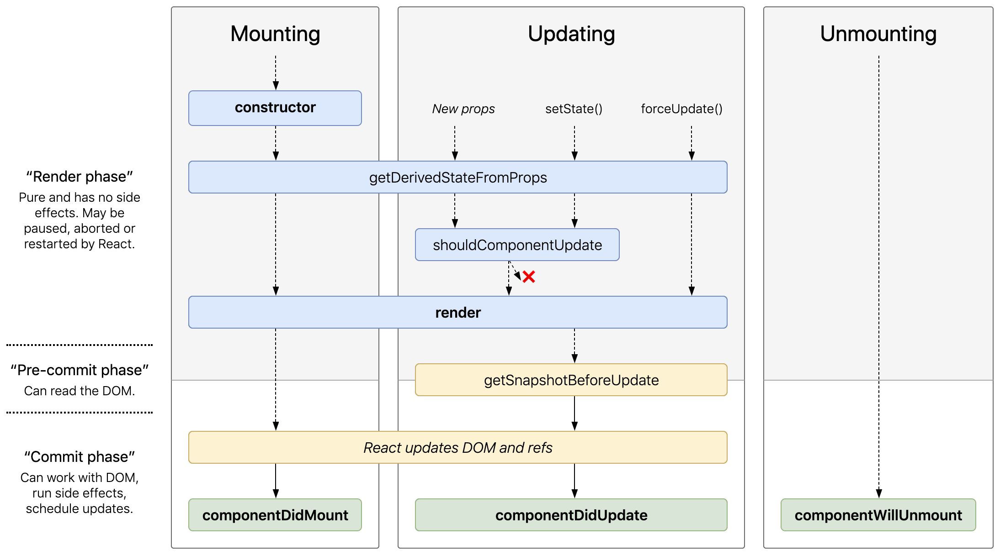

# Course Notes: React from the Beginning (with Redux and React Router)

<details><summary> <strong>Reference links for React and course</strong></summary>

- **[Course files:](https://github.com/robertbunch/reactFromTheBeginning)** These are Rob's course files that may be updated periodically as new sections are added to the course.
- **[NPM `create-react-app` entry:](https://www.npmjs.com/package/create-react-app)** This really just refers you on to some of the links below.
- **[GitHub `create-react-app` repository:](https://github.com/facebook/create-react-app)** See the latest additions/modifications to `create-react-app`. 
- **[Glossary of React Terms:](https://reactjs.org/docs/glossary.html)** Get acquainted with all of the lingo and jargon surrounding React.

---

</details>

<details><summary> <strong>Click to expand <code>create-react-app</code> docs outline</strong></summary>

+ [`create-react-app` docs homepage:](https://create-react-app.dev/docs/getting-started/)
+ **Welcome**
  * [About Docs](https://create-react-app.dev/docs/documentation-intro)
+ **Getting Started**
  * [Getting Started](https://create-react-app.dev/docs/getting-started)
  * [Folder Structure](https://create-react-app.dev/docs/folder-structure/)
  * [Available Scripts](https://create-react-app.dev/docs/available-scripts/)
  * [Supported Browsers and Features](https://create-react-app.dev/docs/supported-browsers-features/)
  * [Updating to New Releases](https://create-react-app.dev/docs/updating-to-new-releases/)
+ **Development**
  * [Editor Setup](https://create-react-app.dev/docs/setting-up-your-editor/)
  * [Developing Components in Isolation](https://create-react-app.dev/docs/developing-components-in-isolation/)
  * [Analyzing Bundle Size](https://create-react-app.dev/docs/analyzing-the-bundle-size/)
  * [HTTPS in Development](https://create-react-app.dev/docs/using-https-in-development/)
+ **Styles and Assets**
  * [Adding Stylesheets](https://create-react-app.dev/docs/adding-a-stylesheet/)
  * [Adding CSS Modules](https://create-react-app.dev/docs/adding-a-css-modules-stylesheet/)
  * [Adding Sass Stylesheets](https://create-react-app.dev/docs/adding-a-sass-stylesheet/)
  * [Adding CSS Reset](https://create-react-app.dev/docs/adding-css-reset/)
  * [Post-Processing CSS](https://create-react-app.dev/docs/post-processing-css/)
  * [Adding Images, Fonts, and Files](https://create-react-app.dev/docs/adding-images-fonts-and-files/)
  * [Loading .graphql Files](https://create-react-app.dev/docs/loading-graphql-files/)
  * [Using the Public Folder](https://create-react-app.dev/docs/using-the-public-folder/)
  * [Code Splitting](https://create-react-app.dev/docs/code-splitting/)
+ **Building your App**
  * [Install a Dependency](https://create-react-app.dev/docs/installing-a-dependency/)
  * [Importing a Component](https://create-react-app.dev/docs/importing-a-component/)
  * [Using Global Variables](https://create-react-app.dev/docs/using-global-variables/)
  * [Adding Bootstrap](https://create-react-app.dev/docs/adding-bootstrap/)
  * [Adding Flow](https://create-react-app.dev/docs/adding-flow/)
  * [Adding TypeScript](https://create-react-app.dev/docs/adding-typescript/)
  * [Adding Relay](https://create-react-app.dev/docs/adding-relay/)
  * [Adding a Router](https://create-react-app.dev/docs/adding-a-router/)
  * [Environment Variables](https://create-react-app.dev/docs/adding-custom-environment-variables/)
  * [Making a Progressive Web App](https://create-react-app.dev/docs/making-a-progressive-web-app/)
  * [Creating a Production Build](https://create-react-app.dev/docs/production-build/)
+ **Testing**
  * [Running Tests](https://create-react-app.dev/docs/running-tests/)
  * [Debugging Tests](https://create-react-app.dev/docs/debugging-tests/)
+ **Back-End Integration**
  * [Proxying in Development](https://create-react-app.dev/docs/proxying-api-requests-in-development/)
  * [Fetching Data](https://create-react-app.dev/docs/fetching-data-with-ajax-requests/)
  * [Integrating with an API](https://create-react-app.dev/docs/integrating-with-an-api-backend/)
  * [Title & Meta Tags](https://create-react-app.dev/docs/title-and-meta-tags/)
+ **Deployment**
  * [Deployment](https://create-react-app.dev/docs/deployment/)
+ **Advanced Usage**
  * [Custom Templates](https://create-react-app.dev/docs/custom-templates/)
  * [Can I Use Decorators?](https://create-react-app.dev/docs/can-i-use-decorators/)
  * [Pre-Rendering Static HTML](https://create-react-app.dev/docs/pre-rendering-into-static-html-files/)
  * [Advanced Configuration](https://create-react-app.dev/docs/advanced-configuration/)
  * [Alternatives to Ejecting](https://create-react-app.dev/docs/alternatives-to-ejecting/)
+ **Support**
  * [Troubleshooting](https://create-react-app.dev/docs/troubleshooting/)

---

</details>

<details><summary> <strong>Click to expand React docs outline</strong></summary>

+ [React docs homepage](https://reactjs.org/)
+ [Tutorial I](https://reactjs.org/tutorial/tutorial.html): Learning React by doing (building a Tic-Tac-Toe game)
+ [Tutorial II](https://reactjs.org/docs/hello-world.html): Learn React from the ground up (more conceptual than the tutorial above--these tutorials will likely be most effective in tandem)
+ **FAQ**
  * [AJAX and APIs](https://reactjs.org/docs/faq-ajax.html)
  * [Babel, JSX, and Build Steps](https://reactjs.org/docs/faq-build.html)
  * [Passing Functions to Components](https://reactjs.org/docs/faq-functions.html)
  * [Component State](https://reactjs.org/docs/faq-state.html)
  * [Styling and CSS](https://reactjs.org/docs/faq-styling.html)
  * [File Structure](https://reactjs.org/docs/faq-structure.html)
  * [Versioning Policy](https://reactjs.org/docs/faq-versioning.html)
  * [Virtual DOM and Internals](https://reactjs.org/docs/faq-internals.html)
+ **Installation**
  * [Getting Started](https://reactjs.org/docs/getting-started.html)
  * [Add React to a Website](https://reactjs.org/docs/add-react-to-a-website.html)
  * [Create a New React App](https://reactjs.org/docs/create-a-new-react-app.html)
  * [CDN Links](https://reactjs.org/docs/cdn-links.html)
  * [Release Channels](https://reactjs.org/docs/release-channels.html)
+ **Main Concepts**
  * [Hello World](https://reactjs.org/docs/hello-world.html)
  * [Introducing JSX](https://reactjs.org/docs/introducing-jsx.html)
  * [Rendering Elements](https://reactjs.org/docs/rendering-elements.html)
  * [Components and Props](https://reactjs.org/docs/components-and-props.html)
  * [State and Lifecycle](https://reactjs.org/docs/state-and-lifecycle.html)
  * [Handling Events](https://reactjs.org/docs/handling-events.html)
  * [Conditional Rendering](https://reactjs.org/docs/conditional-rendering.html)
  * [Lists and Keys](https://reactjs.org/docs/lists-and-keys.html)
  * [Forms](https://reactjs.org/docs/forms.html)
  * [Lifting State Up](https://reactjs.org/docs/lifting-state-up.html)
  * [Composition vs Inheritance](https://reactjs.org/docs/composition-vs-inheritance.html)
  * [Thinking in React](https://reactjs.org/docs/thinking-in-react.html)
+ **Advanced Guides**
  * [Accessibility](https://reactjs.org/docs/accessibility.html)
  * [Code-Splitting](https://reactjs.org/docs/code-splitting.html)
  * [Context](https://reactjs.org/docs/context.html)
  * [Error Boundaries](https://reactjs.org/docs/error-boundaries.html)
  * [Forwarding Refs](https://reactjs.org/docs/forwarding-refs.html)
  * [Fragments](https://reactjs.org/docs/fragments.html)
  * [Higher-Order Components](https://reactjs.org/docs/higher-order-components.html)
  * [Integrating with Other Libraries](https://reactjs.org/docs/integrating-with-other-libraries.html)
  * [JSX In Depth](https://reactjs.org/docs/jsx-in-depth.html)
  * [Optimizing Performance](https://reactjs.org/docs/optimizing-performance.html)
  * [Portals](https://reactjs.org/docs/portals.html)
  * [Profiler](https://reactjs.org/docs/profiler.html)
  * [React Without ES6](https://reactjs.org/docs/react-without-es6.html)
  * [React Without JSX](https://reactjs.org/docs/react-without-jsx.html)
  * [Reconciliation](https://reactjs.org/docs/reconciliation.html)
  * [Refs and the DOM](https://reactjs.org/docs/refs-and-the-dom.html)
  * [Render Props](https://reactjs.org/docs/render-props.html)
  * [Static Type Checking](https://reactjs.org/docs/static-type-checking.html)
  * [Strict Mode](https://reactjs.org/docs/strict-mode.html)
  * [Typechecking With PropTypes](https://reactjs.org/docs/typechecking-with-proptypes.html)
  * [Uncontrolled Components](https://reactjs.org/docs/uncontrolled-components.html)
  * [Web Components](https://reactjs.org/docs/web-components.html)
+ **API Reference**
  * [React](https://reactjs.org/docs/react-api.html)
    - [React.Component](https://reactjs.org/docs/react-component.html)
  * [ReactDOM](https://reactjs.org/docs/react-dom.html)
  * [ReactDOMServer](https://reactjs.org/docs/react-dom-server.html)
  * [DOM Elements](https://reactjs.org/docs/dom-elements.html)
  * [SyntheticEvent](https://reactjs.org/docs/events.html)
  * [Test Utilities](https://reactjs.org/docs/test-utils.html)
  * [Test Renderer](https://reactjs.org/docs/test-renderer.html)
  * [JS Environment Requirements](https://reactjs.org/docs/javascript-environment-requirements.html)
  * [Glossary](https://reactjs.org/docs/glossary.html)
+ **Hooks**
  * [Introducing Hooks](https://reactjs.org/docs/hooks-intro.html)
  * [Hooks at a Glance](https://reactjs.org/docs/hooks-overview.html)
  * [Use the State Hook](https://reactjs.org/docs/hooks-state.html)
  * [Using the Effect Hook](https://reactjs.org/docs/hooks-effect.html)
  * [Rules of Hooks](https://reactjs.org/docs/hooks-rules.html)
  * [Building Your Own Hooks](https://reactjs.org/docs/hooks-custom.html)
  * [Hooks API Reference](https://reactjs.org/docs/hooks-reference.html)
  * [Hooks FAQ](https://reactjs.org/docs/hooks-faq.html)
+ **Testing**
  * [Testing Overview](https://reactjs.org/docs/testing.html)
  * [Testing Recipes](https://reactjs.org/docs/testing-recipes.html)
  * [Testing Environments](https://reactjs.org/docs/testing-environments.html)
+ **Concurrent Mode (Experimental)**
  * [Introducing Concurrent Mode](https://reactjs.org/docs/concurrent-mode-intro.html)
  * [Suspense for Data Fetching](https://reactjs.org/docs/concurrent-mode-suspense.html)
  * [Concurrent UI Patterns](https://reactjs.org/docs/concurrent-mode-patterns.html)
  * [Adopting Concurrent Mode](https://reactjs.org/docs/concurrent-mode-adoption.html)
  * [Concurrent Mode API Reference](https://reactjs.org/docs/concurrent-mode-reference.html)
+ **Contributing**
  * [How to Contribute](https://reactjs.org/docs/codebase-overview.html)
  * [Codebase Overview](https://reactjs.org/docs/codebase-overview.html)
  * [Implementation Notes](https://reactjs.org/docs/implementation-notes.html)
  * [Design Principles](https://reactjs.org/docs/design-principles.html)

---

</details>

<details><summary> <strong>Click to expand docs reference for <code>React.Component</code> (in a nutshell)</strong></summary>

See [React.Component](https://reactjs.org/docs/react-component.html) in the docs for all the gory details. Below is a modest attempt to provide just a nuts and bolts reference for ease of use (i.e., consult the actual docs for examples of everything below).

Each component has several "lifecycle methods" that you can override to run code at particular times in the process. You can use [this lifecycle diagram](http://projects.wojtekmaj.pl/react-lifecycle-methods-diagram/) as a cheat sheet. In the list below, commonly used lifecycle methods are marked as bold. The rest of them exist for relatively rare use cases.

- **Mounting:** These methods are called in the following order when an instance of a component is being created and inserted into the DOM:
  + **[constructor()](https://reactjs.org/docs/react-component.html#constructor)**
  + [static getDerivedStateFromProps()](https://reactjs.org/docs/react-component.html#static-getderivedstatefromprops) 
  + **[render()](https://reactjs.org/docs/react-component.html#render)**
  + **[componentDidMount()](https://reactjs.org/docs/react-component.html#componentdidmount)**
  + **Note:** These methods are considered legacy and you should [avoid them](https://reactjs.org/blog/2018/03/27/update-on-async-rendering.html) in new code:
    * [UNSAFE_componentWillMount()](https://reactjs.org/docs/react-component.html#unsafe_componentwillmount)
- **Updating:** An update can be caused by changes to props or state. These methods are called in the following order when a component is being re-rendered:
  + [static getDerivedStateFromProps()](https://reactjs.org/docs/react-component.html#static-getderivedstatefromprops)
  + [shouldComponentUpdate()](https://reactjs.org/docs/react-component.html#shouldcomponentupdate)
  + **[render()](https://reactjs.org/docs/react-component.html#render)**
  + [getSnapshotBeforeUpdate()](https://reactjs.org/docs/react-component.html#getsnapshotbeforeupdate)
  + **[componentDidUpdate()](https://reactjs.org/docs/react-component.html#componentdidupdate)** These methods are considered legacy and you should avoid them in new code:
  + **Note:** These methods are considered legacy and you should [avoid them](https://reactjs.org/blog/2018/03/27/update-on-async-rendering.html) in new code:
    * [UNSAFE_componentWillUpdate()](https://reactjs.org/docs/react-component.html#unsafe_componentwillupdate)
    * [UNSAFE_componentWillReceiveProps()](https://reactjs.org/docs/react-component.html#unsafe_componentwillreceiveprops)
- **Unmounting:** This method is called when a component is being removed from the DOM:
  + **[componentWillUnmount()](https://reactjs.org/docs/react-component.html#componentwillunmount)**
- **Error Handling:** These methods are called when there is an error during rendering, in a lifecycle method, or in the constructor of any child component.
  + [static getDerivedStateFromError()](https://reactjs.org/docs/react-component.html#static-getderivedstatefromerror)
  + [componentDidCatch()](https://reactjs.org/docs/react-component.html#componentdidcatch)
- **Other APIs:** Each component also provides some other APIs:
  + [setState()](https://reactjs.org/docs/react-component.html#setstate)
  + [forceUpdate()](https://reactjs.org/docs/react-component.html#forceupdate)
- **Class Properties**
  + [defaultProps](https://reactjs.org/docs/react-component.html#defaultprops)
  + [displayName](https://reactjs.org/docs/react-component.html#displayname)
- **Instance Properties**
  + [props](https://reactjs.org/docs/react-component.html#props)
  + [state](https://reactjs.org/docs/react-component.html#state)

---

</details>

<details><summary> <strong>Click to expand conditional rendering cheatsheet</strong></summary>

[This article](https://www.robinwieruch.de/conditional-rendering-react) gives a *very* nice overview of conditional rendering in React. The author specifies the following waysof conditional rendering: if, if else, ternary, switch case, multiple conditional renderings in React, nested conditional rendering in React, conditional rendering with higher-order components, and finally if else components. Here's the actual cheatsheet:
+ [if](https://www.robinwieruch.de/conditional-rendering-react#conditional-rendering-in-react-if)
  * most basic conditional rendering
  * use to opt-out early from a rendering (guard pattern)
  * cannot be used within return statement and JSX (except self invoking function)
+ [if-else](https://www.robinwieruch.de/conditional-rendering-react#conditional-rendering-in-react-if-else)
  * use it rarely, because it's verbose
  * instead, use ternary operator or logical && operator
  * cannot be used inside return statement and JSX (except self invoking function)
+ [ternary operator](https://www.robinwieruch.de/conditional-rendering-react#conditional-rendering-in-react-ternary)
  * use it instead of an if-else statement
  * it can be used within JSX and return statement
+ [logical && operator](https://www.robinwieruch.de/conditional-rendering-react#conditional-rendering-in-react-)
  * use it when one side of the ternary operation would return null
  * it can be used inside JSX and return statement
+ [switch case](https://www.robinwieruch.de/conditional-rendering-react#conditional-rendering-in-react-switch-case)
  * avoid using it, because it's too verbose
  * instead, use enums
  * cannot be used within JSX and return (except self invoking function)
+ [enums: multiple conditional renderings](https://www.robinwieruch.de/conditional-rendering-react#multiple-conditional-renderings-in-react)
  * use it for conditional rendering based on multiple states
  * perfect to map more than one condition
+ [nested conditional rendering](https://www.robinwieruch.de/conditional-rendering-react#nested-conditional-rendering-in-react)
  * avoid them for the sake of readability
  * instead, split out components, use if statements, or use HOCs
+ [conditional rendering with higher-order components](https://www.robinwieruch.de/conditional-rendering-react#conditional-rendering-with-hoc)
  * components can focus on their main purpose
  * use HOC to shield away conditional rendering
  * use multiple composable HOCs to shield away multiple conditional renderings
+ [external templating components: if else components](https://www.robinwieruch.de/conditional-rendering-react#if-else-components-in-react)
  * avoid them and be comfortable with JSX and JS

---

</details>

## React 101

<details><summary> <strong>Starter notes (course starter files, <code>create-react-app</code>, React docs, etc.)</strong></summary>

As we will see, [Node.js](https://nodejs.org/en/) is not *necessary* in order to use React, but you will be in for a world of pain if you don't use Node. It will make your life so much easier. In particular, once we have made sufficient progress, we will be able to use  the `create-react-app` CLI and add on numerous other packages meant for React via Node. It's really the only way to go. 

As noted at the top of this file, there are several React-specific docs to make development with React as painless as possible. Use the docs to your advantage!

---

</details>

<details><summary> <strong>What React is and why we need it</strong></summary>

Before we get into the weeds as to how to use React, it would be a good idea to know what it is, where it comes from, what problems it has tried to solve, etc. The more background we can have on it before directly using it the better. Our background knowledge can inform our use. 

In web development, 1995 was a monster year. Python (really 1991), Java, PHP, Ruby, Apache, and (prematurely) JavaScript were born. Netscape (now Mozilla) had Navigator (now Firefox) as the only real web browser at that point. They know Microsoft is coming to build their own browser so the CEO, Marc Andreessen, hires Brendan Eich to build a scripting language. That language is not meant to compete with the heavy lifters (i.e., Python, Java, PHP, Ruby, etc.) because those heavy lifters are already handling all of the back-end stuff. We want a scripting language that's accessible to amaeteurs and hobbyists and people who just want to dabble in basic programming. Why? Why not just make it a full-on language with inheritance and other features like those mentioned above? There are many reasons, but the main one is probably that in 1995 there's a grand total of about 23,000 websites. That may sound like a decent amount, but it's nothing at all--today we have *billions* of websites. So the web was in its absolute infancy in 1995. You're not going to be able to get heavy-lifter developers to migrate over to JavaScript world since the ecosystem is so small at that point. And websites were mostly inert. Think Wikipedia. You open the page and that's it. 

JavaScript came into the world to be the easy programming language while the heavy-lifters remained as they were. Fast forward to roughly 2005 and AJAX comes out. We have iOS and Android. jQuery comes out in 2006. And we hit 100 million websites. So in just 10 years, we went from around 23,000 websites to over 100 million. People are now carrying around full computers in their pocket that are able to run JavaScript. AJAX has revolutionized the web because internet connections are faster so you can send lots of little pieces of data. And in all of this jQuery was awesome. In some ways, jQuery kind of unified the DOM almost as a language across everything that used the DOM. And jQuery was awesome because it took us from web pages that hundreds of lines of JavaScript and condensed them down to just a few lines. So jQuery was great, but the web was growing at a frenetic pace.

If we hop to around 2010, then the V8 engine has come out, Node.js has come out, and Angular is born (and BackBone). This is where things really start to change for JavaScript. At this point in history, Instagram, Netflix, and Twitch go on the web, and browsers have gone from needing to serve up a tiny number of pages in 1995 to now where you have major websites like Netflix, Walmart, Amazon, etc. All of these websites have gone from being little fun marketing sites in 2000 to being really important parts of the company. They're not just little applications but major software as a service or they're a major platform in able to actually make money. 

Angular is the first UI framework, and a UI framework is a framework that seeks to simplify your life. So first we had JavaScript files that became unmanageable. jQuery was a lifesaver and condensed the code we needed. The web continued to explode and then the jQuery files got out of hand. Angular sought to reign in the chaos. In 2013 enters React, and React is almost unanimously seen as a vast improvement over Angular 1 (not necessarily Angular as it is now). It is also a UI framework. 

Basically, a UI framework is a whole bunch of JavaScript someone else has written to try and make your life easier. In what way does it make life easier? React seeks to answer the following question: "How can we modernize web development?" Because we can't have thousands of really long files of JavaScript. It becomes intractable. And if you're Facebook then you'll have a ton of those really monolithic files. So it answers this question in the following way:

- **Modularize:** It breaks up the application into a bunch of tiny little pieces. So once again the goal is to get back to the point where files are reasonably short and manageable. This is also good because it allows the files to be encapsulated. That is, we can follow some basic object-oriented programming principles and make our files easier to reuse. We can pass them around freely from one place to the next within our application (they manage their own data and all their methods are internal and so forth). 
- **Manages state effectively:** This is something that Angular did not really do. We'll talk about this a lot more later, but now you have webpages that are changing constantly in a big way, and you need someone who is in charge of it, and it's not a good approach to just let the DOM be the source of truth anymore.
- **Efficient:** If you think about Facebook, then you can think about chats, notifications, messages, etc., all happening nearly instantly and *all* of those things are tiny DOM manipulations. And jQuery was computationally very very expensive in how it manipulated the DOM. React can do this in a very efficient way. 
- **Front-end/back-end separation of concerns:** React completely separates the front-end from the back-end. There are a number of positive benefits about this, but just to name a few: You can have two separate teams (front-end people and back-end people). The front-end people can focus entirely on React and the back-end people can focus on their own thing. In the past, if you had the front-end and back-end teams tightly coupled, as was the case for many many years, then if one thing went down the other went down as well. If you wanted to change one you had to change the other. Separating them out makes everything much more modular, easier to manage and maintain, etc. 
- **Hardware increases:** Your phone may have a stronger processor than, say, what's on your `T2.micro` on AWS. The hardware is just there now to where we want to offload as much as possible to the browser because the hardware that the user is running their browser on is outstanding, and for large-scale websites this can save so much processing power.
- **Declarative instead of imperative:** We can get away from telling the computer exactly how to do something to simply say, "Hey, this is what I want you to do." 

The super short version: What is React? React is a whole bunch of JavaScript that someone else wrote (mostly Facebook) that helps your development go from being boring, small, and unsophisticated to being big, exciting, professional, and organized. If you have a tiny website or project, then React is not what you need. React is made to build buildings and cities--it is not meant to make log cabins or tents. That's what the web was in the beginning. It is no longer that way. The web grew up. It is no longer boring with unsophisticated progammers. It is now professional programmers, large teams, huge companies (e.g., Amazon, Facebook, Google, etc.), and it allows you to make your UI (i.e., your front-end or your stuff inside the browser) really well.

---

</details>

<details><summary> <strong>First React program (and touching on JSX and Babel)</strong></summary>

Without `create-react-app`, it's not exactly extremely straightforward to get an application going with React. Remember that React is meant to build large websites. Here is what you get when professionally developing with React:

- React
  + JSX
  + ES6
    * Babel
    * Webpack/Node

At the beginning, where we will start without using `create-react-app`, we could certainly go the Express route (where we statically load one big folder and then load up the `index.html` in whatever subfolder as we want), but we can just as well use the [live server](https://marketplace.visualstudio.com/items?itemName=ritwickdey.LiveServer) extension in VSCode to launch our local `index.html` file instead. Whatever is most comfortable.

No matter what we do, we will need the following through the [React CDN links](https://reactjs.org/docs/cdn-links.html) as well as [cdnjs](https://cdnjs.com/libraries/babel-standalone) for `babel-standalone`:

- **React:** `<script crossorigin src="https://unpkg.com/react@16/umd/react.production.min.js"></script>`
- **ReactDOM:** `<script crossorigin src="https://unpkg.com/react-dom@16/umd/react-dom.production.min.js"></script>`
- **
- **Babel:** `<script src="https://cdnjs.cloudflare.com/ajax/libs/babel-standalone/6.26.0/babel.min.js"></script>`

These links will give us access to React proper, ReactDOM (React can be used in contexts without a DOM, but we will be working in the contet where there is a DOM), and Babel (`babel-standalone` is a standalone build of Babel for use in non-Node.js environments.) The skeleton for our `index.html` file might look like the following:

``` HTML
<!DOCTYPE html>
<html lang="en">

<head>
  <meta charset="UTF-8">
  <meta name="viewport" content="width=device-width, initial-scale=1.0">
  <title>First React Program</title>
  <script crossorigin src="https://unpkg.com/react@16/umd/react.production.min.js"></script>
  <script crossorigin src="https://unpkg.com/react-dom@16/umd/react-dom.production.min.js"></script>
  <script src="https://cdnjs.cloudflare.com/ajax/libs/babel-standalone/6.26.0/babel.min.js"></script>
</head>

<body>

<!-- What goes in here now? -->
  
</body>

</html>
```

What goes in the `body`? This is where the particulars of React will come into play. We will first have `<div id="root"></div>` which is to serve as the "root" of our application. This is where our content will get dumped. Then below this `div` we will want to drop a `script` tag with `type="text/babel"` so whatever we place within the `script` tag can be processed properly:

``` HTML
<body>
  
  <div id="root"></div>

  <script type="text/babel">
    ReactDOM.render(
      <h1>Sanity Check</h1>,
      document.getElementById('root')
    )
  </script>
  
</body>
```

All in all we end up with the following most basic first React program:

<p align='center'>
  
</p>

Let's go through this in more detail than we did above:

1\. **React:** This is React proper. It is React itself. You can see [the non-minified version of React](https://unpkg.com/react@16/umd/react.development.js) and at least as of this time of writing (April 25, 2020) it's 3,318 lines of code. 

2\. **ReactDOM:** This is ReactDOM. And we can see we make use of ReactDOM in our program by literally using `ReactDOM` and calling the `render` method on it. You can see [the non-minified version of ReactDOM](https://unpkg.com/react-dom@16/umd/react-dom.development.js) if you want and at least as of this time of writing (April 25, 2020) it's 25,147 lines of code. The heart of our program is lines 18-21, and this is where we make use of `ReactDOM`, specifically the `render` method. In our example we supplied `render` with two arguments: 

1. Some HTML (our `h1` tag)
2. A container (a `div` in our case which we selected using basic JavaScript)  

In fact, [the docs](https://reactjs.org/docs/react-dom.html#render) note the following syntax for `render`:

```javascript
ReactDOM.render(element, container[, callback])
```

And we get the following basic description: "Render a React element into the DOM in the supplied `container` [...]. If the optional callback is provided, then it will be executed after the component is rendered or updated."


3\. **Babel:** This is Babel. And we can see we make use of Babel in our program via the `script` tag with the attribute `type="text/babel"`. You can see [the non-minified version of Babel](https://cdnjs.cloudflare.com/ajax/libs/babel-standalone/6.26.0/babel.js) if you want and at least as of this time of writing (April 25, 2020) it's 61,686 lines of code. Check out [babeljs.io](https://babeljs.io/) to [experiment](https://babeljs.io/repl) and find out what it's really doing behind the scenes. As the website notes, Babel is a JavaScript compiler. We'll explore what this means further momentarily.

4\. **JSX:** What is JSX? As always. [the docs](https://reactjs.org/docs/introducing-jsx.html) give us a clue, but the basic gist is this: JSX is a syntax extension to JavaScript, and it is recommended to use with React so we can *describe* what the UI should look like (declarative vs. imperative). And JSX goes hand in with Babel which is also working with React. 

**What does all of this mean?** Well, let's first explore what Babel does even without React first. It's a JavaScript compiler. It basically does two things:

1. It makes the fancy new ES6+ JavaScript we use reverse-compatible so browsers can understand it (many browsers have not completely updated to support ES6+). As an example, something really simple like `() => 2` in ES6+ speak would be turned into 

```javascript
(function () {
  return 2;
});
```

which any browser can understand. 

2. The second thing Babel will do (if we have `react` checked in the left sidebar presets when [trying it out](https://babeljs.io/repl#?browsers=&build=&builtIns=false&spec=false&loose=false&code_lz=Q&debug=false&forceAllTransforms=false&shippedProposals=false&circleciRepo=&evaluate=false&fileSize=false&timeTravel=false&sourceType=module&lineWrap=true&presets=es2015%2Creact%2Cstage-2&prettier=false&targets=&version=7.9.0&externalPlugins=)) is *transpile* our JSX into code React proper can work with (*this* is where React itself comes into play, among others). So something like `() => <h1>Sanity Check</h1>` gets transpiled by Babel into

```javascript
(function () {
  return React.createElement("h1", null, "Sanity Check");
});
```

As you can see, we are directly making use of `React`; specifically, we are making use of the `createElement` method and passing arguments to it. As [the docs](https://reactjs.org/docs/react-api.html#creating-react-elements) note, each JSX element is just syntactic sugar for calling `React.createElement()`. How does `createElement` work? [The docs](https://reactjs.org/docs/react-api.html#createelement) give us an example:

```javascript
React.createElement(
  type,
  [props],
  [...children]
)
```

And they note: "This creates and returns a new [React element](https://reactjs.org/docs/rendering-elements.html) of the given type. The type argument can be either a tag name string (such as `'div'` or `'span'`), a [React component](https://reactjs.org/docs/components-and-props.html) type (a class or a function), or a [React fragment](https://reactjs.org/docs/react-api.html#reactfragment) type. Code written with [JSX](https://reactjs.org/docs/introducing-jsx.html) will be converted [using Babel!!!] to use `React.createElement()`. You will not typically invoke `React.createElement()` directly if you are using JSX. See [React Without JSX](https://reactjs.org/docs/react-without-jsx.html) to learn more."

Returning to our first program, our `script` tag on line 17 with `type="text/babel"` indicates that we want Babel to compile our code into something the browser can understand. If what we use in our `script` is just JavaScript, then it will simply make the JavaScript ES6+ reverse-compatible. But if it's JSX, then it will *transpile* our code into something React knows how to handle. In our own case, Babel took `() => <h1>Sanity Check</h1>` and turned this into

```javascript
(function () {
  return React.createElement("h1", null, "Sanity Check");
});
```

From above, we see that the `type` we gave it was an `h1`, `null` for `[props]` (we'll get to props and all that good stuff soon enough, but right now you can think of `props` as basically attributes on a normal HTML element), and `"Sanity Check"` for `[...children]`. Of course, we may have cases where we have a lot more than a single child. Consider something still rather basic but that could be a nightmare to deal with without Babel:

```javascript
() => (
<div>
  <h1>Heading</h1>
  <h2>First Subsection</h2>
  <p>
    Little paragraph in subsection and we may link to <a href="google.com">Google</a> or something like that.
  </p>
  <p>Another <span>little</span> paragraph</p>
</div>
)
```

Babel will turn this into the following:

```javascript
(function () {
  return React.createElement("div", null, React.createElement("h1", null, "Heading"), React.createElement("h2", null, "First Subsection"), React.createElement("p", null, "Little paragraph in subsection and we may link to ", React.createElement("a", {
    href: "google.com"
  }, "Google"), " or something like that."), React.createElement("p", null, "Another ", React.createElement("span", null, "little"), " paragraph"));
});
```

You can easily see how children of the single `div` can have multiple children themselves and things can quickly spiral out of control. 

---

</details>

<details><summary> <strong>More JSX and Babel</strong></summary>

Facebook made JSX and you can see [the GitHub repository for JSX](https://github.com/facebook/jsx) if you're really into that. As they note in the description for the repository: The JSX specification is a XML-like syntax extension to ECMAscript. JSX is made basically for React. Because using React without JSX quickly becomes impossible as the end of the note above started to hint towards but which we will quickly see even more soon. 

Returning to the basics, we see that Babel will take something like

``` HTML
<div id="root">I love React!</div>
```

and turn it into 

```javascript
React.createElement("div", {
  id: "root"
}, "I love React!");
```

So what *looks* like HTML to us is not that at all when Babel is looking at it (especially in the context of using React). It's pure JavaScript. We could maybe add a class to our HTML element like so:

``` HTML
<div id="root" class="container">I love React!</div>
```

But we cannot do this! Why? Because `class` is a *keyword* in JavaScript. In fact, Babel will take a silly `class` like

```javascript
class Car {
  constructor(color, mileage) {
    this.color = color;
    this.mileage = mileage;
  }
  
  showMileage() {
    return this.milage;
  }
}
```

and compile it into 

```javascript
var Car = function () {
  function Car(color, mileage) {
    _classCallCheck(this, Car);

    this.color = color;
    this.mileage = mileage;
  }

  _createClass(Car, [{
    key: "showMileage",
    value: function showMileage() {
      return this.milage;
    }
  }]);

  return Car;
}();
```

Hence, in React, we do not use `class` for a `class` attribute we might normally put on an HTML element. Instead, we use `className`:

``` HTML
<div id="root" className="container">I love React!</div>
```

And Babel turns this into 

```javascript
React.createElement("div", {
  id: "root",
  className: "container"
}, "I love React!");
```

So every attribute that we add in JSX will be added as a prop(erty) in the second argument to `React.createElement`. Another "gotcha" to remember in React is we *always* need to close our elements even if they may be conventionally self-closing. For example, we need `<br />` not `<br>`, `` not ``, etc. 

We can create a more interesting React program (though still tiny in the grand scheme of things) in the following manner:

``` HTML
<!DOCTYPE html>
<html lang="en">

<head>
  <meta charset="UTF-8">
  <meta name="viewport" content="width=device-width, initial-scale=1.0">
  <title>First React Program</title>

  <link rel="stylesheet" href="https://cdnjs.cloudflare.com/ajax/libs/materialize/1.0.0/css/materialize.min.css">
  <script crossorigin src="https://unpkg.com/react@16/umd/react.production.min.js"></script>
  <script crossorigin src="https://unpkg.com/react-dom@16/umd/react-dom.production.min.js"></script>
  <script src="https://cdnjs.cloudflare.com/ajax/libs/babel-standalone/6.26.0/babel.min.js"></script>
</head>

<body>

  <div id="root"></div>

  <script type="text/babel">

    const markup = <div className="row">
                    <div className="col s2">
                      <div className="card hoverable small">
                        <div className="card-image">
                          
                        </div>
                        <div className="card-content">
                          <p>React From the Beginning</p>
                          <p>Robert Bunch</p>
                        </div>
                        <div className="card-action">
                          <a href="#">$9.99</a>
                        </div>
                      </div>
                    </div>
                  </div>

    ReactDOM.render(
      markup,
      document.getElementById('root')
    )
  </script>
  
</body>

</html>
```

Not the addition of the materialize link: `<link rel="stylesheet" href="https://cdnjs.cloudflare.com/ajax/libs/materialize/1.0.0/css/materialize.min.css">`. Of course, the real addition is the `markup` variable. The entire thing looks like HTML, but it isn't. It's JSX. If we throw everything in the `markup` variable into Babel, we will see what is really being done underneath the hood:

```javascript
React.createElement("div", {
  className: "row"
}, React.createElement("div", {
  className: "col s2"
}, React.createElement("div", {
  className: "card hoverable small"
}, React.createElement("div", {
  className: "card-image"
}, React.createElement("img", {
  src: "http://lorempixel.com/400/400/nature/"
})), React.createElement("div", {
  className: "card-content"
}, React.createElement("p", null, "React From the Beginning"), React.createElement("p", null, "Robert Bunch")), React.createElement("div", {
  className: "card-action"
}, React.createElement("a", {
  href: "#"
}, "$9.99")))));
```

What an unholy mess! Imagine having to do this every single time instead of just using JSX. The real power of all of this isn't just the fact that Babel does a bunch of compiling/transpiling underneath the hood. The power comes from how modular everything can be when we note that all of this is just JavaScript. So we can make variables and the like, perform computations, etc., and place the *results* in our JSX *dynammically*. The result can eventually be a bunch of dynamically rendered HTML. So how do insert variables and the like into JSX?

A decent way of thinking about JSX is that it is in "HTML mode" by default, where nothing is dynamic. But we can use curly braces `{ javascrpt-mode }` to enter "JavaScript mode." So when Babel gets to a curly brace it expects whatever is inside to be an expression in JavaScript that can be evaluated. The expression is evaluated and placed and when the closing curly brace is encountered, HTML mode resumes. So when Babel encounters something like `{title}` it knows you mean the *variable* `title` as opposed to the string `'title'`. We can run almost anything we want inside of the curly braces except for a full-blown statement like an `if...else` statement, a `for` loop, etc. But this is also where the power of the ternary `?` in JavaScript comes into play. We can make a more dynamic HTML file like the following:

``` HTML
<!DOCTYPE html>
<html lang="en">

<head>
  <meta charset="UTF-8">
  <meta name="viewport" content="width=device-width, initial-scale=1.0">
  <title>First React Program</title>

  <link rel="stylesheet" href="https://cdnjs.cloudflare.com/ajax/libs/materialize/1.0.0/css/materialize.min.css">
  <script crossorigin src="https://unpkg.com/react@16/umd/react.production.min.js"></script>
  <script crossorigin src="https://unpkg.com/react-dom@16/umd/react-dom.production.min.js"></script>
  <script src="https://cdnjs.cloudflare.com/ajax/libs/babel-standalone/6.26.0/babel.min.js"></script>
</head>

<body>

  <div id="root"></div>

  <script type="text/babel">

    const title = 'React From the Beginning';
    const name = 'Robert Bunch';
    // const saleOn = false;
    function saleOn() {
      return true;
    }

    const markup = <div className="row">
                    <div className="col s2">
                      <div className="card hoverable small">
                        <div className="card-image">
                          
                        </div>
                        <div className="card-content">
                          <p>{title}</p>
                          <p>{name}</p>
                        </div>
                        <div className="card-action">
                          <a href="#">${saleOn() ? 9.99 : 59.99}</a>
                        </div>
                      </div>
                    </div>
                  </div>

    ReactDOM.render(
      markup,
      document.getElementById('root')
    )
  </script>
  
</body>

</html>
```

If we dumped everything within the `script` tags in the `body`, we would end up with the following via Babel: 

```javascript
var title = 'React From the Beginning';
var name = 'Robert Bunch';

function saleOn() {
  return true;
}

var markup = React.createElement("div", {
  className: "row"
}, React.createElement("div", {
  className: "col s2"
}, React.createElement("div", {
  className: "card hoverable small"
}, React.createElement("div", {
  className: "card-image"
}, React.createElement("img", {
  src: "http://lorempixel.com/400/400/nature/"
})), React.createElement("div", {
  className: "card-content"
}, React.createElement("p", null, title), React.createElement("p", null, name)), React.createElement("div", {
  className: "card-action"
}, React.createElement("a", {
  href: "#"
}, "$", saleOn() ? 9.99 : 59.99)))));
ReactDOM.render(markup, document.getElementById('root'));
```

Yikes! Definitely use JSX. Apart from the ease, JSX [also prevents injection attacks](https://reactjs.org/docs/introducing-jsx.html#jsx-prevents-injection-attacks). So it is safe to embed user input in JSX. 

---

</details>

<details><summary> <strong>Understanding React elements as opposed to DOM elements</strong></summary>

What is a React element? [The docs](https://reactjs.org/docs/rendering-elements.html) note that an element describes what you want to see on the screen:

```javascript
const element = <h1>Hello, world</h1>;
```

And that unlike browser DOM elements, React elements are plain objects and are cheap to create. React DOM takes care of updating the DOM to match the React elements. To get a sense of how much cheaper it is to create a React element than a DOM element, consider the following basic HTML file:

``` HTML
<!DOCTYPE html>
<html lang="en">

<head>
  <meta charset="UTF-8">
  <meta name="viewport" content="width=device-width, initial-scale=1.0">
  <title>Sample React Element</title>

  <script crossorigin src="https://unpkg.com/react@16/umd/react.production.min.js"></script>
  <script crossorigin src="https://unpkg.com/react-dom@16/umd/react-dom.production.min.js"></script>
  <script src="https://cdnjs.cloudflare.com/ajax/libs/babel-standalone/6.26.0/babel.min.js"></script>
</head>

<body>

  <div id="root"></div>

  <script type="text/babel">

    const element = <h1 id="sample-react-element">Hello, world</h1>;

    console.log('This is a React element:');
    console.dir(element);
    console.log('============================================================');
    console.log('========== React element above; DOM element below ==========');
    console.log('============================================================');

    ReactDOM.render(
      element,
      document.getElementById('root')
    )

    const sampleElement = document.getElementById('sample-react-element');

    console.log('This is a DOM element:');
    console.dir(sampleElement);
  </script>

</body>

</html>
```

What's happening here? First, we create a React element with the JSX `const element = <h1 id="sample-react-element">Hello, world</h1>;` which is converted to the following using Babel: 

```javascript
var element = React.createElement("h1", {
  id: "sample-react-element"
}, "Hello, world");
```

*Before* this React element is created in the DOM, we display an interactive list of the properties of this object in the console via [console.dir](https://developer.mozilla.org/en-US/docs/Web/API/Console/dir). *After* React has updated the DOM, by transforming our `element` React element into an actual DOM element by placing it in the DOM, we select our "now actual DOM element" by using basic JavaScript: `const sampleElement = document.getElementById('sample-react-element');`, and then we display an interactive list of the properties of our "now actual DOM element". The beginning of the output will look like this:

<p align='center'>
  
</p>

To fully appreciate the difference, *watch* what happens when you view and expand some of the React element's properties as opposed to the actual DOM element's properties:

<p align='center'>
  
</p>

Talk about the DOM element not being cheap! That object is *huge* with all sorts of properties on it. The React object is just a plain old JavaScript object (POJO) with only a few properties. It's when React injects into the actual DOM that it becomes a real DOM element with all of crazy extensive properties one might expect of a DOM element. 

---

</details>

<details><summary> <strong><code>ReactDOM.render()</code> and the virtual DOM</strong></summary>

`ReactDOM.render` takes two arguments ([really three](https://reactjs.org/docs/react-dom.html#reference), with the third one being *optional* as a callback):

1. What we want to render. (a React element; that is, probably some JSX)
2. Where we want to render it. (this will be an actual DOM element, something that already exsists in our markup as of page load)

Let's return to our example from earlier where we were dropping some variables in our JSX:

``` HTML
<!DOCTYPE html>
<html lang="en">

<head>
  <meta charset="UTF-8">
  <meta name="viewport" content="width=device-width, initial-scale=1.0">
  <title>First React Program</title>

  <link rel="stylesheet" href="https://cdnjs.cloudflare.com/ajax/libs/materialize/1.0.0/css/materialize.min.css">
  <script crossorigin src="https://unpkg.com/react@16/umd/react.production.min.js"></script>
  <script crossorigin src="https://unpkg.com/react-dom@16/umd/react-dom.production.min.js"></script>
  <script src="https://cdnjs.cloudflare.com/ajax/libs/babel-standalone/6.26.0/babel.min.js"></script>
</head>

<body>

  <div id="root"></div>

  <script type="text/babel">

    const title = 'React From the Beginning';
    const name = 'Robert Bunch';
    // const saleOn = false;
    function saleOn() {
      return true;
    }

    const markup = <div className="row">
                    <div className="col s2">
                      <div className="card hoverable small">
                        <div className="card-image">
                          
                        </div>
                        <div className="card-content">
                          <p>{title}</p>
                          <p>{name}</p>
                        </div>
                        <div className="card-action">
                          <a href="#">${saleOn() ? 9.99 : 59.99}</a>
                        </div>
                      </div>
                    </div>
                  </div>

    ReactDOM.render(
      markup,
      document.getElementById('root')
    )
  </script>
  
</body>

</html>
```

We can now start to see where the full power of React comes into play: On the first go around, React has to build out the entire DOM (of course, this is quite expensive, as we through the note above when we looked at actual DOM elements). BUT from here on out (i.e., after React has built and rendered the DOM on the initial page load), any time something inside of `<div id="root"></div>` changes, instead of it being an actual DOM element, it's a React element, and React in the background keeps track of the old as well of the new. So it compares the two objects. Again, they're not DOM objects. They're React elements which are regular JavaScript objects which are cheap and small. It compares the two and sees what's actually different. 

Here's a clearer verbal description of what React does behind the scenes: When `ReactDOM.render` is *first* called, React builds the *virtual* DOM which consists only of React elements (i.e., plain old JavaScript objects or POJOs that are cheap and small). Then React builds out the actual DOM (which consists of all of the very expensive objects that have tons of properties and prototypes) from the virtual DOM it just created. Now suppose something happens in your application where something is supposed to be updated on the page (e.g., someone types something in). Instead of just automatically updating the DOM, what React will do is create a completely *new* virtual DOM and *compare* this new virtual DOM with the *old* virtual DOM, comparing everything in both virtual DOMs. When it comes across any differences in the new DOM compared to the old DOM, instead of updating the entire DOM tree (which is very common and incredibly expensive computationally), React will only update the thing(s) that changed. The next time something happens that is supposed to update the page will result in React again making a new virtual DOM, comparing it to the old virtual DOM, and updating the actual DOM with any differences that occurred, and so on and so forth:

<p align='center'>
  
</p>


So the speed is not only in that you are changing/updating only what needs to be changed/updated but also that you are comparing regular JavaScript objects with regular JavaScript objects instead of DOM elements with DOM elements. That is what makes all of this worth it and what makes React so fast. 

---

</details>

<details><summary> <strong>Components</strong></summary>

So far we have rendered things two ways via `ReactDOM.render`. First, we put our JSX directly in the `render`:

``` HTML
...
  <script type="text/babel">
    ReactDOM.render(
      <h1>Sanity Check</h1>,
      document.getElementById('root')
    )
  </script>
...
```

Second, we assigned our JSX to a variable and then passed that variable to `render`:

``` HTML
...
<script type="text/babel">

  const title = 'React From the Beginning';
  const name = 'Robert Bunch';
  
  function saleOn() {
    return true;
  }

  const markup = <div className="row">
                  <div className="col s2">
                    <div className="card hoverable small">
                      <div className="card-image">
                        
                      </div>
                      <div className="card-content">
                        <p>{title}</p>
                        <p>{name}</p>
                      </div>
                      <div className="card-action">
                        <a href="#">${saleOn() ? 9.99 : 59.99}</a>
                      </div>
                    </div>
                  </div>
                </div>

  ReactDOM.render(
    markup,
    document.getElementById('root')
  )
</script>
...
```

As fate would have it, neither of these ways is the preferred React way. Of course these ways *work*, but React is meant to be component-based. Everything in React is meant to be a component. It's just a bunch of little Lego pieces or modules pieced together to actually formulate your UI. 

How will this actually work? We will create a `Card` component by creating a `Card.js` file with the following as its contents:

```javascript
// Card.js
function Card() {
  const title = 'React From the Beginning';
  const name = 'Robert Bunch';
  function saleOn() {
    return true;
  }
  
  return (
    <div className="row">
      <div className="col s2">
        <div className="card hoverable small">
          <div className="card-image">
            
          </div>
          <div className="card-content">
            <p>{title}</p>
            <p>{name}</p>
          </div>
          <div className="card-action">
            <a href="#">${saleOn() ? 9.99 : 59.99}</a>
          </div>
        </div>
      </div>
    </div>
  )
}
```

It is worth noting here that *everything* that happens above the `return` in the `Card` function is just plain JavaScript. That is, structurally, we will have the following for components:

```javascript
function Card(props) {
  // a bunch of pure JavaScript

  return (
    // a bunch of JSX to be processed by Babel
  )
}
```

Now we can create our `index.html` to use this `Card` component in the following manner:

``` HTML
<!DOCTYPE html>
<html lang="en">

<head>
  <meta charset="UTF-8">
  <meta name="viewport" content="width=device-width, initial-scale=1.0">
  <title>First Component</title>

  <link rel="stylesheet" href="https://cdnjs.cloudflare.com/ajax/libs/materialize/1.0.0/css/materialize.min.css">
  <script crossorigin src="https://unpkg.com/react@16/umd/react.production.min.js"></script>
  <script crossorigin src="https://unpkg.com/react-dom@16/umd/react-dom.production.min.js"></script>
  <script src="https://cdnjs.cloudflare.com/ajax/libs/babel-standalone/6.26.0/babel.min.js"></script>
  <script src="./Card.js" type="text/babel"></script>
</head>

<body>

  <div id="root"></div>

  <script type="text/babel">

    ReactDOM.render(
      <Card />,
      document.getElementById('root')
    )
  </script>
  
</body>

</html>
```

Two things to note right out of the gate:

1. `type="text/babel"`: This will not work: `<script src="./Card.js"></script>`. It is imperative that this script have an attribute of `type="text/babel"` so Babel will know to process it. So we need `<script src="./Card.js" type="text/babel"></script>`, as indicated above.
2. `<Card />`: This is essentially going to invoke the `Card` function in `Card.js` and will get the return value, which is a bunch of JSX, from the `Card` function living in `Card.js`. If you use a different name for your component such as `<Different />`, then this will not work. We need `<ComponentName />` to match the function `ComponentName` in whatever file the `ComponentName` function is located in. Often a file's name will reflect what component lives within it, but we could just as well have named `Card.js` as `Honk.js` and the function inside `Craziness` and then we would need to have `<script src="./Honk.js" type="text/babel"></script>` and use `<Craziness />`. The point is that `<ComponentName />` needs to match the function name returning a component in whatever file that component lives in. As stated previously, your file name will generally be named to reflect what component lives within it and that component will be used as such within your application. 


Recapping, our `script` tag must have `type="text/babel"` because what the `script` tag points to (e.g., the `Card` function) needs to be processed by Babel. That way, when the `Card` function is invoked within our code by `<Card />`, what we are getting is *processed* JSX by Babel instead of just a bunch of gibberish that JavaScript won't understand. Hence, something like

```javascript
ReactDOM.render(
  <Card />,
  document.getElementById('root')
)
```

will actually make sense because `<Card />` is effectively being replaced by what the `Card` function returns from `Card.js` (a bunch of JSX that, thanks to `type="text/babel"`, has been processed by Babel into JavaScript the browser will understand). 

Of course, at this point, we're not so much improving how anything looks, but we are getting closer and closer to how React is *meant* or *intended* to function. Now, `<Card />` is a component, and this component *looks* like an HTML tag, but it *always* starts with an uppercase letter. The reason for that is because when React is parsing through our code, if it runs into lowercase stuff, it's going to assume it's either an HTML tag or it's an XML tag. If, however, it seens an uppercase letter, it will assume it's actually a component. As [the docs](https://reactjs.org/docs/components-and-props.html) note: "Always start component names with a capital letter. React treats components starting with lowercase letters as DOM tags. For example, `<div />` represents an HTML `div` tag, but `<Welcome />` represents a component and requires `Welcome` to be in scope. To learn more about the reasoning behind this convention, please read [JSX In Depth](https://reactjs.org/docs/jsx-in-depth.html#user-defined-components-must-be-capitalized)."

Components are not just the backbone of React but really React in its entirety. As we get to do cooler and cooler things with React, we'll quickly start to notice that the entire UI or entire front-end is really just a whole bunch of components. We're always going to start with one (probably something like `<App />`) that has a whole bunch of components in it where the components inside have components in them, etc. It really is like a bunch of Legos that fit together to make up something awesome.

---

</details>

<details><summary> <strong>Props</strong></summary>

Anytime you have a component in React you have the option of adding attributes to that component. Before we just had `<Card />` but we could also have something like `<Card name="Daniel Farlow" job="Developer"/>`. Of course, attributes in HTML are typically things like `id`, `class`, `width`, etc., but now we are making up our own "attributes". What will happen to the attributes we put on our component is that when the component is called (i.e., think previously about how `<Card />` *invoked* or *called* the `Card` function in `Card.js` that returned a bunch of processed JSX), the component is handed an argument which is always called `props` (since it's a local variable you can call it whatever you want, but convention is to call it `props` so you should always do that). So in our `Card.js` file our `Card` function really should have `function Card(props) { ... }`. 

Suppose our `Card.js` file looked like this:

```javascript
function Card(props) {
  console.log('The props: ', props);

  const title = 'React From the Beginning';
  const name = 'Robert Bunch';
  
  function saleOn() {
    return true;
  }
  
  return (
    <div className="row">
      <div className="col s2">
        <div className="card hoverable small">
          <div className="card-image">
            
          </div>
          <div className="card-content">
            <p>{title}</p>
            <p>{name}</p>
          </div>
          <div className="card-action">
            <a href="#">${saleOn() ? 9.99 : 59.99}</a>
          </div>
        </div>
      </div>
    </div>
  )
}
```

And our `index.html` file was this:

``` HTML
<!DOCTYPE html>
<html lang="en">

<head>
  <meta charset="UTF-8">
  <meta name="viewport" content="width=device-width, initial-scale=1.0">
  <title>First Component</title>

  <link rel="stylesheet" href="https://cdnjs.cloudflare.com/ajax/libs/materialize/1.0.0/css/materialize.min.css">
  <script crossorigin src="https://unpkg.com/react@16/umd/react.production.min.js"></script>
  <script crossorigin src="https://unpkg.com/react-dom@16/umd/react-dom.production.min.js"></script>
  <script src="https://cdnjs.cloudflare.com/ajax/libs/babel-standalone/6.26.0/babel.min.js"></script>
  <script src="./Card.js" type="text/babel"></script>
</head>

<body>

  <div id="root"></div>

  <script type="text/babel">

    ReactDOM.render(
      <Card name="Daniel Farlow" job="Developer"/>,
      document.getElementById('root')
    )
  </script>
  
</body>

</html>
```

Then upon firing up everything and looking in the console, we would see the following:

<p align='center'>
  
</p>

Note that `props` is just an object and that every attribute that you give your component is sent over as `props`. The `props` naming convention is sensible and conventional because `props` is actually a JavaScript object that will have a property for every attribute that you set on your component. The attribute name itself will be a *key* on the `props` object while what you assign to the named attribute will be the key's *value*. So something like `<Card name="Daniel Farlow" job="Developer"/>` results in `props` looking like `{ name: 'Daniel Farlow', job: 'Developer' }`. The upshot of all of this is that you can use `props` within your components to make the components dynamic and reusable. 

For example, if our HTML looks like this:

``` HTML
...
<script type="text/babel">

  ReactDOM.render(
    <Card title="React From the Beginning" name="Robert Bunch"/>,
    document.getElementById('root')
  )
</script>
...
```

Then our `Card.js` file can look like this:

```javascript
function Card(props) {

  const { title: courseTitle, name: courseInstructor } = props;

  function saleOn() {
    return true;
  }
  
  return (
    <div className="row">
      <div className="col s2">
        <div className="card hoverable small">
          <div className="card-image">
            
          </div>
          <div className="card-content">
            <p>{courseTitle}</p>
            <p>{courseInstructor}</p>
          </div>
          <div className="card-action">
            <a href="#">${saleOn() ? 9.99 : 59.99}</a>
          </div>
        </div>
      </div>
    </div>
  )
}
```

How awesome is that! What does this accomplish? Essentially, it lets us create a single `Card` component that could be used *numerous* times in different contexts:

```javascript
  <script type="text/babel">
    ReactDOM.render(
      <React.Fragment>
        <Card title="React From the Beginning" name="Robert Bunch"/>
        <Card title="Apache Kafka Series" name="Stephane Maarek"/>
      </React.Fragment>,
      document.getElementById('root')
    )
  </script>
```

Two things to note here:

1. `React.Fragment`: See [the docs](https://reactjs.org/docs/fragments.html) for more on fragments. The basic idea is that fragments let you group a list of children without adding extra nodes to the DOM. There is also a [shorter](https://reactjs.org/docs/fragments.html#short-syntax) way to use them with `<>` and `</>`, but note that this does not support the use of keys or attributes. You can see more about [keyed fragments](https://reactjs.org/docs/fragments.html#keyed-fragments) and why that might be a good idea (think of creating a description list).
2. We just created two `Card` components very easily by only passing what was different to the cards. That is, we want the cards to look the same but obviously have only the content that's relevant or specific to them. 

This is the power of components! The fact that we can send data down to them makes it almost like a function where instead of passing arguments we are passing `props`. One thing to note is that props are immutable. They are managed by the parent and never managed by the component itself (of course, you could change this behavior by hijacking things with JavaScript within your component, but that's a big no-no and defeats the whole point of components). All components with their props are meant to be pure; that is, given the same props, the component should always look the same. So you never manually mutate or change props. They're meant to be pure.

We can even use the `data` object we have in `data.js`:

```javascript
const data = [
  {
    course: "React From the Beginning",
    instructor: "Robert Bunch"
  },
  {
    course: "Apache Kafka Series",
    instructor: "Stephane Maarek"
  },
  {
    course: "Music Production in Logic Pro X",
    instructor: "Tomas George"
  },
  {
    course: "Unity Game Development",
    instructor: "Jonathan Weinberger"
  }
]
```

And we can use this via `<script src="./data.js"></script>` in our `index.html` file to make several cards dynamically:

```HTML
<!DOCTYPE html>
<html lang="en">

<head>
  <meta charset="UTF-8">
  <meta name="viewport" content="width=device-width, initial-scale=1.0">
  <title>First Component</title>

  <link rel="stylesheet" href="https://cdnjs.cloudflare.com/ajax/libs/materialize/1.0.0/css/materialize.min.css">
  <script crossorigin src="https://unpkg.com/react@16/umd/react.production.min.js"></script>
  <script crossorigin src="https://unpkg.com/react-dom@16/umd/react-dom.production.min.js"></script>
  <script src="https://cdnjs.cloudflare.com/ajax/libs/babel-standalone/6.26.0/babel.min.js"></script>
  <script src="./Card.js" type="text/babel"></script>
  <script src="./data.js"></script>
</head>

<body>

  <div id="root"></div>

  <script type="text/babel">
    ReactDOM.render(
      <div className="row">
        <Card title={data[0].course} name={data[0].instructor}/>
        <Card title={data[1].course} name={data[1].instructor}/>
        <Card title={data[2].course} name={data[2].instructor}/>
        <Card title={data[3].course} name={data[3].instructor}/>
      </div>,
      document.getElementById('root')
    )
  </script>
  
</body>

</html>
```

Of course, we will get to the point soon where we can easily loop through everything and create it even more dynamically. 

---

</details>

<details><summary> <strong>Multiple components in an array (and <code>"key" prop</code> warning)</strong></summary>

One thing that is super cool in React is that you can build your components in an iterative fashion. Consider the following code: 

```javascript
let cards = data.map(courseData => (
  <Card data={courseData}/>
))

console.log(cards)

ReactDOM.render(
  <div className="row">
    {cards}
  </div>,
  document.getElementById('root')
)
```

If we do something like this, then currently we will get a warning like the following:

<p align='center'>
  
</p>

What this means is that `cards` is an array of React elements, the type is a function, and it has a `key` with a value of `null` (also has `ref` with value of `null`, etc.). The problem is that you can basically think of this as a linked list in the context of the virtual DOM. React wants these elements in the array to have keys so that if the state of the application changes React knows which thing changes so that it doesn't have to update the entire thing. If you don't provide a key, then it won't know what it actually needs to change and will have to rebuild the whole array which is expensive which is against the whole ethos of React. The gist: Whenever you build an array of React elements, if you give a key, then React will be a lot faster. When using `map` to build an array, you could just make each `key` the value of the `index`. Hence, our code becomes:

```javascript
let cards = data.map((courseData, index) => (
  <Card data={courseData} key={index}/>
))

console.log(cards)

ReactDOM.render(
  <div className="row">
    {cards}
  </div>,
  document.getElementById('root')
)
```

And the warning goes away.

---

</details>

<details><summary> <strong>Components as classes</strong></summary>

Up until now the only type of component we have made is a regular JavaScript function. For example:

```javascript
function Card(props) { ... }
```

This is a great and common way to make functions that are simply presentational or stateless. It means they don't need to make any decisions. But there is another very important way to make components. And this way is with classes. (The introduction of Hooks has made it possible to use stateful components with functions, and we'll get to all of that much later.)

The way we have kind of done things before is like the following:

```javascript
class Card {
  return (
    <h1>Sanity Check</h1>
  )
}
```

But this is not okay anymore because inside of a `class` in JavaScript the only thing you are allowed to define are properties and methods. We can't just run JavaScript code. We need to put the JSX that we want to return inside a method in order to properly adhere to how `class`es work in JavaScript. What method should we use? It turns out there is a convention/mandate from React and [the docs](https://reactjs.org/docs/react-component.html) spell this out in more detail: "The only method you *must* define in a `React.Component` subclass is called `render()`. All the other methods are optional." Seems important! If you use a class then, you *must* have a `render` method:

```javascript
class Card {
  render() {
    return (
      <h1>Sanity Check</h1>
    )
  }
}
```

It turns out the code above is *still* not good enough. It's not enough to just define the component using a `class`. In order to get all the goodness of a React component, we actually need too *extend* the React component:

```javascript
class Card extends React.Component {
  render() {
    return (
      <h1>Sanity Check</h1>
    )
  }
}
```

What this does is it makes our class, `Card`, a subclass of `React.Component`. So `React.Component` has a bunch of stuff we are going to "inherit". All the cool stuff that belongs with being a React component can now be used as part of our `Card` component. A couple things to note here. This 

```javascript
function Card(props) {
  return (
    <h1>Sanity Check</h1>
  )
}
```

is exactly the same as

```javascript
class Card extends React.Component {
  render() {
    return (
      <h1>Sanity Check</h1>
    )
  }
}
```

right now. They're functionally the same although syntactically different. A class gives you all sorts of power that you do not have with a function. From [the docs](https://reactjs.org/docs/react-component.html#overview): "React lets you define components as classes or functions. Components defined as classes currently provide more features which are described in detail on this page. To define a React component class, you need to extend `React.Component`." So more often than not you will be making components as classes instead of functions. Again, if you make a class component, then it *must* have a `render` method; otherwise, the component is totally useless. It's the only method that a class must have in React. So don't forget to add it! And we have to `extends React.Component` for class components; otherwise, the class is just a regular garden-variety class. And sometimes you'll make classes that you don't extend (e.g., utility classes that don't have anything to do with React just to clean up your JavaScript). 

If you've done much with classes before in JavaScript, then you will know that the `constructor` is another method available to classes (*every* `class` in JavaScript gets this method whether or not the class in question is a React component or just a garden-variety class). The `constructor` method will run when an instance of the `class` (or in our case a React component instance) is created. This gives us the ability to initialize instance variables and initialize state (the notion of state in React is a very important one we will get to momentarily).

Per [the docs](https://reactjs.org/docs/react-component.html#constructor) on `constructor(props)`: "If you dont initialize state and you dont bind methods, you dont need to implement a constructor for your React component. The constructor for a React component is called before it is mounted. When implementing the constructor for a `React.Component` subclass, you should call `super(props)` [within `constructor(props)`] before any other statement. Otherwise, `this.props` will be undefined in the constructor, which can lead to bugs. Typically, in React constructors are only used for two purposes: Initializing local state by assigning an object to `this.state` and binding event handler methods to an instance."

The upshot of all of this is that, in order for us to use state, we need to call the `super(props)` method within our `constructor`:

```javascript
class Card extends React.Component {
  constructor(props) {
    super(props);
    // more stuff to come
  }

  render() {
    return (
      <h1>Sanity Check</h1>
    )
  }
}
```

The `constructor` will run every time a new `Card` is created. And every time the `constructor` is called the first thing that should get called is `super`, which is the `constructor` method of the *parent* class. So every time we create a new `Card` our own `constructor` will run, but we will first call `super` in order to run the `constructor` of the part/super class (i.e., `React.Component`). As the docs noted, the constructor is really only necessary if we are trying to initialize state and/or trying to bind methods to a class instance. 

One last thing to note right off the bat is how `props` are accessed within classes. For a regular JavaScript class, how do you refer to properties of the class? With the `this` keyword:

```javascript
class Dog {
  constructor(name, friends, legs) {
    this.name = name;
    this.friends = friends;
    this.legs = 4;
  }

  sayName() {
    return this.name;
  }
}
```

In the silly example above, how did we refer to the `name` property of the class instance within the `sayName` method? Not by `name` but by `this.name`. Why? Because, [as MDN notes](https://developer.mozilla.org/en-US/docs/Web/JavaScript/Reference/Classes) (under the "Instance properties") subsection, instance properties must be defined inside of class methods (they give the following example with the simple `Rectangle` class):

```javascript
class Rectangle {
  constructor(height, width) {    
    this.height = height;
    this.width = width;
  }
}
```

The `name` instance property for `Dog` is defined inside of the `constructor` class method. For example, something like `let myDog = new Dog('Archie', ['Felix', 'Bruno']);` will result in the `myDog` *instance* of `Dog` having instance properties of

- `name`: `'Archie'`
- `friends`: `['Felix', 'Bruno']`
- `legs`: `4`

And we access these instance properties in methods within the class using the `this` keyword. So something like `myDog.sayName()` results in the `sayName` method of the `Dog` class being called on the `Dog` instance of `myDog`. Hence, `this` points to `myDog` in this case so `myDog.sayName()` would result in `'Archie'`. 

In the exact same manner (albeit more complicated fashion), in a React class component, we do not refer to `props` within the `render` method simply as `props` but by `this.props`. Where do our class instance properties get defined? When we create the component in question and pass props to them; for example, if `PlayingCard` were a class component, then something like `<PlayingCard value="12" suit="Spades" />` would result in implicitly having `this.props.value = "12"` and `this.props.suit = "Spades"` underneath the hood:

```javascript
class PlayingCard extends React.Component {
  constructor(props) {
    super(props);
    console.log(props); // { value: "12", suit: "Spades" }
  }

  render() {
    const cardValueMap = {
      '1': 'ace',
      '2': 'two',
      '3': 'three',
      '4': 'four',
      '5': 'five',
      '6': 'six',
      '7': 'seven',
      '8': 'eight',
      '9': 'nine',
      '10': 'ten',
      '11': 'jack',
      '12': 'queen',
      '13': 'king'
    }

    const { suit, value } = this.props;
    const translatedValue = cardValueMap[value];
    const phrase = translatedValue.slice(0,1).toUpperCase() 
    + translatedValue.slice(1) 
    + ' of ' + suit;

    return(
      <p>This card is a {phrase}</p>
    )
  }
}
```

If we throw `<script type="text/babel" src="PlayingCard.js"></script>` into our `index.html` and `<PlayingCard value="12" suit="Spades"/>` into our `app.js`, we will get `This card is a Queen of Spades` placed in the DOM. 

Returning to our original `Card` example, the once functional component

```javascript
function Card(props) {
  console.log(props)
  const { course: courseTitle, instructor: courseInstructor, image: courseImage } = props.data;

  return (
      <div className="col s2">
        <div className="card hoverable small">
          <div className="card-image">
            
          </div>
          <div className="card-content">
            <p>{courseTitle}</p>
            <p>{courseInstructor}</p>
          </div>
          <div className="card-action">
            <a href="#">$9.99</a>
          </div>
        </div>
      </div>
  )
}
```

can become the functionally equivalent (albeit imbued with many more potential powers now) class component:

```javascript
class Card extends React.Component {
  constructor(props) {
    super(props);
  }
  
  render() {
    const { course: courseTitle, instructor: courseInstructor, image: courseImage } = this.props.data;
    
    return (
      <div className="col s2">
        <div className="card hoverable small">
          <div className="card-image">
            
          </div>
          <div className="card-content">
            <p>{courseTitle}</p>
            <p>{courseInstructor}</p>
          </div>
          <div className="card-action">
            <a href="#">$9.99</a>
          </div>
        </div>
      </div>
    )
  }
}
```

Worth noting is that for functional components we could run any plain JavaScript we wanted before we `return`ed the JSX we wanted to. Similarly, in a class component, **within the render method**, we can run any plain JavaScript we want *before* we `return` the JSX we want, as indicated above and also in the `PlayingCard` example.

Using classes is actually rather helpful in general when thinking about your React components because it almost enforces the concept of encapsulation on the developer. That is, a given object should not only contain all of its own data but should also contain all the methods that change and effect that data. So we are going to try to make our components as self-sufficient as possible. They'll carry their data around with them, and they'll also carry their `render` around with them. They'll carry other methods around with them as well so that ideally you'll be able to move these components across applications or parts of applications and it should be as seamless as possible. 

---

</details>

<details><summary> <strong>React Essentials: Recap</strong></summary>

#### What Is React and Why Do We Need It?

React is a bunch of JavaScript that someone else wrote that makes it easier to do front-end web development. React modernizes front-end web development by doing the following:

- Making the front-end modular via components (components are encapsulated, meaning they manage themselves)
- Making it much easier to maintain across teams and even years
- Simplifying state changes in an application
- Getting front-end applications to run very, very fast
- Separating front-end from back-end

#### React in Its Simplest Form

Recall our first React program:

``` HTML
<!DOCTYPE html>
<html lang="en">

<head>
  <meta charset="UTF-8">
  <meta name="viewport" content="width=device-width, initial-scale=1.0">
  <title>First React Program</title>
  <!-- This is React proper -->
  <script crossorigin src="https://unpkg.com/react@16/umd/react.production.min.js"></script>
  <!-- This is ReactDOM -->
  <script crossorigin src="https://unpkg.com/react-dom@16/umd/react-dom.production.min.js"></script>
  <!-- This is Babel -->
  <script src="https://cdnjs.cloudflare.com/ajax/libs/babel-standalone/6.26.0/babel.min.js"></script>
</head>

<body>

  <div id="root"></div>

  <script type="text/babel">
    ReactDOM.render(
      <h1>Sanity Check</h1>, // <-- This is JSX
      document.getElementById('root')
    )
  </script>
  
</body>

</html>
```

Here's the breakdown from the comments above:

- **React:** Everything we make is a "React" element, not a DOM element.
- **ReactDOM:** `ReactDOM` uses its `render` method to take our React elements and inject them into the actual DOM (on the webpage).
- **JSX:** Allows us to commingle HTML and JavaScript. This saves us from having to write TONS of JavaScript. 
- **Babel:** Converts our JSX into something the browser can read.

More explicitly, [React](https://unpkg.com/react@16/umd/react.development.js) allows us to create React elements via `React.createElement`. [ReactDOM](https://unpkg.com/react-dom@16/umd/react-dom.development.js) allows us to use `ReactDOM`'s `render` method to get React elements into the actual DOM from the React's virtual DOM (i.e., onto the actual webpage). [JSX](https://reactjs.org/docs/introducing-jsx.html), via [Babel](https://cdnjs.cloudflare.com/ajax/libs/babel-standalone/6.26.0/babel.js), makes it possible for us to write

``` HTML
<h1 className='root'>Sanity Check</h1>
```

instead of writing

```javascript
React.createElement("h1", { className: "root" }, "Sanity Check");
```

as you can see through an [interactive session on babeljs.io](https://babeljs.io/repl#?browsers=&build=&builtIns=false&spec=false&loose=false&code_lz=MYewdgzgLgBApgGzgWzmWBeGAeAFgRhgEsATDAIggENkAHJAWgCc4rgoHEU0pyA-ABKIEIADQwA7iCYIS2APQE-AbiA&debug=false&forceAllTransforms=false&shippedProposals=false&circleciRepo=&evaluate=false&fileSize=false&timeTravel=false&sourceType=module&lineWrap=true&presets=es2015%2Creact%2Cstage-2&prettier=false&targets=&version=7.9.0&externalPlugins=). We are also allowed to [embed JavaScript expressions in JSX](https://reactjs.org/docs/introducing-jsx.html#embedding-expressions-in-jsx) using the so-called wax-on/wax-off technique: `{ <-- wax-on | expression here | wax-off --> }`:

```javascript
const name = 'Josh Perez';
const element = <h1>Hello, {name}</h1>;

ReactDOM.render(
  element,
  document.getElementById('root')
);
```

#### ReactDOM and the virtual DOM

React keeps track of all React elements in a "virutal DOM" object. Whenever something changes, React builds a new "virtual DOM" object and ReactDOM compares them:

<p align='center'>
  
</p>

Because React elements are just plain JavaScript objects, React is very, very fast with its ability to update only what is necessary in the real DOM (where objects are far more weighted and computationally expensive to create); that is, ReactDOM updates *only* the part of the DOM that needs to change.

#### Component Basics

- Components are the backbone of React.
- They are little pieces that make up the entire UI.
- They always start with a capital letter.
- They *must* close along with all other React elements (i.e., neither `<br>` nor `<Card something"else">` will do; instead, we must use `<br />` and `<Card something="else" />`, as an example).
- Components *look* like HTML tags in JSX (but uppercase): `<Card />`.
- Components always return some HTML so ReactDOM has something to put on the page. Remember that React is a front-end UI so every component we make has to have something for the UI in it. So every component has to return some HTML (technically JSX is what gets returned, which is processed by Babel and subsequently React uses what was processed to create React elements which subsequently get created as *actual* DOM elements via ReactDOM).
- Components can be pure functions (stateless or simple).
- Components can be classes (stateful or complex).
- Note: Hooks make it possible to use stateful functions but we'll get to that later.

#### Prop Basics

- Components are a lot like JavaScript functions.
- They can be rendered as many times as needed.
- In order to change when they render, components can be sent any data you wish (like an argument in a function). The data that gets passed to a component is called `props`.
- A prop is anything inside a Component call after the Component name and looks like an HTML attribute:

<p align='center'>
  
</p>

- A prop's value comes after the `=`, just like an HTML attribute.
- A prop value can be accessed inside the component. `props` is always an object.
- The `props` object will have a property for each prop that was passed when the component was created.
- The value of the property will be the value of that prop:

<p align='center'>
  
</p>

#### Components in an Array

- React allows us to put components in an array.
- JSX can unpack that array.
- We typically use `.map()` to build the array of components.
- `map()` builds a new array and expects a return value.

#### Components as Classes

- Aside from regular JavaScript functions, components can also be made as classes.
- Classes themselves do not return JSX; they have a `render` method that returns JSX.
- Classes always extend `React.Component` (unless you have a utility class you are using that has nothing to do with React) so that your custom class, which via `extends` is a subclass of React's `Component` superclass, inherits all the goodness that comes from being a React component. When initializing state or binding methods, `constructor(props) {super(props); ... }` will need to be used at the top of your class.
- Props work the same way in a class as they do in a function except we refer to the props in a class by `this.props` instead of simply `props`.
- Classes (currently) come with more powers than plain JavaScript functions, [as noted in the docs](https://reactjs.org/docs/react-component.html#overview).

#### Breaking Down Components into Smaller Parts (i.e., subcomponents)

- Components can contain other components.
- Think of it like the DOM:
  + A `div` often lives inside another `div`.
  + A `<City />` can live inside a `<CitiesContainer />`.

#### JavaScript Inside Components

Recall that you can [embed JavaScript expressions in JSX](https://reactjs.org/docs/react-component.html#overview) by putting any valid [JavaScript expression](https://developer.mozilla.org/en-US/docs/Web/JavaScript/Guide/Expressions_and_Operators#Expressions) (simply: any valid unit of code that resolves to a value) inside curly braces in JSX: `{ JavaScriptExpression }`. Importantly, we *cannot* use non-expression JavaScript code inside of JSX. So a question becomes: Where can you perform "normal" or "heavy duty" JavaScript within components before returning your desired JSX? This depends on whether or not you have a function or a class:

- **Function:** In functional components, regular JavaScript can be used *before* you `return` your JSX:

```javascript
function FunctionComponent(props) {

  // Do all non-expression or "heavy-lifting"
  // JavaScript stuff here before returning JSX below

  return (
    // JSX
  )
}
```

- **Class:** In class components, regular JavaScript can be used *before* you `return` your JSX in the `render` method (as with regular JavaScript `class`es, plain JavaScript *cannot* be left outside of a method, whether it be the `constructor` method or a custom method):

```javascript
class ClassComponent extends React.Component {
  constructor(props) {
    super(props);
    // initialize state; bind methods
  }

  // JavaScript CANNOT go here

  render() {

  // Do all non-expression or "heavy-lifting"
  // JavaScript stuff here before returning JSX below

    return(
      // JSX
    )
  }
}
```

---

</details>

## State and Events (and create-react-app)

<details><summary> <strong><code>npx</code> vs. <code>npm</code> in regards to <code>create-react-app</code> (use <code>npx</code>!)</strong></summary>

[This answer on Stack Overflow](https://stackoverflow.com/a/52018825/5209533) does an *excellent* job of making clear what `npm` and `npx` actually are and why we might want to use one over the other. Some key takeaways: 

- `npm`: *Manages* packages *but* doesn't make life easy *executing* any.
- `npx`: A tool for *executing* Node packages.
- `npx` comes bundled with `npm` version `5.2+`.
- The major advantage of `npx` is the ability to execute a package which wasn't previously installed:

  ``` BASH
  $ npx create-react-app my-app
  ```

  The above example will generate a `react` app boilerplate *within* the path the command had run in, and **ensures that you always use the latest version** of a generator or build tool without having to upgrade each time youre about to use it.

Hence, for what we are about to learn, instead of doing something like

``` BASH
$ sudo npm install create-react-app -g
```

you will want to do

``` BASH
$ npx create-react-app my-app
```

every time you want to make a new `react` application using `create-react-app`. Using `npx` in this fashion ensures you are getting the latest version of `create-react-app` instead of installing `create-react-app` globally and subsequently possibly using an outdated version.

---

</details>

<details><summary> <strong>Modernizing our web development with <code>create-react-app</code></strong></summary>

Up until now, we have used actual `.html` files and actual `.js` files and we connected the JavaScript to our HTML by means of `script` tags. Nothing is wrong with this, and it's probably rather important to start learning React this way; otherwise, you risk it being *very* mystical how React is actually working under the hood. But this is not how modern React development is done. Instead, Facebook has made (and maintains) [create-react-app](https://github.com/facebook/create-react-app) which is a node module [available through NPM](https://www.npmjs.com/package/create-react-app). And this thing does a crazy good job of kicking out everything you could possibly need to build out a great React application from scratch. Building production applications before this came out was highly frustrating (due to the amount of configuration that was needed in so many respects). 

We are now going to fire off a React application from a scaffold using `create-react-app`. And if you've used, say, Rails before, Rails creates a scaffold for you when you do [rails g](https://guides.rubyonrails.org/command_line.html#rails-generate), Laravel [is similar](https://github.com/JeffreyWay/Laravel-4-Generators) with `php artisan`, the [Express generator](http://expressjs.com/en/starter/generator.html) is similar with `express-generator`, and so on. Most frameworks and platforms have something like this where it will just create a whole bunch of files for you (i.e., a "scaffolding"). It's kind of like saying, "Developers need this to make almost anything so we'll just give you what you probably need and you can take it from there." 

We will run 

``` BASH
$ npx create-react-app first-cra
```

where `first-cra` simply stands for "First Create-React-App." This process will probably take a decent bit of time because a *ton* of dependencies are being installed. We can then `cd first-cra` and run `npm start` as we are informed in the terminal and we'll get a boilerplate React application launched on `localhost:3000` (or we will be prompted for another port on which to listen if that port is already in use). Now, if you look at the `node_modules` folder, you will see hundreds of node modules. The `webpack` node module is what creates the development server for us. We also see a whole bunch of `jest` node modules. And `jest` is a [unit-testing framework](https://jestjs.io/) for JavaScript, and React has been kind enough to install everything to get that up and running if we choose to do testing (as we should!). We also see a whole bunch of `eslint` node modules. And those are meant to make error messages when we run our code to be much friendlier and much more helpful. 

Now let's inspect our `package.json` for a moment:

```JSON
{
  "name": "first-cra",
  "version": "0.1.0",
  "private": true,
  "dependencies": {
    "@testing-library/jest-dom": "^4.2.4",
    "@testing-library/react": "^9.5.0",
    "@testing-library/user-event": "^7.2.1",
    "react": "^16.13.1",
    "react-dom": "^16.13.1",
    "react-scripts": "3.4.1"
  },
  "scripts": {
    "start": "react-scripts start",
    "build": "react-scripts build",
    "test": "react-scripts test",
    "eject": "react-scripts eject"
  },
  "eslintConfig": {
    "extends": "react-app"
  },
  "browserslist": {
    "production": [
      ">0.2%",
      "not dead",
      "not op_mini all"
    ],
    "development": [
      "last 1 chrome version",
      "last 1 firefox version",
      "last 1 safari version"
    ]
  }
}
```

Recall that the `package.json` file gives metadata about our application; that is, it tells the world about our application. And one of the most important things the `package.json` file does is it determines your dependencies, meaning if someone downloads your app and wants to use it, you have to have the node modules listed in the dependencies:

```JSON
"dependencies": {
  "@testing-library/jest-dom": "^4.2.4",
  "@testing-library/react": "^9.5.0",
  "@testing-library/user-event": "^7.2.1",
  "react": "^16.13.1",
  "react-dom": "^16.13.1",
  "react-scripts": "3.4.1"
}
```

As for why `npm start` worked to launch our development server, we can see this from the `scripts` part in our `package.json`:

```JSON
"scripts": {
  "start": "react-scripts start",
  "build": "react-scripts build",
  "test": "react-scripts test",
  "eject": "react-scripts eject"
}
```

And we can actually check these scripts out for ourselves if we want:

```
node_modules -> react-scripts -> scripts -> build.js | eject.js | init.js | start.js | test.js
```

So the `scripts` folder in the `react-scripts` node module is where all these little scripts live. When we type `npm start`, `npm` is going to go check out our `package.json` file and see if there is a `start` command. There is! So it's going to call the `react-scripts` node module and it's going to grab the `start` script that lives in `start.js`. Basically, this is where Babel, Webpack, and basically all of the development stuff is going to get started. And you can check out `build.js` for the `build` script as well. And in `react-scripts` we see a `package.json` file which details that node module's dependencies, several of which have their own dependencies, and so forth (that is how we end up with a huge folder of node modules at the root of our application).

Apart from the testing modules, React needs `react`, `react-dom`, and `react-scripts`, the last of which actually creates our entire development environment for us. 

---

</details>

<details><summary> <strong>Understanding the file structure given to us by <code>create-react-app</code></strong></summary>

As of this writing (April 26, 2020), this is the file structure you will get when running `create-react-app` on `cra-app-name`:

```
cra-app-name
  node_modules
  public
   favicon.ico
   index.html
   logo192.png
   logo512.png
   manifest.json
   robots.txt
  src
   App.css
   App.js
   App.test.js
   index.css
   index.js
   logo.svg
   serviceWorker.js
   setupTests.js
  .gitignore
  README.md
  package-lock.json
  package.json
```

We are going to spend almost all of our time in the `src` folder. The entry point for the entire application is `index.js` inside of `src`:

```javascript
import React from 'react';
import ReactDOM from 'react-dom';
import './index.css';
import App from './App';
import * as serviceWorker from './serviceWorker';

ReactDOM.render(
  <React.StrictMode>
    <App />
  </React.StrictMode>,
  document.getElementById('root')
);

// If you want your app to work offline and load faster, you can change
// unregister() to register() below. Note this comes with some pitfalls.
// Learn more about service workers: https://bit.ly/CRA-PWA
serviceWorker.unregister();
```

This is where everything is going to start. And some of it may look a little funky, but at least one bit should look very familiar (read more about `React.StrictMode` [on Medium](https://medium.com/nmc-techblog/wait-youre-not-using-react-strictmode-a9713927a33b) or [directly from the docs](https://reactjs.org/docs/strict-mode.html); the gist is that `StrictMode` is a tool for highlighting potential problems in the application and, like `Fragment`, `StrictMode` does not render any visible UI--it simply activates additional checks and warnings for descendants):

```javascript
ReactDOM.render(
  <React.StrictMode>
    <App />
  </React.StrictMode>,
  document.getElementById('root')
);
```

Above, we are rendering a component call `App` (in `StrictMode`) and we are putting in whatever HTML element has an `id` of `root`. But where is React actually getting `root` at? It is getting it from `index.html` which appears in the `public` folder. Note that anything placed in the `public` folder will be publicly accessible. All of its contents will be statically served--it won't be part of your React application (unless it's a link or something like that). This is where you would typically place files like images, audio clips, videos, JavaScript that is not part of React (like a library or your own utility files), CSS files, etc. The point, however, is that `index.html` is located in this `public` folder and we see `<div id="root"></div>` contained therein so *that* is where everything is going from `ReactDOM.render` in our `index.js` file in the `src` folder.

At the top of our `index.js` file we see the following:

```javascript
import React from 'react';
import ReactDOM from 'react-dom';
import './index.css';
import App from './App';
import * as serviceWorker from './serviceWorker';
```

These are all `import` statements and this is an ES6+ feature which is not supported by any browser (at least as of this writing). `import` makes it very easy to modularize your stuff. The point is that `import` is kind of like doing

```javascript
import React from 'react';
```

instead of

``` HTML
<script crossorigin src="https://unpkg.com/react@16/umd/react.production.min.js"></script>
```

as we have been doing previously. Using `import React from 'react';` indicates we are fetching the `React` object from the `react` node module. So the `react` node module had better exist! The same thing applies to `ReactDOM` coming from `react-dom`. We brought these in before by adding `React` and `ReactDOM` to the `window` object by our `script` tags, but now they're being added by Node.js through Webpack. We can also import our `index.css` easily with one line. And we can import `App` from `./App` exactly as we just described instead of doing something like

``` HTML
<script src="./App.js"></script>
```

as before. Well, what actually lives in `App.js`? Let's see: 

```javascript
import React from 'react';
import logo from './logo.svg';
import './App.css';

function App() {
  return (
    <div className="App">
      <header className="App-header">
        
        <p>
          Edit <code>src/App.js</code> and save to reload.
        </p>
        <a
          className="App-link"
          href="https://reactjs.org"
          target="_blank"
          rel="noopener noreferrer"
        >
          Learn React
        </a>
      </header>
    </div>
  );
}

export default App;
```

---

</details>

<details><summary> <strong><code>import</code> a new component into <code>App.js</code> before you make it so you can benefit from the linter</strong></summary>

When making a new component, it is often wise to go ahead and import that component in your `App.js` so that any issues you encounter while making your component are caught by the linter and you can be warned about them. 

By default, if you are not importing your component in `App.js`, then the linter will not be able to catch any problems in your component since your component is not actually being loaded into or looked at in `App.js`.

---

</details>


<details><summary> <strong>What is state?</strong></summary>

Previously, we talked about components and about props. Components form the bedrock of React and props is how we pass data to components. The third main staple or backbone element of React is the concept of "state." As discussed previously, React came onto the web development scene with a couple of goals in mind, the first being to modularize web development because modern web development has massive front-ends that are getting totally out of control. The codebases are *huge* and have to be modularized. Components solve that. We need to speed up the front-end in the browser, and the virtual DOM solves that by minimizing the things that actually need to change. The other really big thing that Facebook wanted to do when they made React was create some kind of state management tool.

State is a fairly universal concept in programming. An oversimplified definition might be that state is the value of a variable or variables at any given time. And the whole issue of state management is really a problem in modern web development. An example to illustrate this might be by imagining your daily vist to Amazon's website. We can describe the process in different states:

- **State 1:** What happens when you order a product on their site? What are the different steps of the process? Maybe you start by having an empty cart. You've never been there before and maybe we say that you have a *pristine* empty cart.
- **State 2:** You place an item in your cart. Suppose you add a super cool book about gardening to your cart, but then soon after decide you don't want the book so you *remove* the book from your cart. Does that take you back to State 1 where you had a *pristine* empty cart? No. It does not. It does not take you back to State 1. Why not? Because, in Amazon's eyes, you now have a *dirty* empty cart.
- **State 3:** By *dirty* empty cart what is meant is that something *used to be* in the cart and is no longer there. The difference between a *pristine empty cart* and a *dirty empty cart* is very important to Amazon. Why? Because they will want to market to you as you cruise around the site (e.g., "Hey, remember that gardening book you were thinking about buying? You should buy that! Or maybe these related books."). They are going to want to keep track of what you put in and take out of your cart.
- **State 4:** Maybe this time you add a book to your cart on woodworking because gardening just wasn't doing it to you. Are we now in the same situation we were in during State 2? No, of course not. The books are different. 
- **Other States:** You can imagine other states being things such as maybe you go to the checkout, the payment section, the delivery phase, the customer service phase, etc. And maybe at some point you need to return something. The idea is that there's any number of things that can happen during this whole process, and Amazon whats to track this carefully. 

If you think about a simple web form, the same thing will be true. Maybe you have a super simple form with a `username` entry, a `password` enty, and a `submit` button. As soon as you type something into the `username` or `password` fields, something has just happened. The DOM has just changed, however slightly. The `value` of an `input` box in the DOM has just changed. Every time we have changed something in the DOM we have *mutated* the DOM. For a tiny form, the changes might be totally nominal. Maybe we have *two* password fields, the second to verify the first and vice-versa. Another thing we might want to know is how many times this particular form has been changed: does it seem like human behavior or robot behavior? Have they submitted the form several times? And so on. So there's lots of options and there's lots of reasons to be interested in how the page is actually changing. 

Another example would be something like playing Tic-Tac-Toe in JavaScript (in fact, one of the [main tutorials](https://reactjs.org/tutorial/tutorial.html) on first learning React uses this as an example of highlighting all of the key concepts in React). This would also have state. What is the state of the game right now? What place is occupied by which player? Whose turn is it? And so on.

The bottom line is that there needs to be some state management tool so that we can figure out where certain things are in a process because the application needs to make decisions about what the current state is, and we want to avoid making mutations (i.e., updating the DOM) when they're not necessary. 

Instead of manipulating the DOM directly, we will allow components to manage their themselves, and we can pass that around as needed to other components. We will use functional programming to update the state which means we won't ever change state directly--we will let React know that something happens that way React can go through all of its paces and all the right channels to make sure that whoever needs to know or whatever needs to happen can happen in the appropriate order.

---

</details>

<details><summary> <strong>A note about <code>React.StrictMode</code> double-invoking functions (<code>constructor</code>, <code>render</code>, etc.)</strong></summary>

Since

```javascript
ReactDOM.render(
  <React.StrictMode>
    <App />
  </React.StrictMode>,
  document.getElementById('root')
);
```

is part of the new boilerplate code added to `index.js` in the `src` folder when scaffolding out a project using `create-react-app`, it's good to know that some mildy funky or unexpected behavior can result from using `React.StrictMode`. Specifically, if we make a dummy component like

```javascript
import React, { Component } from 'react';

class StateInAction extends Component {
  constructor(props) {
    super(props);
    console.log('Constructor is running')
  }
  render() { 
    return ( 
      <h1>State in Action</h1>
     );
  }
}
 
export default StateInAction;
```

and drop this in `App.js` like so:

```javascript
import React from 'react';
import './App.css';
import StateInAction from './components/StateInAction/StateInAction.component';

class App extends React.Component {
  render() {
    return (
      <div className="App">
        <StateInAction />
      </div>
    );
  }
}

export default App;
```

Then we will actually see `Constructor is running` logged to the console *twice*. And if we change our `index.js` to only have

```javascript
ReactDOM.render(
  <App />,
  document.getElementById('root')
);
```

as used to be the case when creating projects with `create-react-app`, then `Constructor is running` will only be logged once. What accounts for this behavior? 

[This answer](https://stackoverflow.com/a/60986044/5209533) on Stack Overflow succinctly answers this question and points us to [the docs](https://reactjs.org/docs/strict-mode.html#detecting-unexpected-side-effects) for more information. Essentially (from the SO post), in recent versions of React, rendering uses [strict mode](https://reactjs.org/docs/strict-mode.html) when running in development. Strict mode intentionally double-calls the `constructor` and `render` functions [to better detect unexpected side effects](https://reactjs.org/docs/strict-mode.html#detecting-unexpected-side-effects). From the docs: Strict mode cant automatically detect side effects for you, but it can help you spot them by making them a little more deterministic. **This is done by intentionally double-invoking the following functions**:

- Class component `constructor`, `render`, and `shouldComponentUpdate` methods
- Class component static `getDerivedStateFromProps` method
- Function component bodies
- State updater functions (the first argument to `setState`)
- Functions passed to `useState`, `useMemo`, or `useReducer`

Running in [production build](https://reactjs.org/docs/optimizing-performance.html#use-the-production-build) at least in one use case did *not* result in the same double render of the class component. 

---

</details>

<details><summary> <strong>Getting started with state (where to initialize, do's and don'ts, etc.) and events (binding in <code>constructor</code>, etc.)</strong></summary>

### State (initializing and setting/updating)

You will want to initialize state in the `constructor` method of your class component underneath `super`:

```javascript
constructor(props) {
  super(props);
  this.state = {
    // ...
  }
}
```

The `this` in our case is the class instance itself because we are inside of the `constructor`. And `state` is an instance variable or it's like a variable for this particular object. State is very special. You can make anything you want inside of your constructor just like you can in any other language. But the `state` variable is very very special and unique to React. We can start by defining a property for our `state` object:

```javascript
this.state = {
  text: 'State in Action!'
}
```

And we can use it like so:

```javascript
import React, { Component } from 'react';

class StateInAction extends Component {
  constructor(props) {
    super(props);
    this.state = {
      text: 'State in Action!',
    };
  }

  render() {
    const { text } = this.state;

    return <h1>{text}</h1>;
  }
}

export default StateInAction;
```

Just to illustrate how to update state for the moment, even though we will probably never do this in the future (a whole new world will open up once we start exploring events), we can set up a `setTimeout` in our `constructor`:

```javascript
constructor(props) {
  super(props);
  this.state = {
    text: 'State in Action!',
  };

  setTimeout(() => {
    this.setState({
      text: 'State Changed!'
    })
  }, 2000)
}
```

This method will run one time (when the component is created). We'll run `super` which will get us everything great about being a React component, `this.state` will set up our local `state` variable, and `setTimeout` will get called. Note how we don't try to *manually* change `state` by doing something like `this.state.text = 'State Changed'!`. We *never* mutate `state` manually by ourselves. As [the docs](https://reactjs.org/docs/state-and-lifecycle.html#using-state-correctly) note in the context of certain things we should know about `setState`:

- Do not modify state directly. [[Read more.](https://reactjs.org/docs/state-and-lifecycle.html#do-not-modify-state-directly)]
- State updates may be asynchronous. That is, React may batch mulitple `setState` calls into a single update for performance--because `this.props` and `this.state` may be updated asynchronously, you should not rely on their values for calculating the next state. To account for this, you should use a second form of `setState` that accepts a function rather than an object, and that function will receive the previous state as the first argument and the props at the time the update is applied as the second argument. See [the docs](https://reactjs.org/docs/state-and-lifecycle.html#state-updates-may-be-asynchronous) for more, [this Medium post](https://medium.com/@wisecobbler/using-a-function-in-setstate-instead-of-an-object-1f5cfd6e55d1), [this Stack Overflow thread](https://stackoverflow.com/q/48209452/5209533), and the bottom of [this article](https://tylermcginnis.com/react-interview-questions/) by Tyler McGinnis where he notes that, "It's rarely used (i.e., the second form of `setState` where you pass a function) and not well known, but you can also pass a function to `setState` that receives the previous state and props and returns a new state, just as we're doing above. And not only is nothing wrong with it, but **it's also actively recommended if you're setting state based on the previous state**." So if you are setting state *based on* previous state (e.g., counters and the like or a whole host of other things), then passing a function to `setState` instead of just an object is what you will want to do. [[Read more.](https://reactjs.org/docs/state-and-lifecycle.html#state-updates-may-be-asynchronous)]
- State updates are merged. [[Read more.](https://reactjs.org/docs/state-and-lifecycle.html#state-updates-are-merged)]

As alluded to above, even though something like `this.state.text = 'State changed'` looks fine with regular old JavaScript, this is something we *never* do in React (i.e., never set `state` manually via an assignment like the above). The only time you should be doing `this.state = ...` is inside of the class `constructor` when the component is created for the very first time. The reason for that (some of which is mentioned above in the three different points) is because React needs to do a whole bunch of stuff under the hood when the state changes. So instead of changing the state ourselves, we can hand it to React and React can run its own method (i.e., `setState`), do a whole bunch of stuff, and ultimately change it for us. Why all this rigmarole? In object-oriented programming, something like `setState` is called a `setter` (it is the counter-companion to a `getter`; read more about [setters](https://developer.mozilla.org/en-US/docs/Web/JavaScript/Reference/Functions/set) and [getters](https://developer.mozilla.org/en-US/docs/Web/JavaScript/Reference/Functions/get) on MDN). A setter is a function whose job is to mutate something else (i.e., *set* something and implement *how* that something should be set without exposing the innerworkings of *how* everything is set to the user or developer; in this context, we want to *set* the `state` in some fashion, and React wants to handle *how* the state is set by exposing its `setState` method on the `React.Component` prototype (remember our class inherits all the goodies from the `Component` class since our class `extends React.Component`)). So `setState` is basically saying, "Hey, if you want to change a `state` variable, then you tell me, and I will change it for you. Don't change it yourself."

### Events (getting started)

#### Events in React in General

As [the docs](https://reactjs.org/docs/handling-events.html) detail in regards to handling events (something we will address in more detail in the next note), handling events with React elements is "very similar" to handling events on DOM elements. There are two key syntactical differences:

- React events are named using camelCase, rather than lowercase.
- With JSX you pass a function as the event handler, rather than a string.

Hence, instead of something like

``` HTML
<button onclick="activateLasers()">
  Activate Lasers
</button>
```

as would normally be the case, in React, we would have something like

``` HTML
<button onClick={activateLasers}>
  Activate Lasers
</button>
```

The docs also note that you cannot return `false` to prevent default behavior in React. Instead, you have to call `preventDefault` explicitly. They give an example in plain HTML of preventing the default link behavior of opening a new page:

``` HTML
<a href="#" onclick="console.log('The link was clicked.'); return false">
  Click me
</a>
```

In React, we would have something like the following instead:

```javascript
function ActionLink() {
  function handleClick(e) {
    e.preventDefault();
    console.log('The link was clicked.');
  }

  return (
    <a href="#" onClick={handleClick}>
      Click me
    </a>
  );
}
```

What we care about here, however, is not just preventing default behavior (which is no doubt nice to know) but how events are treated in general in React (the docs note that the `e` referenced above is a `SyntheticEvent`, something we will address in just a moment). Remember that React elements *are not DOM elements* until they are made so by a need to update the DOM. In particular, the JSX we use is transpiled by Babel into JavaScript the browser can understand in order to turn our newly created React elements into freshly minted DOM elements. So how do event listeners work in React? Typically, *without React*, you would use the [addEventListener](https://developer.mozilla.org/en-US/docs/Web/API/EventTarget/addEventListener) Web API for Event Targets to add a listener to a DOM element *after* it was created. Consider this silly example (adding a button to the top of `body` in the DOM which, when clicked, `alert`s `hello!`):

```javascript
let newElement = document.createElement('button');
let buttonText = newElement.innerText;
newElement.innerText = 'Click me to hear me say hello!'
newElement.addEventListener('click', (e) => {
  console.log(e); // MouseEvent { ..., type: "click", ... }
  alert('hello!');
})
document.body.prepend(newElement);
```

Here we have a "normal" event `e` that is a `MouseEvent` of type `click`. In the React example, they noted that `e` is a synthetic event? Well what the heck is a synthetic event? [Their docs](https://reactjs.org/docs/events.html) give more information, but here are some observations:

- The `SyntheticEvent` wrapper forms part of React's Event System.
- Event handlers will be passed instances of `SyntheticEvent`, a cross-browser wrapper around the browser's native event.
- React normalizes events so that they have consistent properties across different browsers. The event handlers below are triggered by an event in the bubbling phase. To register an event handler for the capture phase, append `Capture` to the event name; for example, instead of using `onClick`, you would use `onClickCapture` to handle the click event in the capture phase.

- [Clipboard Events](https://reactjs.org/docs/events.html#clipboard-events)
- [Composition Events](https://reactjs.org/docs/events.html#composition-events)
- [Keyboard Events](https://reactjs.org/docs/events.html#keyboard-events)
- [Focus Events](https://reactjs.org/docs/events.html#focus-events)
- [Form Events](https://reactjs.org/docs/events.html#form-events)
- [Generic Events](https://reactjs.org/docs/events.html#generic-events)
- [Mouse Events](https://reactjs.org/docs/events.html#mouse-events)
- [Pointer Events](https://reactjs.org/docs/events.html#pointer-events)
- [Selection Events](https://reactjs.org/docs/events.html#selection-events)
- [Touch Events](https://reactjs.org/docs/events.html#touch-events)
- [UI Events](https://reactjs.org/docs/events.html#ui-events)
- [Wheel Events](https://reactjs.org/docs/events.html#wheel-events)
- [Media Events](https://reactjs.org/docs/events.html#media-events)
- [Image Events](https://reactjs.org/docs/events.html#image-events)
- [Animation Events](https://reactjs.org/docs/events.html#animation-events)
- [Transition Events](https://reactjs.org/docs/events.html#transition-events)
- [Other Events](https://reactjs.org/docs/events.html#other-events)

If we click on the [Mouse Events](https://reactjs.org/docs/events.html#mouse-events) link, then we will see the React `onClick` event which effectively maps to placing `addEventListener` on an element and listening for an [event](https://developer.mozilla.org/en-US/docs/Web/E) of type [click](https://developer.mozilla.org/en-US/docs/Web/API/Element/click_event). Functionality wise, the code

```javascript
let newElement = document.createElement('button');
let buttonText = newElement.innerText;
newElement.innerText = 'Click me to hear me say hello!'
newElement.addEventListener('click', (e) => {
  console.log(e); // MouseEvent { ..., type: "click", ... }
  alert('hello!');
})
document.body.prepend(newElement);
```

in plain JavaScript and 

``` HTML
<button onClick={(e) => {console.log(e); alert('hello!')}}>Click me to hear me say hello!</button>
```

in JSX when using React are the same. In fact, when we log `e` to the console in the React example when the button is clicked we see `Class { ..., nativeEvent: MouseEvent, type: "click", ...  }`. 

**SO WHAT IS THE POINT OF ALL THIS TEDIUM?** The basic point is this: React may not handle events exactly how you are used to or how you expect. In particular, when you define a component using an [ES6 class](https://developer.mozilla.org/en-US/docs/Web/JavaScript/Reference/Classes), a common pattern in React is for an event handler to be a method on the class (since for JSX we pass *functions* as event handlers rather than strings). Where this pattern can get a little tricky and confusing, however, is understanding the meaning of `this` in reference to the functions we pass as event handlers to React elements (i.e., the functions we use as JSX callbacks). 

#### Possibilities for Confusion: When Event Handlers are Class Methods (the usual)

Consider the following example from [the docs](https://reactjs.org/docs/handling-events.html) that illustrates where confusion may arise when using a class method as an event handler (as the docs also note, this is a *very common* pattern in React development so we need to make sure we understand what is going on):

```javascript
class Toggle extends React.Component {
  constructor(props) {
    super(props);
    this.state = {isToggleOn: true};

    // This binding is necessary to make `this` work in the callback
    this.handleClick = this.handleClick.bind(this);
  }

  handleClick() {
    this.setState(state => ({
      isToggleOn: !state.isToggleOn
    }));
  }

  render() {
    return (
      <button onClick={this.handleClick}>
        {this.state.isToggleOn ? 'ON' : 'OFF'}
      </button>
    );
  }
}
```

What's happening here? Why do we need the `this.handleClick = this.handleClick.bind(this);` line in the `constructor` (try commenting that line out and clicking the button; the application will break and you'll get a nasty error implicitly communicating that `this` is `undefined`: `TypeError: Cannot read property 'setState' of undefined`)? As the docs note, "Class methods in JavaScript are not bound by default. So if you forget to bind `this.handleClick` and pass it to `onClick`, `this` will be `undefined` when the function is actually called." But *why*?  What would `this` *normally* (i.e., outside of React) refer to in regards to DOM event handlers? As [the MDN docs](https://developer.mozilla.org/en-US/docs/Web/JavaScript/Reference/Operators/this) note about `this` (towards the bottom there are two subsections: `this` "As a DOM event handler" and `this` "In an inline event handler"): "When a function is used as an event handler, its `this` is set to the element on which the listener is placed (some browsers do not follow this convention for listeners added dynamically with methods other than `addEventListener()`). [...] When the code is called from an inline [on-event handler](https://developer.mozilla.org/en-US/docs/Web/Guide/Events/Event_handlers), its `this` is set to the DOM element on which the listener is placed."

Here is the key question of concern if we are to have any hope of understanding *why* it is necessary (depending on our approach) to bind event handler class methods in the `constructor` in React: **How is `this` set in regards to event handlers for React elements?** To answer this question, we have to dive under the hood a bit, but the result is worth it. What follows is largely a paraphrased version of [this excellent answer](https://stackoverflow.com/a/51759791/5209533) on Stack Overflow.

#### React Event Handlers: Understanding the Meaning of `this` 

We can better understand how React treats event handlers by considering and pondering a few key points in succession:

- `this` is dynamic
- how React handles event handlers
- why `bind`ing works
- why arrow function properties work
- recap: 4 examples
- main takeaway

##### `this` Is Dynamic

To better understand the React-specific situation, a brief introduction to how `this` works is in order; in particular, we will want to observe how `this` can *lose meaning* (i.e., become `undefined`) when the method referring to `this` gets passed around.

One of the keys to understanding `this` in JavaScript lies in knowing that **`this` is a runtime binding and depends on the current execution context**, hence why `this` is commonly refered to as "context". Sometimes (not just in React) we have to *specify* the context in which we want `this` to be considered (i.e., give information on what we *want* to be the current execution context when `this` is referenced) in order to get desired/expected results. Binding is necessary on occasion because you sometimes you *lose* "context" (this is especially true when dealing with React event handlers, as we will soon see).

To clearly illustrate how this problem (i.e., losing "context") can arise, consider the following basic snippet:

```javascript
const myDog = {
  name: 'Archie',
  sayName: function() {
    return this.name;
  }
}
console.log(myDog.sayName()); // 'Archie' ... all good so far!
```

In this example, we get `'Archie'`, as expected. But consider this example:

```javascript
const sayMyDogName = myDog.sayName;
console.log(sayMyDogName()); // undefined ... Uh oh! Why!?!?
```

It may be unexpected to find that we get `undefined` logged and thrown back in our faces--where did `'Archie'` go? The answer lies in "context" or how you *execute* a function. Compare how we call the functions:

```javascript
// Example 1
myDog.sayName();
// Example 2
const sayMyDogName = myDog.sayName;
sayMyDogName();
```

Notice the difference. In the first example, we are specifying *exactly* where the `sayName` method is located (we'll use "method" to refer to a function that is supposed to be bound to an object, and "function" for those not): on the `myDog` object:

```javascript
myDog.sayName();
^^^^^
```

But in the second example, we store the method into a new variable, and then we use *that* variable to call the method without explicitly state where the method actually exists, **thus losing context**:

```javascript
sayMyDogName(); // which object is this function coming from?
```

And therein lies the problem. When you store a method in a variable, the original information about *where* that method is located (i.e., the "context" in which the method is being executed) is lost. Without this information, at runtime, there is no way for the JavaScript interpreter to bind the correct `this`. Without specific context, `this` does not work as expected (in the second snippet, `undefined` is logged instead of `'Archie'` because `this` defaults to the global execution context (`window` when not in strict mode, or else `undefined`) when it cannot be determined via specific context; and in our example `window.name` does exist thus yielding `undefined`). 

To fix this issue in our own example, we can use [Function.prototype.bind()](https://developer.mozilla.org/en-US/docs/Web/JavaScript/Reference/Global_objects/Function/bind) method: "The `bind()` method creates a new function that, when called, has its `this` keyword set to the provided value, with a given sequence of arguments preceding any provided when the new function is called." So instead of

```javascript
const sayMyDogName = myDog.sayName;
console.log(sayMyDogName()); // undefined ... Uh oh! Why!?!?
```

we can create a new function (i.e., `sayMyDogName`) that, when called, has its `this` keyword set to `myDog`:

```javascript
const sayMyDogName = myDog.sayName.bind(myDog);
console.log(sayMyDogName()); // 'Archie' ... yay! Who's a good boy!?
```

##### How React Handles Event Handlers

Here is an example of a React component suffering from the dreaded error resulting from the `this` problem: `TypeError: Cannot read property 'setState' of undefined`:

```javascript
import React from 'react';

class CountExperiment extends React.Component {
  constructor(props) {
    super(props);
    this.state = {
      clicks: 0,
    };
    // this.handleClick = this.handleClick.bind(this); // <-- needed to work properly; why?
  }

  handleClick() {
    this.setState((prevState, props) => ({
      clicks: prevState.clicks + 1,
    }));
  }

  render() {
    return <button onClick={this.handleClick}>{this.state.clicks}</button>;
  }
}

export default CountExperiment;
```

But why and how does the previous subsection about "`this` is Dynamic" relate to the `this` issue we have here? Because the component above and "Example 2" considered previously both suffer from an abstraction of the same problem. Specifically, [note how React handles event handlers](https://github.com/facebook/react/blob/64e1921aab4f7ad7e2f345f392033ffe724e52e9/packages/events/EventPluginHub.js#L148): 

```javascript
// Edited to fit this description; React performs other checks internally
// props is the current React component's props,
// registrationName is the name of the event handle prop (e.g., "onClick")
let listener = props[registrationName];
// Later, listener is called
```

So when you put `onClick={this.handleClick}` in your JSX in React, the `this.handleClick` method is eventually assigned to the variable `listener` (if you go down the rabbit hole of how events in the event queue are executed, [invokeGuardedCallback](https://github.com/facebook/react/blob/64e1921aab4f7ad7e2f345f392033ffe724e52e9/packages/shared/invokeGuardedCallback.js#L27) is called on the `listener`). But now you can hopefully see *why* we have the problem we do: since React has assigned `this.handleClick` to `listener`, we are no longer specifying exactly where `handleClick` is coming from! From React's point of view, `listener` is just some function, not attached to any object (the `CountExperiment` React component instance in this case). This is similar to what happened in our much simpler previous example:

```javascript
const myDog = {
  name: 'Archie',
  sayName: function() {
    return this.name;
  }
}

const sayMyDogName = myDog.sayName;

console.log(sayMyDogName()); // undefined
```

From JavaScript's point of view, `sayMyDogName` is just some function, not attached to any object (the `myDog` object in this case). 

**The takeway:** In *both* situations (`sayMyDogName` with `myDog` and `handleClick` with `CountExperiment`), we have lost context and thus the interpreter cannot infer a `this` value to use **inside** the `sayName` method in the `myDog` object and the `handleClick` method in the `CountExperiment` object (i.e, React component instance).  

##### Why `bind`ing Works

From everything we have discussed, it is sensible to wonder: If the interpreter decides the `this` value at runtime, then why can I bind the handler so that it *does work*? The reason is because you can use `Function#bind` to *guarantee* the `this` value at runtime (specificially, we want to *guarantee* that the the `this` for our event handler points to the class instance or new React component). This is done by setting an internal `this` binding property on a function, allowing it to not *infer* `this` (we want to set `this` *explicitly): 

```javascript
this.handleClick = this.handleClick.bind(this);
```

When the line above is executed, presumably in the class `constructor`, the current `this` *is captured* (i.e., the React component instance) and set as an internal `this` binding of an entirely new function, returned from `Function#bind`. The `bind` method ensures the interpreter will not try to *infer* anything about the value of `this` when `this` is being calculated at runtime but *explicitly* use the provided `this` you have given it.

To see this in action in a semi-illustrated fashion, consider the following component:

```javascript
import React from 'react';

class IllustratedBinding extends React.Component {
  constructor(props) {
    super(props);
    this.state = {
      unboundedClicks: 0,
      boundedClicks: 0
    }

    this.handleClickBound = this.handleClickBound.bind(this);
    //                                                |____|
    //                                                   ^----- React component instance
  }

  handleClickUnbound() { 
    this.setState((prevState, props) => ({
      unboundedClicks: prevState.unboundedClicks + 1
    }));
  }

  handleClickBound() { 
    this.setState((prevState, props) => ({
      boundedClicks: prevState.boundedClicks + 1
    }));
  }

  render() {
    return (
      <React.Fragment>
        {/*                v----------------- not an event handler (so never assigned as "listener")
                  |_________________| */}
        <p onLoad={console.log(this)}></p>

        <button onClick={this.handleClickUnbound}>handleClickUnbound</button>
        {/*             |_______________________|
                                    ^-------------- this.handleClickUnbound eventually assigned as            
                                                    "listener", thus losing context */}
        
        <button onClick={this.handleClickBound}>handleClickUnbound</button>
        {/*             |_____________________|
                                   ^--------------- this.handleClick eventually assigned as "listener", 
                                                    but context not lost since context was explicitly 
                                                    bound to the current "this" captured in the constructor
                                                    method (i.e., the React component instance) */}
      </React.Fragment>
    )
  }
}
 
export default IllustratedBinding;
```

Although all the details (and comments) are included in the code above, it's worth noting the following:

- `<p onLoad={console.log(this)}></p>` is simply included in order to show that referring to `this` within a class results in what is expected, namely `IllustratedBinding { ... }`. It's when you try to *use* `this` in event handlers that we have to be mindful of how our event handler class method will eventually get assigned as "listener" in the future.
- `handleClickUnbound`: As its name implies, the `handleClickUnbound` method has not been bounded. Hence, when the button is clicked on which this method is passed as the callback, we will get the dreaded `this` error: `TypeError: Cannot read property 'setState' of undefined`. The reason is because `this.handleClick` is eventually assigned to `listener`, thus losing its context (i.e., the React component instance).
- `handleClickBound`: As its name implies, the `handleClickBound` method has been bounded. Specifically, what is *the current `this`* in the class `constructor` (or anywhere else in the class for that matter)? The `this` in the class constructor refers to the React component instance we are creating. Hence, *we capture the current `this` in the constructor* via `bind`: By declaring `this.handleClickBound = this.handleClickBound.bind(this);` in the `constructor`, we ensure whenever `this.handleClickBound` is called that the `this` being referred to within `handleClick` points to the React component instance we are creating.

A slightly more cleaned up "visual" example of the above is given below as an image:

<p align='center'>
  
</p>

##### Why Arrow Function Properties Work

Arrow function class properties currently work through Babel based on, as an example,

```javascript
handleClick = () => { /* Can use this just fine here */ }
```

being effectively transpiled into 

```javascript
constructor() {
  super();
  this.handleClick = () => {}
}
```

And this works due to the fact that arrow functions **do not** bind their own `this` but take the `this` of their enclosing scope, namely the `constructor`'s `this` in this case which points to the React component instance, thus giving us the correct `this`.

It's actually *a lot more complicated*. React internally tries to use `Function#bind` on listeners for its own use, but this does not work with arrow functions as they simply do not bind `this`. That means when `this` inside the arrow function is actually evaluated, the `this` is resolved up each lexical environment of each execution context of the current code of the module. The execution context which finally resolves to have a `this` binding *is* the `constructor`, which has a `this` pointing to the current React component instance, allowing it to work.

##### Recap: 4 Examples

Now that we have a much better understanding of how event handlers work in React and why it's necessary to `bind` methods in the `constructor` (unless you `bind` elsewhere which is atypical and not recommended or you use arrow functions which frequently occurs and *is* recommended), we can consider 4 approaches or examples of how to go about defining event handlers in React. The following component is meant to illustrate these examples:

```javascript
import React from 'react';

class FourExamples extends React.Component {
  constructor(props) {
    super(props);
    this.state = {
      isToggleOnWithoutBind: true,
      isToggleOnWithBind: true,
      isToggleOnWithArrow: true,
      isToggleOnWithArrowCallback: true,
    };

    // For explicit binding in Example 2, as we learned was needed
    this.handleClickWithBind = this.handleClickWithBind.bind(this);
  }

  handleClickWithoutBind() {
    this.setState((prevState, props) => ({
      isToggleOnWithoutBind: !prevState.isToggleOnWithoutBind
    }));
  }

  handleClickWithBind() {
    this.setState((prevState, props) => ({
      isToggleOnWithBind: !prevState.isToggleOnWithBind
    }))
  }

  handleClickWithArrow = () => {
    this.setState((prevState, props) => ({
      isToggleOnWithArrow: !prevState.isToggleOnWithArrow
    }));
  };

  handleClickWithArrowCallback() {
    this.setState((prevState, props) => ({
      isToggleOnWithArrowCallback: !prevState.isToggleOnWithArrowCallback
    }));
  }

  render() {
    const buttonMargin = {
      display: 'block',
      marginTop: '5px',
      marginBottom: '20px',
    };
    const divStyle = {
      textAlign: 'left',
      marginLeft: '10px',
      fontFamily: 'monospace',
      fontSize: '20px',
    };

    return (
      <div style={divStyle}>

        {/* Example 1 (incorrect!!!) */}
        handleClickWithoutBind:
        <button style={buttonMargin} onClick={this.handleClickWithoutBind}>
          {this.state.isToggleOnWithoutBind ? 'ON' : 'OFF'}
        </button>

        {/* Example 2 (use explicit binding: correct) */}
        handleClickWithBind:
        <button style={buttonMargin} onClick={this.handleClickWithBind}>
          {this.state.isToggleOnWithBind ? 'ON' : 'OFF'}
        </button>

        {/* Example 3 (exploit fact that arrow functions do not bind their own "this": correct) */}
        handleClickWithArrow:
        <button style={buttonMargin} onClick={this.handleClickWithArrow}>
          {this.state.isToggleOnWithArrow ? 'ON' : 'OFF'}
        </button>
        
        {/* Example 4 (works but not performant since different callback is created for each render) */}
        handleClickWithArrowCallback:
        <button style={buttonMargin} onClick={() => this.handleClickWithArrowCallback()}>
          {this.state.isToggleOnWithArrowCallback ? 'ON' : 'OFF'}
        </button>
      </div>
    );
  }
}

export default FourExamples;
```

And you can *see* the results below:

<p align='center'>
  
</p>

Other class methods defined in this manner should be similarly bound in the `constructor`. See [this article](https://www.smashingmagazine.com/2014/01/understanding-javascript-function-prototype-bind/) for more about how `bind` works as well as [this Tyler McGinnis article](https://tylermcginnis.com/this-keyword-call-apply-bind-javascript/) for understanding `this`, especially in the context of the `call`, `apply`, and `bind` functions. 

##### Main Takeaway

In most cases, you should either `bind` your class methods in the `constructor`:

```javascript
class SampleClass {
  constructor(props) {
    super(props);
    this.state = { ... };

    this.oneMethod = this.oneMethod.bind(this);
    this.twoMethod = this.twoMethod.bind(this);
    this.threeMethod = this.threeMethod.bind(this);
    ...
  }

  oneMethod() { ... };
  twoMethod() { ... };
  threeMethod() { ... };
  ...

  render() {
    return (
      // JSX
    )
  }
}
```

Or you should simply use public class fields syntax with arrow functions:

```javascript
class SampleClass {

  oneMethod = () => { ... };
  twoMethod = () => { ... };
  threeMethod = () => { ... };
  ...

  render() {
    return (
      // JSX
    )
  }
}
```

---

</details>

<details><summary> <strong>Events in React</strong></summary>

Now that we have a sense of what state is and the basics of how it works, the question becomes: Why would we ever want to use it? When is state really useful? We're going to answer that now. The short answer lies in the fact that React is JavaScript, and it's a UI that runs in the browser, and JavaScript is an event-based language. What causes something to happen on any webpage? What causes the UI or DOM to change? It's usually because the user clicked on something, submitted a form, changed an input box, etc. So we are going to talk about how events work now because state and events are very closely related. Of course, state can change at any point inside of an application or a component, but it's most commonly going to change with events.

If we create a simple button, then historically we might do something like the following to add an event listener to it:

```javascript
import React, {Component, Fragment} from 'react';

class SimpleEvents extends Component {
  constructor(props) {
    super(props);
    this.state = { 
      msg: 'stateActivated'
    }

  }
  render() { 
    document.querySelector('.btn').addEventListener('click', () =>{
      console.log('Button was clicked!')
    })
    return ( 
      <Fragment>
        <button onclick="myFunction()">Click me!</button>      
      </Fragment>
    );
  }
}
 
export default SimpleEvents;
```

This is a very native JavaScript way of doing this. But what's the problem with what we've done above? We'll get an error: `TypeError: Cannot read property 'addEventListener' of null`. We are getting this error because, in React, our `button` actually hasn't been added to the DOM yet. So we can't do `addEventListener` because, well, the first time `render` runs there's *nothing* to add an event listener on (the JSX hasn't been returned yet). So we can't use `addEventListener` right now in this way (we can later if we want due to to how the component lifecycle works in React). 

The *other* way you would normally do something like the above is you would add the event listener directly to the element we wanted to be listening on:

```javascript
<button onclick="myFunction()">Click me!</button>      
```

This is very similar to how we do things in React (with a couple of caveats). In React, virtually every DOM event is still available, but we use camelCase, and we hand the event the callback we want to run:

```javascript
<button onClick={myFunction}">Click me!</button>      
```

Unlike in native JavaScript, we don't invoke functions as part of the event listener but instead *pass* functions, as seen above. We pass a callback in our JSX that is going to get run later. The reason for this is pretty simple: In native JavaScript we invoke the code we want to run later (as in `onclick="myFunction()"`, for example), but in React we don't invoke code we pass code. For something like

```javascript
<button onClick={console.log('Test')}>Click me!</button>      
```

what we pass to `onClick` is going to get evaluated, and we don't return anything in the example immediately below (technically, a function returns `undefined` in JavaScript when nothing else is explicitly returned). So what's actually sent back is `undefined` as a result of `console.log('Test')`. Hence, on the first `render`, we get `Test` logged to the console, but every time thereafter we essentially have `onClick=undefined`. So nothing will really happen when we click on the button because we're technically not telling React to do anything when we click it. The overall point is that we do not run code in `onClick` or other listeners for events; instead, we pass code. We pass a callback. And we can do this in two ways. 

Instead of running our code as above, we can simply create a new anonymous function that runs the code for us: 

```javascript
<button onClick={() => console.log('Test')}>Click me!</button>      
```

Using the code above will result in us logging `Test` to the console every time the button is clicked, as desired. This kind of pattern is fairly common in React. Again, we are not *running* `console.log('Test')`--we are passing a function that runs `console.log('Test')`. In general, this kind of pattern, albeit common, is also a bit messy. If possible, it's often wise to define a class method, which we can then pass by name:

```javascript
import React, {Component, Fragment} from 'react';

class SimpleEvents extends Component {
  constructor(props) {
    super(props);
    this.state = { 
      msg: 'stateActivated'
    }
  }

  handleClick() {
    console.log('Test');
    return console.log('Real Test')
  }

  render() { 
    return ( 
      <Fragment>
        <button onClick={this.handleClick()}>Click me!</button>      
      </Fragment>
    );
  }
}
 
export default SimpleEvents;
```

This is functionally the same as what we had before. Again, we are not going to run `this.handleClick` but *pass* `this.handleClick`. What we can't do is `this.handleClick()` because this will just result in `Test` being logged to the console once when the inital `render` occurs, but `this.handleClick()` returns `undefined`. What if we tried to do something kind of silly like 

```javascript
// ...
handleClick() {
  console.log('Test');
  return console.log('Real Test')
}
//...
<button onClick={this.handleClick()}>Click me!</button>
// ...
```

Would this work? What would happen? Well, instead of returning `undefined` now, we would return `console.log('Real Test')` which itself returns `undefined`; hence, we would just end up with `Test` and `Real Test` being logged to the console in succession. The "fix" (only for the sake of illustration ... you would never want such a silly function!):

```javascript
// ...
handleClick() {
  console.log('Test');
  return () => console.log('Real Test')
}
//...
<button onClick={this.handleClick()}>Click me!</button>
// ...
```

Then we would get `Test` logged on the first render and `Real Test` logged every time we clicked the button thereafter.

In summary, those are the two ways:

1. We can define a method and pass that method. 
2. We can define an anonymous function within the React element itself that runs our code. 

Now let's consider a different kind of element, an `input`. You don't really click on `input` other than to *change* it. So with an `input` we will use `onChange`:

```javascript
<input type="text" placeholder="Enter some text!" onChange={this.handleChange} />
```

And if we want to, we can have a simple

```javascript
handleChange() {
  console.log('User changed the input')
}
```

And as a user types this handler will fire *every single time* the user presses a key because any time something changes inside of the `input` box we are logging `User changed the input` to the console. We can have more fun by using something like

```javascript
handleChange(e) {
  console.log(e.target.value)
}
```

which will actually what's currently in the `input` box. 

Let's now consider a `form` to round things out. You don't click on or change forms--you `submit` them. So we will use `onSubmit`. If we wrap our previous elements in the `form` then something interesting will happen:

```javascript
handleSubmit() {
  console.log('Form submitted!')
}

render() {
  return (
    <Fragment>
      <form onSubmit={this.handleSubmit}>
        <button onClick={this.handleClick}>Click me!</button>
        <input
          type="text"
          placeholder="Enter some text!"
          onChange={this.handleChange}
        />
      </form>
    </Fragment>
  );
}
```

If we hit `Enter` while inside of the `input` box, then you will *very briefly* see `Form submitted!` logged to the console. Why does this message disappear? What's happening is common to JavaScript (in other languages there are mechanisms to prevent this), namely we have to manually tell the browser to not send the form forward to the next page because we don't have one. Normally your `form` tag might have an `action` or a `method` on it (e.g., `action='/process_review_submission'` with `method='post'`). But for our case right now, we want to stop the form from being sent forward. A very important topic when it comes to handling events is that every event in React some with an `event` object that will automatically be passed (even if we don't use it as we haven't so far except in the example of using `e.target.value`, where `e` is referring to the event). The event that is passed in each case comes with a `preventDefault` method which ... prevents the default behavior of what the event normally does, which, in the case of a form submission, is to send the form forward to the next page. We are going to *prevent* that default behavior by using `e.preventDefault` within our `handleSubmit` handler. 

---

</details>

<details><summary> <strong>Available events</strong></summary>

If we head over to [SyntheticEvent](https://reactjs.org/docs/events.html) in the docs, we can see what all events are available in React, and they use the `SyntheticEvent` wrapper (essentially a class) in order to try and normalize the way every browser works with events, just meaning that, for example, Firefox may have a slightly different event object than Chrome does, than Safari does, and so on. Instead, React uses the `SyntheticEvent` which makes sure that they pretty much all behave the same way regardless of the browser. 

If you go down to [Supported Events](https://reactjs.org/docs/events.html#supported-events), you will see that they have categorized them:

- [Clipboard Events](https://reactjs.org/docs/events.html#clipboard-events)
- [Composition Events](https://reactjs.org/docs/events.html#composition-events)
- [Keyboard Events](https://reactjs.org/docs/events.html#keyboard-events)
- [Focus Events](https://reactjs.org/docs/events.html#focus-events)
- [Form Events](https://reactjs.org/docs/events.html#form-events)
- [Generic Events](https://reactjs.org/docs/events.html#generic-events)
- [Mouse Events](https://reactjs.org/docs/events.html#mouse-events)
- [Pointer Events](https://reactjs.org/docs/events.html#pointer-events)
- [Selection Events](https://reactjs.org/docs/events.html#selection-events)
- [Touch Events](https://reactjs.org/docs/events.html#touch-events)
- [UI Events](https://reactjs.org/docs/events.html#ui-events)
- [Wheel Events](https://reactjs.org/docs/events.html#wheel-events)
- [Media Events](https://reactjs.org/docs/events.html#media-events)
- [Image Events](https://reactjs.org/docs/events.html#image-events)
- [Animation Events](https://reactjs.org/docs/events.html#animation-events)
- [Transition Events](https://reactjs.org/docs/events.html#transition-events)
- [Other Events](https://reactjs.org/docs/events.html#other-events)

And we can take a glance at what event names there are for a given category; for example, we get the following for [Mouse Events](https://reactjs.org/docs/events.html#mouse-events):

- onClick 
- onContextMenu 
- onDoubleClick 
- onDrag 
- onDragEnd 
- onDragEnter 
- onDragExit
- onDragLeave 
- onDragOver 
- onDragStart 
- onDrop 
- onMouseDown 
- onMouseEnter 
- onMouseLeave
- onMouseMove 
- onMouseOut 
- onMouseOver 
- onMouseUp

There are the [Pointer Events](https://reactjs.org/docs/events.html#pointer-events) for when you actually move your cursor around, and so on. So the Synthetic Events page can be a great reference to refer to if you are wondering how a particular event works. 

---

</details>

<details><summary> <strong>Changing state with an event</strong></summary>

We are now going to tie the two together (i.e., state and events and how we can let events change state and thereby the UI). The best way to see how state and events can be tied together is by considering a basic example involving them (see if you can tell what is *intended* inside of the component):

```javascript
import React, { Component, Fragment } from 'react';

class EventAndState extends Component {
  constructor(props) {
    super(props);
    this.state = {
      titleText: '',
      inputText: '',
    };
  }

  handleClick = (e) => {
    this.setState({
      titleText: 'Try some more possibilities!',
      inputText: e.target.value,
    });
  };

  handleChange = (e) => {
    this.setState({
      titleText: e.target.value,
      inputText: e.target.value,
    });
  };

  handleSubmit = (e) => {
    this.setState({
      titleText: 'React is so awesome!',
      inputText: '',
    });
    e.preventDefault();
  };

  render() {
    const { inputText, titleText: dynamicTitleText } = this.state;

    return (
      <Fragment>
        <h1>
          {dynamicTitleText === ''
            ? 'Start typing for a dynamic title!'
            : dynamicTitleText}
        </h1>
        <form onSubmit={this.handleSubmit}>
          <button onClick={this.handleClick} type="button">
            Click me to try more dynamic titles!
          </button>
          <input
            value={inputText}
            type="text"
            placeholder="Enter some text to change title!"
            onChange={this.handleChange}
          />
        </form>
      </Fragment>
    );
  }
}

export default EventAndState;
```

A few things to note from the above example component: 

- Any change in state will cause the `EventAndState` component to render itself again (unless we explicitly tell it not to, as we will see is a possibility when looking at the component lifecycle). Since the state changes in this component on every single keystroke in the `input` field, it renders however frequently the user types (as well as when the `button` is clicked or the `form` submitted). More to the point: Every time our component rerenders, React will compare the old virtual DOM with the new virtual DOM; in this case, if a keystroke has been entered, then there *will be* a difference between the old virtual DOM and the new virtual DOM, thus resulting in a change being reflected in the actual DOM.
- Worth repeating: Any time state changes in a React component, `render` will be called again. Every time. Unless we force it to not render.
- In this example, for our `button`, we need to specify `type='button'`. Why? Because, as [this post](https://stackoverflow.com/a/9824845/5209533) observes, buttons like `<button>Click to do something</button>` **are** submit buttons. We can set `type='button'` on the `button` in order to change this.
- In the `handleSubmit` method, we *must* call `e.preventDefault()` in order to prevent the `form` from submitting and the browser trying to move the page to something else that doesn't exist (basically resulting in a worthless refreshing of the page since we don't specify where the browser should go upon form submission). 

This is awesome! We are beginning to see the power of state. We have it all in one place. We essentially have one source of truth for the component. We can update the UI very very efficiently using the same events we are used to but simply allow React to change the variables and then manage the rerender process down below. 

**Side note:** Eventually, you will find that you want to handle `onChange` for *several* `input`s, and you'll notice you're basically rewriting the same code over and over, a giveaway that you could possibly do something more efficient. Without going into much detail here, [this brief post on Medium](https://medium.com/front-end-weekly/react-quick-tip-easy-data-binding-with-a-generic-onchange-handler-fb0254a7094e) discusses easy data binding with a generic `onChange` hander:

```javascript
onChange = e => this.setState({ [e.target.name]: e.target.value });
```

See the post for more details, but this can be pretty handy on a number of occasions. Worth noting is that this is certainly not a catch-all solution as it currently stands: it won't work if, say, you need to validate the format of an email address, check the strength of a password, etc. In those cases, you'll clearly need to run some conditional logic inside of `setState` to handle those edge cases appropriately.

---

</details>

<details><summary> <strong>Practicing with managing state with events</strong></summary>

Here were the original assignment instructions:

<details><summary> Assignment instructions</summary>

#### Make a new Component called StatePractice
- import react and Component
- make it a class, specifically a subclass of Component
- export the class as default
- add the constructor and super
- initialize state in the constructor with a property of message and a value of empty string
- add a render method
- return a sanity check

#### Add StatePractice to app.js
- go to app.js and import the component (remove EventAndState)
- render the component in app.js

#### Add event and state change to StatePractice
- remove sanity check and replace it with an input box and an h3
- in the h3, render the message piece of state
- use onFocus on the input box so that when the user clicks on the input, state updates
- setState on "message" to notify the user that they agree to the site terms of service by filling out the form

#### Add another event
- add the onMouseEnter event to the h3 so that it clears the text when the user hovers over it

#### Add another tag and event
- add an image tag (point at any URL)
- add another property to your state variable in the constructor called imageWidth and init to an empty string
- use the onLoad event to grab the image width
- if the image width is greater than 100px, then console.log("Your image is big!")

---

</details>

We can extend on this basic assignment to create the following behavior (disregard the top and bottom bars blinking and changing colors--that's due to the console being open during the demo):

<p align='center'>
  
</p>

If you try to mimic the behavior above, there are a few things worth noting:

- The `textarea` field should dynamically have the same width as the image.
- You should actually `alert` the user upon first and only first focus of the text area.
- As [the docs note](https://reactjs.org/docs/react-component.html#setstate), the syntax for `setState` is `setState(stateChange[, callback])`. We know a fair amount about the `stateChange` *required* argument which can be a regular object (which is good to use when new state does not depend on previous state) or a callback (that automatically receives previous state and current props as available arguments). But `setState` also accepts an optional callback function that will be executed once `setState` is completed and the component is re-rendered. Generally, the React recommends using `componentDidUpdate()` (a lifecycle method we will get to before long) for such logic instead.
- As [the docs note](https://reactjs.org/docs/refs-and-the-dom.html) about refs (in the component code below a single ref is used in order to send focus back to the `textarea` once a user has hovered over the title): Refs provide a way to access DOM nodes or React elements created in the render method: "In the typical React dataflow, [props](https://reactjs.org/docs/components-and-props.html) are the only way that parent components interact with their children. To modify a child, you re-render it with new props. However, there are a few cases where you need to imperatively modify a child outside of the typical dataflow. The child to be modified could be an instance of a React component, or it could be a DOM element. For both of these cases, React provides an escape hatch." They go on to recommend different use cases for refs: Managing focus (as is done in the component below), text selection, or media playback; triggering imperative animations; integrating with third-party DOM libraries.
- There's also some in-line styling. We'll get to more styling possibilities later.

```javascript
import React, { Component } from 'react';

class StatePractice extends Component {
  constructor(props) {
    super(props);
    this.state = {
      message: 'You agree to our terms of service by filling out the form.',
      dynamicTitle: '',
      inputText: '',
      imageWidth: '',
      termsAcknowledged: false,
    };
    this.textInput = React.createRef();
  }

  handleMouseEnter = (e) => {
    this.setState(
      {
        dynamicTitle: 'New dynamic title inbound!',
        inputText: '',
      },
      () => {
        this.textInput.current.focus();
      }
    );
  };

  handleFocus = (e) => {
    if (!this.state.termsAcknowledged) {
      alert(this.state.message);
    }
    this.setState((prevState, props) => ({
      termsAcknowledged:
        prevState.termsAcknowledged || !prevState.termsAcknowledged,
    }));
  };

  handleChange = (e) => {
    this.setState({
      dynamicTitle: e.target.value,
      inputText: e.target.value,
    });
  };

  handleImgLoad = (e) => {
    this.setState(
      {
        imageWidth: e.target.width,
      },
      () =>
        this.state.imageWidth > 100
          ? console.log(`Your image is big! (${this.state.imageWidth}px)`)
          : null
    );
  };

  handleFormSubmit = (e) => {
    e.preventDefault();
    this.setState({
      dynamicTitle: 'Thanks for submitting! Try a new one!',
      inputText: '',
    });
  };

  render() {
    const { inputText, dynamicTitle, imageWidth } = this.state;

    return (
      <form action="" onSubmit={this.handleFormSubmit}>
        <h3 onMouseEnter={this.handleMouseEnter}>
          {dynamicTitle === ''
            ? 'Type a message to begin! (or hover over this title at any time to begin a new one)'
            : dynamicTitle}
        </h3>
        <button style={{ cursor: 'pointer' }}>Click to submit!</button>
        <br />
        <textarea
          style={
            imageWidth === ''
              ? { display: 'none' }
              : { width: imageWidth + 'px', margin: 10 }
          }
          type="text"
          value={inputText}
          onChange={this.handleChange}
          onFocus={this.handleFocus}
          placeholder="Type new message here"
          ref={this.textInput}
        />
        <br />
        
      </form>
    );
  }
}

export default StatePractice;
```

---

</details>

<details><summary> <strong>State and props together</strong></summary>

One thing worth recalling is that we often want to pass data as props to components instead of adding file `require`ment dependencies within a component. For example, if we have card data in a `cards.js` file, then it's often architecturally better to `require` that file at a high level (e.g. in `App.js`) and *pass* the card data as props to a `CardSet` component like so: `<CardSet cards={cards} />`. This allows us to make sure `CardSet` is *modular* as it can be. It does not depend on reading in data from anywhere else. It simply uses the data it is given (as props). Another nice reason about passing data as props is that props are immutable. So whatever is passed as `cards` to `CardSet` will not change or, if it does, it will only change at a level *above* `CardSet`. So the `CardSet` does not have to worry about the `cards` data changing--that is someone else's problem.

Something worth noting concerning situations when you want to get information from a certain element you created when mapping through data is that what you use as a callback for the JSX should often be an anonymous function where you can pass the *function being returned* data about the specific element. So instead of something like

```javascript
<button onClick={this.saveCourse}>Save</button>
```

where whatever `saveCourse` is it just gets called (we aren't passing the `saveCourse` method anything specific about the element on which there is a listener), we instead can pass data to `saveCourse` by means of an anonymous function:

```javascript
<button onClick={(event) => this.saveCourse(event, index, dataOne, dataTwo, ...)}>Save</button>
```

The result is you can define your methods in such a way that they are waiting for specific data instead of only being passed events:

```javascript
saveCourse = (event, index, dataOne, dataTwo, ...) => {
  console.log(index)
}
```

Note the `...` above refers to whatever else might be passed to `saveCourse` by means of the anonymous callback in our JSX. The point of this is that if you want to pass data to an event handler beyond just the event itself, then you will need to use something like the following (important to note below is that for the anonymous function `() => this.handleEvent` you must provide the event as the argument to the anonymous function if you want to use it in your event handler; that is, if you want to make use of the event inside of `this.handleEvent` while also passing data to `this.handleEvent`, then your JSX callback will need to look like `(event) => this.handleEvent(event, dataToBePassed)` instead of `() => this.handleEvent(event, dataToBePassed)` because in the latter case you actually don't have access to the `event` object):

```javascript
<element onEvent={(event) => this.handleEvent(event, dataOne, dataTwo, ...)}> </element>
```

as opposed to the "normal"

```javascript
<element onEvent={this.handleEvent}> </element>
```

because this "normal" way results in not passing *anything* to the `handleEvent` method other than the event itself. We *definitely* cannot do something like 

```javascript
<element onEvent={this.handleEvent(dateOne, dataTwo, ...)}> </element>
```

because this will result in this function being called immediately on render which is not what we want at all. This should be very empowering because now we have the power to generate a bunch of elements and pull data from these elements based on how the user interacts with them. And we can `setState` within these methods using the data passed to it as a result of the user's interaction with the UI.

---

</details>

<details><summary> <strong>Stateless componenets vs stateful components (terminology)</strong></summary>

Let's get our terms down for "stateless" and "stateful". What do these terms really mean?

- **Stateful:**
  + Has state. In React-speak, that means a component is managing some kind of state variable. There's data inside of the component that's changing, and the component is in charge of that. 
  + A component will have state if it is managing its own data. 
  + The consequence of managing state is that given input `a` in a component, it will not always equal output `b`. The point is that if you have a stateful component and you give it input `a`, then you cannot guarantee that the output is always going to be `b`. 
  + Becuase the internal data is changing in a stateful component, if you give it `a` you might get `b` as the output one time, but you might get `c` another time, `d` another time, etc.
  + Essentially: A stateful component can be thought of as complex and smart.
- **Stateless:**
  + Does not have state.
  + The consequence of not managing state is that input `a` will always equal output `b`. 
  + If you give a stateless component a piece of input or data, then you will *always* get the same output for that specific input. Nothing is changing internally. 
  + Essentially: Simple, pure, presentational

So a stateless component's job is simply to represent some HTML. So if you find yourself writing a bunch of markup in a stateful component, then odds may be decent you should abstract some of that markup away and create a new strictly presentational component and fill in the presentational component by passing data down to it as props.

---

</details>

## The Component Lifecycle and HTTP

<details><summary> <strong>server-side rendering vs. what we typically aim to do with React</strong></summary>

When we go to Wikipedia, we get the DOM for some page. When we go to another page on Wikipedia, we make an HTTP request and we get a whole new DOM. The server accepts our request and repackages a bunch of HTML, CSS, and JS which the browser can understand and then ships that to us. Whenever we browse to a new page, this corresponds to a new request to the server and a subsequent shipment of HTML, CSS, and JS. Basically: `new page request via HTTP -> server fetches appropriate HTML, CSS, and JS -> server responds with HTML, CSS, and JS which the browser parses and returns as a whole new DOM`.

We aim to change such a cycle with React. React is "back-end agnostic." Often one will be using Node.js and Express, but other options are certainly possible. 

The difference between server-side rendering and what React aims to do is that when we need any new data at all, we still will make another HTTP request, but we will *not* get back HTML, CSS, and JS. Instead, we will get back JSON. And this will happen over and over and over. You can get back other things (XML, other files, etc.) but by far the most common is going to be JSON. 

And that is the route we are going to take. Instead of loading up a new DOM, it's going to be

```
HTTP -> JSON : HTTP -> JSON : HTTP -> JSON ...
```

So React can update itself. It's purely a UI library so it has no idea how the data was made or who is on the other end. It could be PHP, Node, Go, C++, etc. All React knows is that it got some data and that it can do something with it. The server's job is just going to be to kick back some JSON. 

Instead of server-side rendering, where the server does everything (like where you use templating engines to build the UI with the server and couple the logic), we are now creating a clean separation between front-end and back-end. This separation now means that there needs to be some chatter between the front-end and the back-end (i.e., chatter between the front-end, React, and the server that is going to provide the data, the back-end). To manage this chatter as well as other things, React gives us the component lifecycle which will help us manage how and when things should be happening.

---

</details>

<details><summary> <strong>HTTP requests using React </strong></summary>

Up until now, everything we have done has been from hard-coded data. We loaded static files into our application directory and used the data from those files. But that's not really how the web works anymore. Typically, React is going to be asking for data from somewhere else whether it be your own server or someone else's because React is just a UI framework. It doesn't have any access to databases or anything like that. So generally we will be making HTTP requests to a server in order to *get* data. In order to make HTTP requests, however, we need an HTTP client.

Unlike Angular or some other frameworks you may have worked with, there isn't a built-in HTTP client with React. So we can use the [fetch API](https://developer.mozilla.org/en-US/docs/Web/API/Fetch_API) which is built into native JavaScript now. There's also tested and tried [jQuery](https://www.npmjs.com/package/jquery) where you can use `$.ajax`. We are going to use [axios](https://www.npmjs.com/package/axios) though. Why? The reason (among others) is that it is the most commonly used HTTP client in production.

---

</details>

<details><summary> <strong>Note about environment variables and hiding secrets (e.g., API keys) in React</strong></summary>

**This still needs to be addressed** (some ideas included below for time being)

In something like Express/Node (especially in the context of server-side rendering), you might often put API keys and the like into an `.env` file and use [dotenv](https://www.npmjs.com/package/dotenv) to access your environment variables throughout your application. Sense everything in React is done client- or browser-side, we have to be more careful with secrets like API keys. 

[The docs](https://create-react-app.dev/docs/adding-custom-environment-variables/) indicate that environment variables are embedded during the build time. It seems like [most solutions](https://stackoverflow.com/questions/46838015/using-api-keys-in-a-react-app/46839021#46839021) involve sending a request to the backend where environment variables can remain hidden and then having the backend make the request for us (subsequently sending what response the backend request gets to the frontend).

Assuming we are using Express as the backend (I imagine it would work similarly otherwise as well), at least one approach I have seen involves having the client make a call to, say, `/api`, and then have an `/api` route in Express proxy that request to the actual API URL:

```javascript
app.use('/api', (req, res) => {
  const method = req.method.toLowerCase();
  const headers = req.headers;
  const url = 'your_actual_api_url';
 
  // Proxy request
  const proxyRequest = req.pipe(
    request({
      url
      headers,
      method,
    })
  );
 
  const data = [];
  proxyRequest.on('data', (chunk) => {
    data.push(chunk);
  });
 
  proxyRequest.on('end', () => {
    const { response } = proxyRequest;
    const buf = Buffer.concat(data).toString();
    res.status(response.statusCode).send(buf);
  });
});
```

And I have also seen [another approach](https://github.com/react-boilerplate/react-boilerplate/issues/1744#issuecomment-303112505) that looks a bit more elaborate (but possibly more effective/secure?).

This is something to spend a fair amount of time with to ensure secrets aren't exposed in the bundle for a real production application.

---

</details>

<details><summary> <strong>The component lifecycle</strong></summary>

#### Asynchronous Rendering Quandary: Forced Introduction to the Component Lifecycle

We have an example of how one API works ([open weather map](https://openweathermap.org/api)) and how to get some data from it:

```javascript
import React from 'react';
import './App.css';
import axios from 'axios';

function App() {
  const url = 'https://api.openweathermap.org/data/2.5/weather?q=London&units=imperial&appid=e312dbeb8840e51f92334498a261ca1d'
  let weatherData= axios.get(url).then(resp => console.log(resp.data))

  return (
    <div className="App">
      <h1>Sanity Check</h1>
    </div>
  );
}

export default App;
```

The question now is how do we actually use the data we get back from the API we send a request to? Because this is certainly going to be the most common way in which you fetch data in React (or really any UI framework). Essentially: How do we get the data from our API call into our JSX that we actually want to render to the screen? 

The key thing to remember here is that HTTP requests are asynchronous, meaning JavaScript will not wait for the response. It will keep on moving. So above, the `const url = ... ` line will run and the next line will *start* to run, but JavaScript will keep going and return the JSX without the data even if we don't intend for or want it to. So we are going to want to use state. State is meant for this very thing when we have data that needs to change. We start off with our basic rendering *without* data, but that's not what we ultimately want in the DOM. We are going to want to change the DOM once we hear back from our API request. So this is a very good example of when we would want to use state. So for the time being (until we get to hooks), we will convert `App` to be a class.

The following may be one attempt at trying to come up with a solution to our apparent problem:

```javascript
import React, { Component } from 'react';
import './App.css';
import axios from 'axios';

class App extends Component {
  constructor(props) {
    super(props);
    const url = 'https://api.openweathermap.org/data/2.5/weather?q=London&units=imperial&appid=e312dbeb8840e51f92334498a261ca1d'
    let weatherData = axios.get(url).then(resp => {
      this.state = {
        temp: resp.data.main.temp
      }
    })
  }

render() {
  return (
    <div className="App">
      <h1>{this.state.temp}</h1>
    </div>
  );
}
}

export default App;
```

Why won't this work? Again, it's the asynchronous part at work here. `this.state` in the `axios` request doesn't get run until *after* the `render` runs (we also can't be assigning a variable inside of an `axios` request that we can nakedly access later). So there are all sorts of things wrong with this. 

So where do we put our request? We have an asynchronous thing that needs to happen. We can't put it in the constructor. So what if we put our request in the `render` like so:

```javascript
import React, { Component } from 'react';
import './App.css';
import axios from 'axios';

class App extends Component {
  constructor(props) {
    super(props);
    this.state = {
      temp: ''
    }
  }

render() {
  const url = 'https://api.openweathermap.org/data/2.5/weather?q=London&units=imperial&appid=e312dbeb8840e51f92334498a261ca1d';
  axios.get(url).then(resp => {
    this.setState({
      temp: resp.data.main.temp
    })
  })
  return (
    <div className="App">
      <h1>{this.state.temp}</h1>
    </div>
  );
}
}

export default App;
```

If you run the code above, then it *looks* like it works (you will get a number on the screen with the data we retrieved), but this is really really bad. Why? Because we are updating state inside of `render`. And what happens when we update state? Our component renders again. React is smart enough to see what we are doing and keeps us from hurting ourselves. So our request doesn't belong in `render` either. If React didn't have safety mechanisms in place, then we would get caught in an infinite loop: our `setState` would run, cause a render, which would then update state, cause another render, etc., etc. 

So where on earth does our request belong then? This is where the lifecycle methods for components become crucial! We will make use of the `componentDidMount` lifecycle method like so:

```javascript
import React, { Component } from 'react';
import './App.css';
import axios from 'axios';

class App extends Component {
  constructor(props) {
    super(props);
    this.state = {
      temp: ''
    }
  }

  componentDidMount() {
    const url = 'https://api.openweathermap.org/data/2.5/weather?q=London&units=imperial&appid=e312dbeb8840e51f92334498a261ca1d';
    axios.get(url).then(resp => {
      this.setState({
        temp: resp.data.main.temp
      })
    })
  }

  render() {
    return (
      <div className="App">
        <h1>{this.state.temp}</h1>
      </div>
    );
  }
}

export default App;
```

So we get exactly the same result now, but what gives? We didn't *call* `componentDidMount` anywhere inside `render` or anywhere else. So why did our request run, our state update, and then our component render again with the data we wanted? This is the lifecycle of the component at work. 

At the *very beginning* of our component we have a class `App` which has all the goodness that comes from being a `Component` which `react` gives us. Because `App` is a component and we called `super` within our class definition, we get all that cool stuff that comes with being a React component, namely all of the lifecycle methods for React components. In particular, one of the lifecycle methods we get is `componentDidMount`, and React will look for the existence of this method and, if it exists, React will call this method automatically after the first render. Without even saying else just yet, you should be able to see why it is often advised to put asynchronous requests in `componentDidMount`: React will call this method after the initial render of your component and you can do all your fun data retrieval then. Since you will *still render a component* without your data at first, the idea of "conditional rendering" is prominent. You may see stuff like a "loading" component that will display if our data hasn't been retrieved just yet. As soon as we get our data, then we can render what we actually want. 

#### Initial Rendering Order

Consider the following pseudocode:

```js
class Foo extends Component {
  constructor() {
    super();

    this.state = {temp: ''}
  }

  componentDidMount() {
    axios 
    ...
  }

  render() {
    ...
    return(
      ...
    )
  }
}
```

In what order does all of this execute? 

1. The very first thing that will happen when an instance of the `Foo` class is created is its `constructor` will run (which, in this case, means calling `super` and inhereting everything that comes with being a React `Component` as well as setting initial values of `state`, etc.).
2. The `render` method is called and whatever is being returned is placed in the virtual DOM and then the actual DOM (on the first rendering of the application).
3. `componentDidMount`, if it exists (which it does above!), will get called after the initial `render`. The reason this is a sensible method is because of the single-threaded nature of JS. Anything asynchronous gets plucked out of the event loop and plopped onto the call stack. This method is where it makes sense to make HTTP requests using `axios`, `fetch`, or something similar. The idea is then to call `setState` once you have gotten the data back that you want.
4. Calling `setState` results in a rerender (a new render results any time state changes unless we force different behavior). The idea is to get one version of the DOM upon the initial render without the desired data (along with probably a loading screen of some sort). Once the desired data is obtained and the state updated, the state can then be used to render the DOM how we want.

#### Rendering Process (mounting, updating, unmounting)

Here is the simplified rendering process for components in React:

| **Mounting** | **Updating** | **Unmounting**| 
| ------------ | ------------ | ------------- |
| 1. `constructor` | New props / new state |  |
| 2. `render` | 4. `render` again (as many times as needed) |  | 
| 3. `componentDidMount` | 5. `componentDidUpdate` | `componentWillUnmount` |

Every React component has to mount, where "mount" is simply the term for "it wasn't in the virtual DOM a second ago and I'm about to put it in there"; that is, the entire component is being rendered. 

Here is a high-level overview of the whole process:

- **Mounting:** The very first thing that happens is the `constructor` runs when the component is actually created or called by something else. So `index.js` starts everything with `ReactDOM.render(<App />, document.getElementById('root'));` which asks for `App` from `App.js`. When `App` gets asked for, the `constructor` for `App` will run, and then the `render` for `App` will run. And once the first `render` is finished, `componentDidMount` will run (if it exists). And at this point our React component is just sitting there. It doesn't have anything else to do. After that, we get into the updating phase.
- **Updating:** The mounting phase is now over and the component is in the DOM. Thus begins the update phase. If we get new `props` or new `state`, then `render` will run again; as soon as `render` is finished running, `componentDidUpdate` will run again. And then we get new `props`. Then `render` runs again. Then `componentDidUpdate` runs again. And so on and so forth so long as new `props` or new `state` come in. Hence, in a nutshell, the update phase is a circular process that looks as follows:
  1. new `props` or new `state`
  2. `render`
  3. `componentDidUpdate`
This process happens again and again and again (however long is necessary). Every time there is new `props` or new `state`, the component will rerender and `componentDidUpdate` will always follow. We need `render` to run because we need the component to update the virtual DOM. And `componentWillUpdate` will allow us to run logic after we have an update--we might need to know if something happened. 
- **Unmounting:** The unmounting process is when the component is going to get removed from the DOM. So, in this example, it may be that we do not need `App` anymore because we are going to go to something else. `componentWillUnmount` runs as a last gasp right before it's actually removed. So if we have logic we need to run, if we need to clear up something in memory or we want to alert some other component or some other part of the application, then we can do that inside of `componentWillUnmount`. 

The above is the lifecycle that components go through. There are a couple of other methods, but these are the most frequently used. The point is that the power of the component lifecycle is that it gives us the ability to patch into the process but let React manage how and when everything happens. We can use the methods React is giving us to optimize how everything is being processed and rendered. 

#### Component Lifecycle Visualized (and legacy lifecycle methods addressed)

It's worth taking a good look at [the docs](https://reactjs.org/docs/react-component.html) concerning `React.Component`. In particular, [this blog post on React's official site](https://reactjs.org/blog/2018/03/27/update-on-async-rendering.html) addresses some updates concerning asynchronous rendering ([this talk](https://reactjs.org/blog/2018/03/01/sneak-peek-beyond-react-16.html) by Dan Abramov addresses what the React team has been working on). Essentially, the React team noted that some of their legacy component lifecycles tended to encourage unsafe coding practices:

- `componentWillMount`
- `componentWillReceiveProps`
- `componentWillUpdate`

They show in their [Gradual Migration Path](https://reactjs.org/blog/2018/03/27/update-on-async-rendering.html#gradual-migration-path) that React 17.0+ (as of writing now, April 28, 2020, the latest React version is 16.13.1) will actually *remove* the lifecycle methods listed above. [This Reddit post](https://www.reddit.com/r/reactjs/comments/997s8o/how_replace_component_will_update_lifecycles/) points out the general approach to making sure you avoid the methods listed above:

- Use `componentDidMount` instead of `componentWillMount`
- Use `static getDerivedStateFromProps` instead of `componentWillReceiveProps` (only if you *really* need to derive state; the React team has another blog post literally titled [You Probably Don't Need Derived State](https://reactjs.org/blog/2018/06/07/you-probably-dont-need-derived-state.html))
- Use `componentDidUpdate` instead of `componentWillUpdate`

With all of the above said, [this site](http://projects.wojtekmaj.pl/react-lifecycle-methods-diagram/) (which React actually links to in the docs) illustrates the commonly used lifecycle methods we have just mentioned in passing:

<p align='center'>
  
</p>

They also show the less common lifecycles as well (although it's a more cluttered picture):

<p align='center'>
  
</p>

The following link list may be helpful for reference in the context of the outline(s) above:

- **Mounting:**
  + [constructor](https://reactjs.org/docs/react-component.html#constructor)
  + [getDerivedStateFromProps](https://reactjs.org/docs/react-component.html#static-getderivedstatefromprops)
  + [render](https://reactjs.org/docs/react-component.html#render)
  + [componentDidMount](https://reactjs.org/docs/react-component.html#componentdidmount)
- **Updating:**
  + [getDerivedStateFromProps](https://reactjs.org/docs/react-component.html#static-getderivedstatefromprops)
  + [shouldComponentUpdate](https://reactjs.org/docs/react-component.html#shouldcomponentupdate)
  + [render](https://reactjs.org/docs/react-component.html#render)
  + [getSnapshotBeforeUpdate](https://reactjs.org/docs/react-component.html#getsnapshotbeforeupdate)
  + [componentDidUpdate](https://reactjs.org/docs/react-component.html#componentdidupdate)
- **Unmounting:**
  + [componentWillUnmount](https://reactjs.org/docs/react-component.html#componentwillunmount)

[This article on Medium](https://blog.bitsrc.io/understanding-react-v16-4-new-component-lifecycle-methods-fa7b224efd7d) explores all of the lifecycle methods listed above in the hypothetical context of building a music player.

---

</details>

<details><summary> <strong>Reference: The docs on <code>React.Component</code> (in a nutshell)</strong></summary>

See [React.Component](https://reactjs.org/docs/react-component.html) in the docs for all the gory details. Below is a modest attempt to provide just a nuts and bolts reference for ease of use (i.e., consult the actual docs for examples of everything below).

Each component has several "lifecycle methods" that you can override to run code at particular times in the process. You can use [this lifecycle diagram](http://projects.wojtekmaj.pl/react-lifecycle-methods-diagram/) as a cheat sheet. In the list below, commonly used lifecycle methods are marked as bold. The rest of them exist for relatively rare use cases.

- **Mounting:** These methods are called in the following order when an instance of a component is being created and inserted into the DOM:
  + **[constructor()](https://reactjs.org/docs/react-component.html#constructor)**
  + [static getDerivedStateFromProps()](https://reactjs.org/docs/react-component.html#static-getderivedstatefromprops) 
  + **[render()](https://reactjs.org/docs/react-component.html#render)**
  + **[componentDidMount()](https://reactjs.org/docs/react-component.html#componentdidmount)**
  + **Note:** These methods are considered legacy and you should [avoid them](https://reactjs.org/blog/2018/03/27/update-on-async-rendering.html) in new code:
    * [UNSAFE_componentWillMount()](https://reactjs.org/docs/react-component.html#unsafe_componentwillmount)
- **Updating:** An update can be caused by changes to props or state. These methods are called in the following order when a component is being re-rendered:
  + [static getDerivedStateFromProps()](https://reactjs.org/docs/react-component.html#static-getderivedstatefromprops)
  + [shouldComponentUpdate()](https://reactjs.org/docs/react-component.html#shouldcomponentupdate)
  + **[render()](https://reactjs.org/docs/react-component.html#render)**
  + [getSnapshotBeforeUpdate()](https://reactjs.org/docs/react-component.html#getsnapshotbeforeupdate)
  + **[componentDidUpdate()](https://reactjs.org/docs/react-component.html#componentdidupdate)** These methods are considered legacy and you should avoid them in new code:
  + **Note:** These methods are considered legacy and you should [avoid them](https://reactjs.org/blog/2018/03/27/update-on-async-rendering.html) in new code:
    * [UNSAFE_componentWillUpdate()](https://reactjs.org/docs/react-component.html#unsafe_componentwillupdate)
    * [UNSAFE_componentWillReceiveProps()](https://reactjs.org/docs/react-component.html#unsafe_componentwillreceiveprops)
- **Unmounting:** This method is called when a component is being removed from the DOM:
  + **[componentWillUnmount()](https://reactjs.org/docs/react-component.html#componentwillunmount)**
- **Error Handling:** These methods are called when there is an error during rendering, in a lifecycle method, or in the constructor of any child component.
  + [static getDerivedStateFromError()](https://reactjs.org/docs/react-component.html#static-getderivedstatefromerror)
  + [componentDidCatch()](https://reactjs.org/docs/react-component.html#componentdidcatch)
- **Other APIs:** Each component also provides some other APIs:
  + [setState()](https://reactjs.org/docs/react-component.html#setstate)
  + [forceUpdate()](https://reactjs.org/docs/react-component.html#forceupdate)
- **Class Properties**
  + [defaultProps](https://reactjs.org/docs/react-component.html#defaultprops)
  + [displayName](https://reactjs.org/docs/react-component.html#displayname)
- **Instance Properties**
  + [props](https://reactjs.org/docs/react-component.html#props)
  + [state](https://reactjs.org/docs/react-component.html#state)

---

</details>

<details><summary> <strong>The Lifecycle: <code>componentDidMount()</code></strong></summary>

We will now explore [componentDidMount()](https://reactjs.org/docs/react-component.html#componentdidmount) a bit more. As the docs note: `componentDidMount()` is invoked immediately after a component is mounted (inserted into the tree). Initialization that requires DOM nodes should go here. 

**Example:** If you need something to already exist in the DOM, then this is where you can access that thing. You could then technically use `element.addEventListener` or something similar even though we will rarely use that. The point is that if you need an *actual DOM element* to grab after rendering, then this is a place to do that. 

If you need to load data from a remote endpoint, this is a good place to instantiate the network request.

**Example:** This is a good place to instantiate HTTP requests!

We are now going to consider a simple use case of `componentDidMount()` in the context of trying to use the [Materialize](https://materializecss.com/) framework. We can copy their CDN links and dump them into our `index.html` in our `public` folder (under `title` or somewhere appropriate in the `head`):

``` HTML
<!-- Compiled and minified CSS -->
<link rel="stylesheet" href="https://cdnjs.cloudflare.com/ajax/libs/materialize/1.0.0/css/materialize.min.css">

<!-- Compiled and minified JavaScript -->
<script src="https://cdnjs.cloudflare.com/ajax/libs/materialize/1.0.0/js/materialize.min.js"></script>
```

Suppose we like the [Modals](https://materializecss.com/modals.html) in Materialize and we want to use one in our React application (there are *lots* of modules for React modals and other such things, but we're just going to use Materialize here to illustrate how `componentDidMount()` can be used in this instance). We can copy their base modal:

``` HTML
<!-- Modal Trigger -->
<a class="waves-effect waves-light btn modal-trigger" href="#modal1">Modal</a>

<!-- Modal Structure -->
<div id="modal1" class="modal">
  <div class="modal-content">
    <h4>Modal Header</h4>
    <p>A bunch of text</p>
  </div>
  <div class="modal-footer">
    <a href="#!" class="modal-close waves-effect waves-green btn-flat">Agree</a>
  </div>
</div>
```

Note that we will need to change `class` to `className` to make this work in our application (we will also need get rid of the HTML comments or change them to be `{/* JSX Comments */}`). The Materialize docs note that the following about initialization and opening a modal using a trigger: 

```javascript
document.addEventListener('DOMContentLoaded', function() {
  var elems = document.querySelectorAll('.modal');
  var instances = M.Modal.init(elems, options);
});
```

Our modal uses a trigger. But notice the use of `document.querySelectorAll('.modal')`. What does this assume? That an element with a class of `modal` actually *exists* in the DOM (they have even structured things to make sure that element exists by only adding the event listener once all of the DOM content has loaded). In our situation, in the context of React, how can we add an event listener to an element if the element doesn't even exist in the DOM on the first go around? This is exactly where `componentDidMount()` comes into play! The React team even told us as much in the docs: "Initialization that requires DOM nodes should go here." Materialize tells us how to initialize a modal to open using a trigger, but they gave us a vanilla JavaScript approach--we want the React approach, and the sensible way of doing this in React is to perform the initialization in the `componentDidMount()` lifecycle method. One last potential "gotcha" in this case concerns the fact that we have to be careful of stuff that we bring in from the outside: right now, with just

```javascript
var elems = document.querySelectorAll('.modal');
var instances = M.Modal.init(elems, options);
```

in `componentDidMount()` we would get an error: `'M' is not defined`. Basically, `M` *was inserted* by the Materialize script (you can check this via `console.log(M)`), so `M` does exist, but it's attached to the `window` object (i.e., `console.log(window.M)` will give the same result as `console.log(M)` because we are in the window when we are in the browser console). In our React application, we are not in the `window`. So we need `window.M.Modal.init(elems)` (we drop the `options` since we aren't going to use those here). All in all, our component might look something like the following:

```javascript
import React, { Component } from 'react';
import './App.css';
import axios from 'axios';

class App extends Component {
  constructor(props) {
    super(props);
    this.state = {
      temp: ''
    }
  }

  componentDidMount() {
    const url = 'https://api.openweathermap.org/data/2.5/weather?q=London&units=imperial&appid=e312dbeb8840e51f92334498a261ca1d';
    axios.get(url).then(resp => {
      this.setState({
        temp: resp.data.main.temp
      })
    })
    const elems = document.querySelectorAll('.modal');
    const instances = window.M.Modal.init(elems);
  }

  render() {
    return (
      <div className="App">
        <h1>{this.state.temp}</h1>
        <a className="waves-effect waves-light btn modal-trigger" href="#modal1">Modal</a>

        <div id="modal1" className="modal">
          <div className="modal-content">
            <h4>Modal Header</h4>
            <p>A bunch of text</p>
          </div>
          <div className="modal-footer">
            <a href="#!" className="modal-close waves-effect waves-green btn-flat">Agree</a>
          </div>
        </div>
      </div>
    );
  }
}

export default App;
```

---

</details>

<details><summary> <strong>The Lifecycle: <code>render()</code></strong></summary>

We know a good deal about `render()` as we have interacted with it a fair amount so far, but we can still glean some useful information from [the docs](https://reactjs.org/docs/react-component.html#componentdidmount) (and also recall that the `render()` method is the *only* required method in a class component):

- When called, `render()` should examine `this.props` and `this.state` and return one of the following types: React elements, arrays and [fragments](https://reactjs.org/docs/fragments.html), [portals](https://reactjs.org/docs/portals.html), strings and numbers, booleans or null.
  + Recall that all of our "regular JavaScript" happens in `render()` *above* the `return`. Typically, this means we might destructure things we want to use off of `this.props` and/or `this.state`, mash up our data however we see fit, and then use the mashed up data within the `return`.
- The `render()` function should be pure, meaning that it does not modify component state, it returns the same result each time it's invoked, and it does not directly interact with the browser.
  + Concerning state, the docs basically communicate that we should not call `setState` in `render()`. If you are doing that, then you have likely organized your component incorrectly. Concerning the browser, `render()`'s job is to just *build* the virtual DOM appropriately, not interact with the actual DOM in some way. It is `ReactDOM`'s job to interact with the browser and the actual DOM (hence its name, React**DOM**). 
- If you need to interact with the browser, perform your work in `componentDidMount()` or the other lifecycle methods instead. Keeping `render()` pure makes components easier to think about.
  + Note how this corresponds to what we just did with the Materialize modal (where we needed to access an element with class `modal` that did not yet exist in the DOM): we needed to wait for the first `render()` before we could access the element.

The bottom line in all of this is to simply keep `render()` pure. It should always return the same thing given the same input. That doesn't mean don't use `state` in render (we will do that a lot!). It just means do not set `state` or do not mutate `state` inside of `render()`. That and any time `state` or props changes the render method will fire. So we will get that method firing any time one of those two things changes.

---

</details>

<details><summary> <strong>The Lifecycle: <code>componentDidUpdate()</code></strong></summary>

We are now going to take a look at [componentDidUpdate()](https://reactjs.org/docs/react-component.html#componentdidupdate). As they note: "`componentDidUpdate()` is invoked immediately after updating occurs. This method is not called for the initial render." So `componentDidMount()` runs the very first time after the initial render. And `componentDidUpdate()` runs after every render thereafter. So if you make an HTTP request in `componentDidMount()` and get the data and set new state with this data, then `render()` will run again because new state was set, and this *second* `render()` (and every one thereafter) will result in `componentDidUpdate()` being called. Here is the chain of events:

| Order | Method | Description |
| :-: | --- | --- |
| 1 | `constructor()` | constructor fires when creating component |
| 2 | `render()` | initial render (no async data loaded/available) |
| 3 | `componentDidMount()` | component has mounted (make network requests here) |
| 4 | `render()` | state has changed (we updated state from data obtained in `componentDidMount`) |
| 5 | `componentDidUpdate()` | component has been updated (actual DOM now has data we wanted from network request) |
| 6 | `render()` | user does something in UI to trigger new state/props for this component |
| 7 | `componentDidUpdate()` | component has been updated/rerendered to reflect new state/props |
| 8 | `render()` | user does something in UI to trigger new state/props for this component |
| 9 | `componentDidUpdate()` | component has been updated/rerendered to reflect new state/props |
| `...` | `...` | `...` |

So what gives? Why would we ever want to use `componentDidUpdate`? Mostly because what `componentDidUpdate` receives: `componentDidUpdate(prevProps, prevState, snapshot)`. That is, yes, it probably will not make much sense to call `componentDidUpdate` if you do not care about how state or props updated and compares to *previous* (i.e., before the update) state or props. 

Essentially `componentDidUpdate` will give you the ability to look at what *was* (via `prevProps` and `prevState`) and what *is* (via current props, `this.props`, and current state, `this.state`) in order to decide what needs to happen in your application. 

Lastly, what is `snapshot`? As the docs note at [the bottom](https://reactjs.org/docs/react-component.html#componentdidupdate) of the entry on `componentDidUpdate`: "If your component implements the `getSnapshotBeforeUpdate()` lifecycle (which is rare), the value it returns will be passed as a third snapshot parameter to `componentDidUpdate()`. Otherwise this parameter will be undefined." Let's take a look at [the docs](https://reactjs.org/docs/react-component.html#getsnapshotbeforeupdate) on `getSnapshotBeforeUpdate()`: "`getSnapshotBeforeUpdate()` is invoked right before the most recently rendered output is committed to e.g. the DOM. It enables your component to capture some information from the DOM (e.g. scroll position) before it is potentially changed. Any value returned by this lifecycle will be passed as a parameter to `componentDidUpdate()`. This use case is not common, but it may occur in UIs like a chat thread that need to handle scroll position in a special way. A snapshot value (or `null`) should be returned." 

We will hardly ever use `getSnapshotBeforeUpdate()`, but it's useful to know that it exists. The `componentDidUpdate()` lifecycle method will be especially useful when we get React router. 

Continuing, suppose we wanted to do something like the following:

```javascript
componentDidUpdate(prevProps, prevState) {
  const isRaining = this.state.weather.includes('rain');
  if (isRaining) {
    this.setState({
      isRaining: 'Rain rain go away!'
    });
  }
}
```

If it is raining in the city you just received data about, then you just might be the recipient of a really ugly warning:

```
Error: Maximum update depth exceeded. This can happen when a component 
repeatedly calls setState inside componentWillUpdate or componentDidUpdate. 
React limits the number of nested updates to prevent infinite loops.
```

We are not using `componentWillUpdate` so it seems we at least know the likely culprit: How are we repeatedly calling `setState` inside of `componentDidUpdate` though? What happened? This example illustrates why we need `prevProps` and `prevState` in `componentDidUpdate`. Before examining our specific example, let's see what [the docs](https://reactjs.org/docs/react-component.html#componentdidupdate) say about this: "You may call `setState()` immediately in `componentDidUpdate()` but note that it must be wrapped in a condition like in the example above, or youll cause an infinite loop." And they give the following example:

```javascript
componentDidUpdate(prevProps) {
  // Typical usage (don't forget to compare props):
  if (this.props.userID !== prevProps.userID) {
    this.fetchData(this.props.userID);
  }
}
```

With this in mind, can we now deduce what the issue is with the code we originally had for our own example? It may be most helpful to look at the entire lifecycle in sequence to see why the sequence will never end:

- `constructor` runs
- initial `render` runs
- `componentDidMount` runs (we get our default data)
- `render` runs (user searches for a city where it *is* raining and state is set with new city data)
- `componentDidUpdate` runs (and state is set)
- `render` runs (to reflect new state from `componentDidUpdate` above)
- `componentDidUpdate` runs (because we just updated the DOM; state is set again since *it is still raining* in the searched for city (i.e., we never changed `isRaining` for the searched for city)) 
- `render` runs (to reflect new state (even though it really isn't new) from `componentDidUpdate` above)
- `...`

Hopefully the problem above is clear. We need some way of making sure that we set the state only when we need to within `componentDidUpdate`. And the way we can do this is by comparing previous props/state (i.e., `prevProps/prevState`) with current props/state (i.e., `this.props/this.state`). Specifically, we could do something like the following:

```javascript
componentDidUpdate(prevProps, prevState) {
  if (this.state.weather !== prevState.weather) {
    const isRaining = this.state.weather.includes('rain');
    if (isRaining) {
      this.setState({
        isRaining: 'Rain rain go away!'
      });
    } else {
      this.setState({
        isRaining: ''
      });
    }
  }
}
```

Hence, we will only set state again (raining or not) if the city weather data we have received *after* a render is *different* from the data we received before the render that triggered `componentDidUpdate`. 

Perhaps more clearly: The bottom line is that you need to always *conditionally* set state within `componentDidUpdate`; otherwise, setting state in `componentDidUpdate` triggers a render, which then triggers `componentDidUpdate` which again triggers render because state was set (even if we were setting the state to be the exact same), etc., etc.

---

</details>

<details><summary> <strong>The Lifecycle: <code>componentWillUnmount()</code></strong></summary>

As [the docs](https://reactjs.org/docs/react-component.html#componentwillunmount) note: "`componentWillUnmount()` is invoked immediately before a component is unmounted and destroyed (i.e., before it is removed from the DOM). Perform any necessary cleanup in this method, such as invalidating timers, canceling network requests, or cleaning up any subscriptions that were created in `componentDidMount()`. You should not call `setState()` in `componentWillUnmount()` because the component will never be re-rendered. Once a component instance is unmounted, it will never be mounted again." 

In our weather application, how could we possibly make use of `componentWillUnmount()`? What if we selectively got rid of the weather data modal and then brought it back somehow (and somehow tied a timer to this somehow as well)? Conditional rendering is one possible case where a component may be mounted one moment and umounted/destroyed the next (i.e., it may be mounted again later but only as a brand *new* component ... the unmounted one never comes back). So this is a very useful hook for cleanup that you need to do. So if you have a heavy workload or series of network requests in the background that need to stop, then this will be the place to do that. 

---

</details>

<details><summary> <strong>Practicing what we know so far: city weather application</strong></summary>

Using what we know so far about the different component lifecycle methods, we can make a reasonably decent, however basic, city weather application. I have expanded on some of the notes included so far. You can go to [the repository](https://github.com/daniel-farlow/city-weather) and do an `npm install` and don't forget to create an `.env` file with `REACT_APP_WEATHER_APP=e312dbeb8840e51f92334498a261ca1d` in it or you can go to [the live site](https://daniel-farlow.github.io/city-weather/) to play around with it (demo below):

<p align='center'>
  
</p>


There are four files that serve as the core of the application:

1\. `App.js`
2\. `Headers.jsx`
3\. `Modal.jsx`
4\. `UnitedStatesSelectionForm.jsx`

<details><summary> Click to see <code>App.js</code> contents here</summary>

```javascript
import React, { Component } from 'react';
import './App.css';
import axios from 'axios';
import moment from 'moment';
import Headers from './Headers';
import Modal from './Modal';
import UnitedStatesSelectionForm from './UnitedStatesSelectionForm';

class App extends Component {
  constructor(props) {
    super(props);
    this.state = {
      searchCount: -1,
      genWeatherDesc: '',
      specificWeatherDesc: '',
      temp: '',
      feelsLike: '',
      low: '',
      high: '',
      cityId: '',
      cityName: '',
      cityState: '',
      timezone: '',
      sunrise: '',
      sunset: '',
      icon: '',
      iconURL: '',
      showCityDetailsModal: true,
      sameCityState: false,
      persistentTimeCount: 0
    }
  }

  componentDidUpdate(prevProps, prevState){
    if (this.state.cityId !== prevState.cityId) {
      this.setState((prevState, props) => ({
        searchCount: prevState.searchCount + 1
      }));
    }
  }

  componentDidMount() {
    this.persistentTimer = setInterval(() => {
      this.setState((prevState, props) => ({
        persistentTimeCount: prevState.persistentTimeCount + 1
      }));
    }, 1000);

    this.getCityWeather('Nashville', 'TN')
  }

  searchCity = e => {
    e.preventDefault();
    const city = document.getElementById('city').value;
    const cityState = document.getElementById('city-state').value;
    this.getCityWeather(city, cityState);
  }

  getCityWeather = async (city, cityState) => {
    if (city === this.state.cityName && cityState === this.state.cityState) {
      alert(`You already have data for ${city}, ${cityState}!`);
      return;
    }
    const url = `https://api.openweathermap.org/data/2.5/weather?q=${city},${cityState},us&units=imperial&appid=${process.env.REACT_APP_WEATHER_APP}`;
    let weatherInfo;
    try {
      weatherInfo = await axios.get(url);
    } catch (error) {
      alert(`No data found for the city you entered: "${city}". Please try again!`);
      return;
    }
    let { weather: weatherDesc, main: weatherFacts, name: cityName, sys: { sunrise, sunset }, timezone, id: cityId } = weatherInfo.data;
    let { main: genWeatherDesc, description: specificWeatherDesc, icon } = weatherDesc[0];
    let { temp, feels_like: feelsLike, temp_min: low, temp_max: high } = weatherFacts;

    sunrise = moment.unix(sunrise).utcOffset(timezone / 60).format('h:mm A');
    sunset = moment.unix(sunset).utcOffset(timezone / 60).format('h:mm A');
    let iconURL = `http://openweathermap.org/img/wn/${icon}@2x.png`;

    let desiredState = { genWeatherDesc, specificWeatherDesc, temp, feelsLike, low, high, cityName, icon, cityState, sunrise, sunset, iconURL, cityId };

    this.setState((prevState, props) => ({
      persistentTimeCount: 0,
      sameCityState: false,
      ...desiredState
    }));
  }

  toggleModal = e => {
    this.setState((prevState, props) => ({
      showCityDetailsModal: !prevState.showCityDetailsModal,
      sameCityState: true
    }));
  }

  render() {
    console.log('render is running...')
    const { genWeatherDesc, specificWeatherDesc, temp, feelsLike, low, high, cityName, cityState, sunrise, sunset, iconURL, showCityDetailsModal, searchCount, cityId, persistentTimeCount, sameCityState } = this.state;

    const headerProps = {temp, specificWeatherDesc, cityName, cityState, searchCount};
    const modalProps = {genWeatherDesc, specificWeatherDesc, temp, feelsLike, low, high, cityName, iconURL, cityState, sunrise, sunset, searchCount, cityId, persistentTimeCount, sameCityState};

    return (
      <div className="App">
        <div className="row">
          <div className="col s6 offset-s3">
            <Headers { ...headerProps } />
            <div className="row center-align">
            {showCityDetailsModal ? <a
              className="waves-effect waves-light btn modal-trigger"
              href="#modal1"
              style={{marginRight: 40 }}
            >See Weather Details
            </a> : ''}
            <button style={{marginLeft: 20}} onClick={this.toggleModal} className='btn'> {showCityDetailsModal ? 'Remove Weather Details and Timer' : 'Add Weather Details and Timer'}</button>
            </div>
            <form onSubmit={this.searchCity}>
              <UnitedStatesSelectionForm />
            </form>
          </div>
        </div>
        {showCityDetailsModal ? <Modal { ...modalProps } /> : ''}
      </div>
    );
  }
}

export default App;
```

---

</details>

<details><summary> Click to see <code>Headers.jsx</code> contents</summary>

```javascript
import React, { Fragment } from 'react';

const Headers = ({temp, specificWeatherDesc, cityName, cityState, searchCount}) => {
  return (
    <Fragment>
      {searchCount === 0 ? <h2>Search for US City Weather!</h2> : null}
      {searchCount === 0 ? <h3 style={{marginBottom: 30}}>Sample City: {cityName}, {cityState}</h3> 
        : <h2>{cityName}, {cityState}: {Math.round(temp)}{String.fromCharCode(176, 70).toUpperCase()} and {specificWeatherDesc}</h2> }
    </Fragment>
  );
};

export default Headers;

```

---

</details>

<details><summary> Click to see <code>Modal.jsx</code> contents</summary>

```javascript
import React, { Component, Fragment } from 'react';

class Modal extends Component {
  constructor(props) {
    super(props);
    this.state = {
      timerCount: 0
    };
  }

  componentDidMount() {
    console.log('componentDidMount is running ...')

    const modalElem = document.querySelectorAll('.modal');
    const selectElem = document.querySelectorAll('select');
    window.M.Modal.init(modalElem);
    window.M.FormSelect.init(selectElem);

    this.timer = setInterval(() => {
      this.setState((prevState, props) => ({
        timerCount: prevState.timerCount + 1
      }));
    }, 1000);
  }

  componentWillUnmount() {
    console.log('Component is about to be history ... (compnentWillUnmount running ...)')
    clearInterval(this.timer);
  }

  componentDidUpdate(prevState, prevProps) {
    console.log('THIS IS YOUR PERSISTENT TIME COUNT: ', this.props.persistentTimeCount)
    console.log('componentDidUpdate is running ... ')
    if( this.props.cityId !== prevState.cityId ) {
      this.setState({
        timerCount: 0
      });
    }
  }

  render() {
    console.log('render is running ...')
    const {genWeatherDesc, specificWeatherDesc, temp, feelsLike, low, high, cityName, iconURL, cityState, sunrise, sunset, sameCityState, persistentTimeCount} = this.props;
    const {timerCount} = this.state;
    console.log(timerCount)
    return (
      <Fragment>
        <h4>How long you have been viewing weather data for {cityName}, {cityState} (seconds): {sameCityState ? persistentTimeCount : timerCount}</h4>
        <div id="modal1" className="modal" style={{ maxWidth: 700 }}>
      <div className="modal-content">
        <table className="striped bordered">
          <thead>
            <tr>
              <th>Descriptor</th>
              <th>Information</th>
            </tr>
          </thead>

          <tbody>
            <tr>
              <td>City</td>
              <td>
                {cityName} ({cityState})
              </td>
            </tr>
            <tr>
              <td>Current Temperature</td>
              <td>{Math.round(temp)} (&#8457;)</td>
            </tr>
            <tr>
              <td>Feels Like</td>
              <td>{Math.round(feelsLike)} (&#8457;)</td>
            </tr>
            <tr>
              <td>High</td>
              <td>{Math.round(high)} (&#8457;)</td>
            </tr>
            <tr>
              <td>Low</td>
              <td>{Math.round(low)} (&#8457;)</td>
            </tr>
            <tr>
              <td>Sunrise</td>
              <td>{sunrise}</td>
            </tr>
            <tr>
              <td>Sunset</td>
              <td>{sunset}</td>
            </tr>
            <tr>
              <td>Weather Description</td>
              <td>
                {genWeatherDesc} ({specificWeatherDesc})
              </td>
            </tr>
            <tr>
              <td>Weather Condition</td>
              <td>
                
              </td>
            </tr>
          </tbody>
        </table>
      </div>
      <div className="modal-footer">
        <a href="#!" className="modal-close waves-effect waves-green btn-flat">
          Cool!
        </a>
      </div>
    </div>
      </Fragment>
    );
  }
}

export default Modal;
```

---

</details>

<details><summary> Click to see <code>UnitedStatesSelection.jsx</code> contents</summary>

```javascript
import React, { Fragment } from 'react';

const UnitedStatesSelectionForm = () => {
  return (
    <Fragment>
      <div className="input-field col s7">
        <input type="text" id="city" className="validate" required />
        <label htmlFor="city">Enter a City for Weather Data</label>
      </div>
      <div className="input-field col s3">
        <select id="city-state">
          <option value="" disabled defaultValue>
            US State
          </option>
          <option value="AL">Alabama</option>
          <option value="AK">Alaska</option>
          <option value="AZ">Arizona</option>
          <option value="AR">Arkansas</option>
          <option value="CA">California</option>
          <option value="CO">Colorado</option>
          <option value="CT">Connecticut</option>
          <option value="DE">Delaware</option>
          <option value="DC">District of Columbia</option>
          <option value="FL">Florida</option>
          <option value="GA">Georgia</option>
          <option value="HI">Hawaii</option>
          <option value="ID">Idaho</option>
          <option value="IL">Illinois</option>
          <option value="IN">Indiana</option>
          <option value="IA">Iowa</option>
          <option value="KS">Kansas</option>
          <option value="KY">Kentucky</option>
          <option value="LA">Louisiana</option>
          <option value="ME">Maine</option>
          <option value="MD">Maryland</option>
          <option value="MA">Massachusetts</option>
          <option value="MI">Michigan</option>
          <option value="MN">Minnesota</option>
          <option value="MS">Mississippi</option>
          <option value="MO">Missouri</option>
          <option value="MT">Montana</option>
          <option value="NE">Nebraska</option>
          <option value="NV">Nevada</option>
          <option value="NH">New Hampshire</option>
          <option value="NJ">New Jersey</option>
          <option value="NM">New Mexico</option>
          <option value="NY">New York</option>
          <option value="NC">North Carolina</option>
          <option value="ND">North Dakota</option>
          <option value="OH">Ohio</option>
          <option value="OK">Oklahoma</option>
          <option value="OR">Oregon</option>
          <option value="PA">Pennsylvania</option>
          <option value="RI">Rhode Island</option>
          <option value="SC">South Carolina</option>
          <option value="SD">South Dakota</option>
          <option value="TN">Tennessee</option>
          <option value="TX">Texas</option>
          <option value="UT">Utah</option>
          <option value="VT">Vermont</option>
          <option value="VA">Virginia</option>
          <option value="WA">Washington</option>
          <option value="WV">West Virginia</option>
          <option value="WI">Wisconsin</option>
          <option value="WY">Wyoming</option>
        </select>
        <label>State of City</label>
      </div>
      <div className="input-field col s2">
        <button
          className="btn waves-effect waves-light"
          type="submit"
          name="action"
        >
          Submit
          <i className="material-icons right">cloud</i>
        </button>
      </div>
    </Fragment>
  );
};

export default UnitedStatesSelectionForm;
```

---

</details>

A couple takeaways:

- [moment.js](https://momentjs.com/): This is *very* useful when dealing with time-related data in JavaScript. This made it possible to report accurate `sunrise` and `sunset` times for a selected city instead of just using, say, your own local time which really wouldn't be accurate for another timezone (the `timezone` given from the `openweathermap` API is supplied as the shift in seconds from UTC). Basically, working with timezones is annoying in JavaScript.
- [Materialize](https://materializecss.com/): Don't forget to initialize!
- [Conditional rendering](https://www.robinwieruch.de/conditional-rendering-react): The linked to article gives a *very* nice overview of conditional rendering in React. He specifies the following ways even though I have just used the ternary way: [if](https://www.robinwieruch.de/conditional-rendering-react#conditional-rendering-in-react-if), [if else](https://www.robinwieruch.de/conditional-rendering-react#conditional-rendering-in-react-if-else), [ternary](https://www.robinwieruch.de/conditional-rendering-react#conditional-rendering-in-react-ternary), [&&](https://www.robinwieruch.de/conditional-rendering-react#conditional-rendering-in-react-), [switch case](https://www.robinwieruch.de/conditional-rendering-react#conditional-rendering-in-react-switch-case), [multiple conditional renderings in React](https://www.robinwieruch.de/conditional-rendering-react#multiple-conditional-renderings-in-react), [nested conditional rendering in React](https://www.robinwieruch.de/conditional-rendering-react#nested-conditional-rendering-in-react), [conditional rendering with higher-order components](https://www.robinwieruch.de/conditional-rendering-react#conditional-rendering-with-hoc), and finally [if else components in React](https://www.robinwieruch.de/conditional-rendering-react#if-else-components-in-react). Clearly quite a few ways! He provides a nice summary to make it all more palatable: 
  + [if](https://www.robinwieruch.de/conditional-rendering-react#conditional-rendering-in-react-if)
    * most basic conditional rendering
    * use to opt-out early from a rendering (guard pattern)
    * cannot be used within return statement and JSX (except self invoking function)
  + [if-else](https://www.robinwieruch.de/conditional-rendering-react#conditional-rendering-in-react-if-else)
    * use it rarely, because it's verbose
    * instead, use ternary operator or logical && operator
    * cannot be used inside return statement and JSX (except self invoking function)
  + [ternary operator](https://www.robinwieruch.de/conditional-rendering-react#conditional-rendering-in-react-ternary)
    * use it instead of an if-else statement
    * it can be used within JSX and return statement
  + [logical && operator](https://www.robinwieruch.de/conditional-rendering-react#conditional-rendering-in-react-)
    * use it when one side of the ternary operation would return null
    * it can be used inside JSX and return statement
  + [switch case](https://www.robinwieruch.de/conditional-rendering-react#conditional-rendering-in-react-switch-case)
    * avoid using it, because it's too verbose
    * instead, use enums
    * cannot be used within JSX and return (except self invoking function)
  + [enums: multiple conditional renderings](https://www.robinwieruch.de/conditional-rendering-react#multiple-conditional-renderings-in-react)
    * use it for conditional rendering based on multiple states
    * perfect to map more than one condition
  + [nested conditional rendering](https://www.robinwieruch.de/conditional-rendering-react#nested-conditional-rendering-in-react)
    * avoid them for the sake of readability
    * instead, split out components, use if statements, or use HOCs
  + [conditional rendering with higher-order components](https://www.robinwieruch.de/conditional-rendering-react#conditional-rendering-with-hoc)
    * components can focus on their main purpose
    * use HOC to shield away conditional rendering
    * use multiple composable HOCs to shield away multiple conditional renderings
  + [external templating components: if else components](https://www.robinwieruch.de/conditional-rendering-react#if-else-components-in-react)
    * avoid them and be comfortable with JSX and JS
- [Destructuring](https://hacks.mozilla.org/2015/05/es6-in-depth-destructuring/): Life will be so much easier if you can effectively destructure. 

The last point above deserves another remark in the context of passing props. Depending on your application, you will often want to pass quite a few props. Everything can get out of control quickly if you aren't careful. Instead of passing all of the props individually inside of a component, you can *spread* the props. This makes it possible, for example, to specify what you want your component props to be and then to pass them as needed:

```javascript
const headerProps = {temp, specificWeatherDesc, cityName, cityState, searchCount};
const modalProps = {genWeatherDesc, specificWeatherDesc, temp, feelsLike, low, high, cityName, iconURL, cityState, sunrise, sunset, searchCount, cityId, persistentTimeCount, sameCityState};

<Headers { ...headerProps } />
<Modal { ...modalProps } />
```

Then, inside of the `Model` component, which is a class, we can do the following:

```javascript
const {genWeatherDesc, specificWeatherDesc, temp, feelsLike, low, high, cityName, iconURL, cityState, sunrise, sunset, searchCount, cityId, persistentTimeCount, sameCityState} = this.props;
```

Since `Headers` is a functional component, we can do the following:

```javascript
const Headers = ({temp, specificWeatherDesc, cityName, cityState, searchCount}) => {  }
```

The less you have to type the better!

---

</details>


## Supplemental Notes

<details open><summary> <strong>TBD</strong></summary>

TBD

---

</details>


