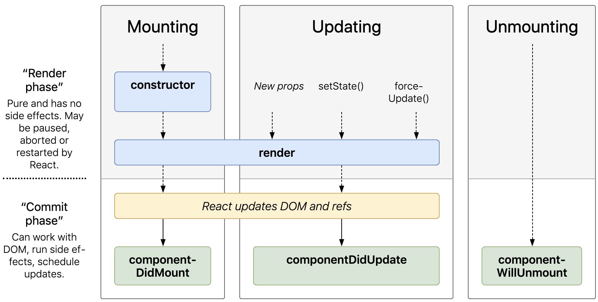

# November 24

## React Basics, State, and Events

<details><summary> every React class must have a <code>render()</code> method</summary>

As noted in [the docs](https://reactjs.org/docs/react-component.html#render), the `render()` method is the only required method in a class component. 

Recall that, in classes, the only thing you can define are methods. We can't just run JS code in a class. Hence, instead of using `return()` in a "naked" way as in a functional component, the `return()` must be within the `render()` method of a class. 

You should have something like the following for both kinds of components:

<details><summary> functional component</summary>


```javascript
const Card = (props) => {
  // { somePropsStuff } = props;
  // some JS code to run; can access props directly
  return(
    // some JSX
  )
}
```

</details>

<details><summary> class component</summary>

```javascript
class Card extends React.Component { // the Card class will be a sub class of the React Component class
  constructor() {
    // everything in here runs as soon as an instance of the class is created; lets us define instance variables
    super(); // allow yourself to be able to use all the cool things that come with the React Component class like state (we couldn't use state without this) and other things; recall that "super" calls the constructor function of the super class 
  }

  render() {
    // { somePropsStuff } = this.props;
    // some JS code to run; must access props using this.props
    return(
      // some JSX
    )
  }
}
```

</details>

A class without a `render()` method in React is literally useless. Every React class must have this method. Additionally, we have to `<our-class/component-name> extends React.Component` (i.e., we have to extend `React.Component`); otherwise, we just have a regular, garden variety class. And sometimes we'll make classes we do not want to extend such as utility classes that don't have anything to do with React. That's just to clean up our JS.

Since the class above is meant to be a React component, we must tell React that our class will extend the Component class from React.

</details>

<details><summary> class components force the idea of encapsulation on the developer</summary>

Using class-based or stateful components basically force the idea of encapsulation onto the developer. How? And what does this mean?

The basic idea is that an object should not only contain all of its own data but should also contain all the methods that change and effect that data. We want to make our components as self-sufficient as possible. They'll carry their data around with them; they'll also carry their `render()` around with them, and they'll carry around other methods with them as well. Hence, ideally, you'd be able to move these components across applications or parts of applications, and it should be as seamless as possible.

Alternatively, functional or stateless components are not encapsulated at all. 

</details>

<details><summary> React in its simplest form</summary>

### Minimal Needs

- **React:** Everything we make is a "React" element (not a DOM element). 
- **ReactDOM.render:** `ReactDOM.render` takes our React elements and gets them in the DOM (on the page)
- **JSX:** Allows us to commingle HTML and JS. This saves us from having to write TONS of JS.
- **Babel:** Converts our JSX into something the browser can understand.

### Using JSX and Babel

We use React to make React elements, and JSX allows us to write something like

```javascript
<h1 className='root'>Sanity Check</h1>
```

instead of

```javascript
React.createElement('h1', {className: 'root'}, 'Sanity Check')
```

This becomes an increasingly big deal as stuff becomes nested. Finally, JS is evaluated in JSX by something like `{2+2}` (i.e., "wax on wax off"), where we are effectively "leaving HTML mode" to enter "JS mode", where we can drop in expressions, variables, etc.

### ReactDOM.render and the Virtual DOM

- React keeps track of all React elements in "virtual DOM" object
- Whenever something changes, React builds a new "virtual DOM" object and ReactDOM compares them
- Because they are just plain JS objects, it's very, very fast
- ReactDOM then updates ONLY the part of the DOM that needs to change

### Component Basics

- Components are the backbone of React
- They are little pieces that make up the entire UI
- They always start with a capital letter
- They MUST close
- They look like HTML tags in JSX (but uppercase) (e.g., <Card />)
- They always return some HTML (technically a React element) so ReactDOM has something to put on the page
- They can be pure functions (simple)
- They can be classes (complex)

### Prop Basics

- Components are a lot like JS functions
- They can be rendered as many times as needed
- In order to change what they render, you can send them any data you wish (like an argument in a function). Such data is called props (short for "properties")
- A prop is anything inside a Component call after the Component name and looks like an HTML attribute
- Props are to components what arguments are to functions

### Components in an Array

- React allows us to put components in an array
- JSX can unpack that array
- We typically use `.map()` to build the array of components
- `map()` builds a new array and expects a return value

### Components as Classes

- Aside from regular JS functions, components can also be made as classes
- Classes do not return JSX, they have a `render` method
- The render method returns JSX
- Classes always extend React.Component (unless you are creating a pure class for your own JS reasons)
- `props` works the same way in a class but uses `this.props` (instead of just `props`)
- They have access to state and lifecycle methods

### Breaking Down Components into Small Parts

- Components can contain other components (these are called higher-order components)
- Think of it like the DOM:
  + a `div` lives inside another `div`:
  + A `<City />` lives inside of a `<CitiesContainer/>`

</details>

<details><summary> entry point for a React app using create react app</summary>

The entry point for the entire application is `index.js` in the `src` folder. This is where the dev server will start (using webpack). 

</details>

<details><summary> public accessibility in react app</summary>

In the `index.js` file of our `src` folder, we see the familiar

```javascript
ReactDOM.render(
  <App />, 
  document.getElementById('root')
);
```

Where is `'root'`? This is coming from the `index.html` file that is in the `public` folder of our root directory. Everything in this folder will be statically served. 

It won't be part of your react app--this is where you would put things like files (images, audio clips, videos, JS not part of react (like a library), CSS files, etc.)

</details>

<details><summary> what is state?</summary>

State may be loosely thought of as the value of variables at any given time. 

</details>

<details><summary> letting the linter help you out by importing your components into App while making them</summary>

When making a new component, it is often wise to go ahead and import that component in your `App.js` so that any issues you encounter while making your component are caught by the linter and you can be warned about them. 

By default, if you are not importing your component in `App.js`, then the linter will not be able to catch any problems in your component since your component is not actually being loaded into or looked at in `App.js`.

</details>

<details><summary> why must every class have the <code>render()</code> method?</summary>

If a class does not have a `render()` method, then it has no purpose. Why? Because React is a UI framework, and every component's job is to return something to the UI, something to the DOM, something on the page. If the class does not have a `render()` method, then this cannot happen and then the component becomes pointless.

</details>

<details><summary> where state gets initialized</summary>

Recall that the `constructor` for a class gets called immediately when an instance of the class is created. Inside of the constructor (i.e., before the `render()` method) is where you want to initialize state.

</details>

<details><summary> a class does not have to have a constructor</summary>

A class does not have to have a constructor--the purpose of the constructor is for code to run the moment an instance of a class is created. If you do not provide a constructor, then you are effectively not initializing an instance of that class with anything.

In React, if you have a constructor, then you will need to also provide `super();` within the constructor so your class gets everything it needs from its super class, the React Component classs.

</details>

<details><summary> best practices with state (what to do and what not to do)</summary>

- **changing state:** When you create a class in React, it is normal to do something like the following:

```javascript
this.state = {
  // key: value pairs
}
```

To change state, you should *never* do something like `this.state = ... ` later in your class. You should *always* use React's `setState` method. Why? Because, behind the scenes, React does a ton of things when executing the `setState` function. 

In OOP, something like `setState` is called a "setter," the idea being that you do not directly change the state yourself but hand that task off to something else (i.e., the setter) that sets it for you. 

[An answer](https://stackoverflow.com/a/2649116/5209533) on SO describes what setters and getters are in the context of OOP:

>A getter is a method that gets the value of a property. A setter is a method that sets the value of a property.  There is some contention about their efficacy, but the points are generally:
>
>- for completeness of encapsulation
>
>- to maintain a consistent interface in case internal details change
>
>More useful is when you need to add some logic around getting or setting, like validating a value before you write it.

As a last note, you can definitely (and often will) commingle state and props.

</details>

<details><summary> why would you ever want to use state or why is it useful?</summary>

The short answer is because this is JS, we're describing a UI that lives in the browser, and JS is an event-based language. What causes stuff to happen on any web page? What causes the UI or DOM to change? It's usally because the user clicked on something, submitted a form, or changed an input box, or whatever. So we're going to need to understand events in React.

Of course, state can change almost at any time within an application or component, but it's most often going to change in the context of certain events happening. 

</details>

<details><summary> DOM events in React</summary>

Often with JS you might see something like the following:

```HTML
<button onclick='myFunction()'>Click me</button>
```

In React, virtually every DOM event is still available but we use camelCase. So the above becomes

```javascript
<button onClick={() => myFunction()}'>Click me</button>
```

One of the differences that can be seen above is that in regular JS we just invoke functions in the `onclick` attribute. In React, we do not invoke code, we pass code. Hence, instead of directly supplying the code to run as we would in native JS, we will pass a callback to run.

So in React we might do something like

```javascript
<button onClick={() => console.log('Hi!')}'>Click me</button>
```

Above, note that `() => console.log('Hi!')` is a function we are passing--we are not running `console.log('Hi!')`; we are passing a function that runs `console.log('Hi!')`.

More often, because it looks cleaner, you will see something like the following:

```javascript
import React, { Component, Fragment } from 'react';

class SimpleEvents extends Component {
  state = {
    
  }

  handleClick = () => {
    console.log('You clicked me!');
  }

  render() { 
    return ( 
      <Fragment>
        <button onClick={this.handleClick}>Click me!</button>
      </Fragment>
    );
  }
}
 
export default SimpleEvents;
```

Notice how we define the class method above and then pass it to `onClick` (we do not run it--we pass it).

</details>

<details><summary> some normal events to take note of (click, input, etc.)</summary>

You need to keep in mind what you want to happen based on certain events. For buttons, we often want something to happen in response to a click event. Hence, we often have an `onClick` attribute for buttons in React.

For inputs, we are not clicking something--we are *changing* something. Hence, you often want to respond to an `onChange` event. 

For forms, you are not clicking something or necessarily changing something dynamically--you are *submitting* something. Hence, you will want to account for the `onSubmit` event.

</details>

<details><summary> all events in React</summary>

The [React docs](https://reactjs.org/docs/events.html) have useful information concerning what events are available. Specifically, you may want to see the [supported events](https://reactjs.org/docs/events.html#supported-events).

The `SyntheticEvent` wrapper is essentially a class that is used to try and normalize the way every browser works with events, just meaning that, for example, Firefox may have a slightly different `event` object than Chrome does, than Safari does, and so on. Instead, React uses the `SyntheticEvent` which makes sure they pretty much all behave the same way regardless of the browser.

</details>

<details><summary> when state changes, <code>render()</code> will run again</summary>

**Important:** Any time state changes in a React component, the `render()` method gets called again (unless we force the component not to render). 

`render()` is called the first time the component loads. Subsequently, `render()` is called whenever the component's state is updated (whatever DOM node needs to be changed is then changed based on React's virtual DOM ... the entire component is not rerendered, only the part that has changed)

</details>

<details><summary> React automatically binds <code>render()</code> to the class instance</summary>

With `render()`, why don't we see it written as 

```javascript
render = (event) => {
  // a bunch of JS
}
```

So that the `this` keyword is binded to the class? The answer is that React automatically binds its own methods to the class instance so we do not need to worry about the `this` context.

</details>

<details><summary> passing an argument based on event</summary>

Earlier we discussed how we might often want to write something like the following:

```javascript
<button onClick={this.saveCourse}>Save</button>
```

This is fine for when we want the saveCourse function to run just based on the event, but sometimes we might want to pass our function an argument. We *cannot* do something like the following:

```javascript
<button onClick={this.saveCourse(index)}>Save</button>
```

This would result in the `saveCourse` function immediately being executed, and we do not want that. Instead, we can write something like the following: 

```javascript
<button onClick={() => this.saveCourse(index)}>Save</button>
```

Hence, we can pass our function arguments from within whatever scope we are working in but delay its execution until the event we are looking out for has fired.

</details>

<details><summary> stateful vs. stateless components</summary>

It is good to have knowledge of what people loosely mean when they talk about stateful vs. stateless components:

- Stateful components are complex and smart
- Stateless components are simple, dumb, presentational, and pure

A stateful component has to make decisions and will have data that changes. That's what makes a stateful component smart or complex. The "complex" part has more to do with how, given an input A, we might end up with output B, C, D, or something else. We cannot always expect the same output given the same input.

A stateless component's job, however, is to do nothing other than to present some HTML or present something to the DOM. It doesn't manage any data and it isn't responsible for any other than to just present some stuff. A stateless component should be "pure" in the sense that we can *always* expect the same output given a certain input. Nothing ever changes. Hence. given an input A, we will always get the same output B.

To illustrate things even more via an example: Consider the following JS:

```javascript
function sum(x,y) {
  return x+y; 
}

sum(2,3) // always gives 5
sum(1,6) // always gives 7

/* Summary:
  - sum(x,y) will ALWAYS give the same output, namely x+y, given the same input. sum(2,5) will ALWAYS return 7 so long as we do not change the input values. The same input results in the same output every single time.
  - The sum function will always return the same output given the same input. In this universe, there will never be any deviation from that. The sum function does not use stuff coming from elsewhere that may change.
*/
```

Now consider the following JS alternative:

```javascript
const rand = Math.random();

function sum(x,y) {
  return x+y+rand; 
}

sum(2,3) // varies
sum(1,6) // varies

/* Summary:
  - The sum function will now have different output, namely x+y+rand, given the same input, namely x and y. Why? Because what is being returned, x+y+rand, is reliant on something that changes from the outside, namely rand.
*/
```

The whole point of stressing this points is the following: Our functional components will be pure--given the same input, they will always return the same output.

</details>

## The Component Lifeycle and HTTP

<details><summary> server-side rendering vs. what we typically aim to do with React</summary>

When we go to Wikipedia, we get the DOM for some page. When we go to another page on Wikipedia, we make an HTTP request and we get a whole new DOM. The server accepts our request and repackages a bunch of HTML, CSS, and JS which the browser can understand and ships that to us. Whenever we browse to a new page, this corresponds to a new request to the serve and a subsequent shipment of HTML, CSS, and JS. Basically: `new page request via HTTP -> server fetches appropriate HTML, CSS, and JS -> server responds with HTML, CSS, and JS which the browser parses and returns as a whole new DOM`.

We aim to change such a cycle with React. React is "back-end agnostic." Often one will be using Node.js and Express, but other options are certainly possible. 

The difference between server-side rendering and what React aims to do is that when we need any new data at all, we *will* make another HTTP request, but we will *not* get back HTML, CSS, and JS. Instead, we will get back JSON. And this will happen over and over and over. You can get back other things (XML, other files, etc.) but by far the most common is going to be JSON. 

And that is the route we are going to take. Instead of loading up a new DOM, it's going to be

```
HTTP -> JSON : HTTP -> JSON : HTTP -> JSON ...
```

So React can update itself. It's purely a UI library so it has no idea how the data was made or who is on the other end. It could be PHP, Node, Go, C++, etc. All React knows is that it got some data and that it can do something with it. The server's job is just going to be to kick back some JSON. 

Instead of server-side rendering, where the server does everything (like where you use templating engines to build the UI with the server and couple the logic), we are now creating a clean separation between front-end and back-end. This separation now means that there needs to be some chatter between the front-end and the back-end (i.e., chatter between the front-end, React, and the server that is going to provide the data, the back-end). To manage this chatter as well as other things, React gives us the component lifecycle which will help us manage how and when things should be happening.

---

</details>

<details><summary> HTTP requests using React</summary>

In order to make HTTP requests, we need an HTTP client. Because unlike Angular or some other frameworks, there isn't a built-in HTTP client with React. So we can use the `fetch` API which is built-in to native JS now. There's also the tested and tried `jQuery` where you can make AJAX requests the same way you always have. 

But here we will use [Axios](https://www.npmjs.com/package/axios). The reason for that is that it is the most commonly used HTTP client in production. 

---

</details>

<details><summary> state and HTTP requests</summary>

The concept of `state` is perfect when thinking about your needs in terms of handling data that needs to change. So when you have a class or component where you need to get some data externally or are simply concerned with changing data, `state` is how you will likely want to handle that.

---

</details>

<details><summary> async JS lending sense to lifecycle methods</summary>

Given how the event loop works in JS, if we are making an HTTP request, this is necessarily async so JS will execute the rest of our code first. This presents an interesting problem when dealing with classes in React. 

It presents the perfect opportunity for learning about lifecycle methods and why something like `componentDidMount` makes sense. We will, of course, want to do something with whatever data we receive from our async request. But JS will execute everything else first and React will first render everything without our data (due to how the event loop works). The solution is to use lifecycle methods and state. 

Specifically, in the case of making HTTP requests, you will often want to set your state to something empty that you wish to populate with your retrieved data, attempt to fetch your data in the `componentDidMount` lifecycle method, and then subsequently call `setState` which will cause React to rerender once the state has changed.

---

</details>

<details><summary> rendering order in React</summary>

Consider the following pseudocode:

```js
class Foo extends Component {
  constructor() {
    super();

    this.state = {temp: ''}
  }

  componentDidMount() {
    axios 
    ...
  }

  render() {
    ...
    return(
      ...
    )
  }
}
```

In what order does all of this execute? 

1. The very first thing that will happen when an instance of the `Foo` class is created is that `constructor` will run (which, in this case, means calling `super` and inhereting everything that comes with a React `Component` as well as setting initial values of `state`, etc.).
2. The `render` method is called and whatever is being returned is placed in the virtual DOM and then the actual DOM (on the first rendering of the application).
3. `componentDidMount` will get called after the initial `render` if this method is present (as it is above). The reason this is a sensible method is because of the single-threaded nature of JS. Anything asynchronous gets plucked out of the event loop and plopped onto the call stack. This method is where it makes sense to make HTTP requests using `axios`, `fetch`, or something similar. The idea is then to call `setState` once you have gotten the data back that you want.
4. Calling `setState` results in a rerender. The idea is to get one version of the DOM upon the initial render without the desired data (along with probably a loading screen of some sort). Once the desired data is obtained and the state updated, the state can then be used to render the DOM how we want.

---

</details>

<details><summary> rendering process in React (mounting, updating, and unmounting)</summary>

Here is the process:

| **Mounting** | **Updating** | **Unmounting**| 
| ------------ | ------------ | ------------- |
| 1. `constructor` | New props / new state |  |
| 2. `render` | 4. `render` again (as many times as needed) |  | 
| 3. `componentDidMount` | 5. `componentDidUpdate` | `componentWillUnmount` |

Every React component has to mount, where "mount" is simply the term for "it wasn't in the virtual DOM a second ago and I'm about to put it in there"; that is, the entire component is being rendered. 

Here is a high-level overview of the whole process:

- **Mounting:** The very first thing that happens is the `constructor` runs when the component is actually created or called by something else. So `index.js` starts everything with `ReactDOM.render(<App />, document.getElementById('root'));` which asks for `App` from `App.js`. When `App` gets asked for, the `constructor` for `App` will run, and then the `render` for `App` will run. And once the first `render` is finished, `componentDidMount` will run. And at this point our React component is just sitting there. It doesn't have anything else to do. After that, we get into the updating phase.
- **Updating:** The mounting phase is now over and the component is in the DOM. Thus begins the update phase. If we get new `props` or new `state`, then `render` will run again; as soon as `render` is finished running, `componentDidUpdate` will run again. And then we get new props. Then `render` runs again. Then `componentDidUpdate` runs again. And so on and so forth so long as new props or new state come in. Hence, in a nutshell, the update phase is a circular process that looks as follows:
  + new `props` or new `state`
  + `render`
  + `componentDidUpdate`
This process happens again and again and again (however long is necessary). Every time there is new props or new state, the component will rerender and `componentWillUpdate` will always follow. We need `render` to run because we need the component to update the virtual DOM. And `componentWillUpdate` will allow us to run logic after we have an update--we might need to know if something happened. 
- **Unmounting:** The unmounting process is when the component is going to get removed from the DOM. So, in this example, it may be that we do not need `App` anymore because we are going to go to something else. `componentWillUnmount` runs as a last gasp right before it's actually removed. So if we have logic we need to run, if we need to clear up something in memory or we want to alert some other component or some other part of the application, then we can do that inside of `componentWillUnmount`. 

The above is the lifecycle that components go through. There are a couple of other methods, but these are the most frequently used. The point is that the power of the component lifecycle is that it gives us the ability to patch into the process but let React manage how and when everything happens. We can use the methods React is giving us to optimize how everything is being processed and rendered. 

[Here](http://projects.wojtekmaj.pl/react-lifecycle-methods-diagram/) is an illustration of this process:

<p align='center'>
  
</p>

---

</details>

<details><summary> the React docs</summary>

The [docs](https://reactjs.org/docs/react-component.html) are always a useful place to go, *especially* for React. THey have gone above and beyond to detail everything clearly and to make things easy to use.

---

</details>

<details><summary> <code>componentDidMount</code></summary>

Check out [this lecture](https://www.udemy.com/course/react-js-from-the-beginning-w-redux-and-react-router/learn/lecture/14585602#overview) which uses Materialize for styling (the example involves creating a modal). 

The point in this example is that we are trying to access something in the DOM, and we need to do this *after* the component has rendered (so what we want to access is available). We can access such things by initializing what's appropriate within `componentDidMount`. Useful to know is how sometimes objects can be attached to the `window` object in the browser environment.

Any time you need to wait until that first `render` has run is when you need `componentDidMount`.

---

</details>

<details><summary> <code>render()</code></summary>

As noted in [the docs](https://reactjs.org/docs/react-component.html#componentdidmount):

> The `render()` function should be pure, meaning that it does not modify component state, it returns the same result each time it’s invoked, and it does not directly interact with the browser.

The first sentence above basically means do not call `setState` in `render`. If you are doing that, then you have likely organized your component incorrectly. The second sentence is in reference to the fact that `render`'s job is to just build the virtual DOM appropriate. `ReactDOM`'s job is to actually interact with the browser. And because of that they note the following:

> If you need to interact with the browser, perform your work in `componentDidMount()` or the other lifecycle methods instead. Keeping `render()` pure makes components easier to think about.

Note how this use case corresponds to what we did with the modal (where we needed access to something in the DOM, but we needed to wait for the first `render` before we could do that).

The bottom line here is to simply keep `render` pure. It should always return the same thing given the same input. That doesn't mean don't use state in render (we will do that a lot!). It just means do not set state or do not mutate state inside of render. That and any time state or props changes the render method will fire. So we will get that method firing any time one of those two things changes.

---

</details>

<details><summary> class methods and binding</summary>

Recall that you do not really need to bind class methods if you use the rocket functions.

---

</details>

<details><summary> <code>componentDidUpdate()</code></summary>

Recall that *any time* state is changed will result in a render. Often this might mean the constructor gets called first, then the initial render, then componentDidMount, and then render again (assuming state has been updated in componentDidMount)

Here is a sample usage of `componentDidUpdate`:

```javascript
  componentDidUpdate(prevProps, prevState, snapshot) {
    console.log('Component has updated ...');
    console.log('prevProps:', prevProps); // for this example with App we are not using props so this will not change but if it did change it would cause a rerender
    console.log('prevState:', prevState); // we are changing this each time, thus causing a render/update
    console.log('current state: ', this.state); // at the beginning this will come from once the component has mounted, where, right now, the default city is Atlanta
    console.log('snapshot:', snapshot); // 
  }
```

Notice how we have access to previous props and previous state via `prevProps` and `prevState`, respectively. This gives us the ability to look at what was and what is and to decide what needs to happen in our application. 

---

</details>

<details><summary> <code>snapshot</code></summary>

What is `snapshot`? [Here](https://reactjs.org/docs/react-component.html#getsnapshotbeforeupdate) is the documentation on it. The `getSnapshotBeforeUpdate()` lifecycle method is *kind of* like the `componentWillUpdate()` lifecycle method. 

If you needed some information like where the scroll position was at or where the mouse was at right before the DOM changed, then this method would be a way to do it. It's rare.

---

</details>

<details><summary> avoiding stack overflow by setting state inside of <code>componentDidUpdate()</code></summary>

Consider the following example of using `componentDidUpdate`:

```javascript
  componentDidUpdate(prevProps, prevState) {
    if (this.state.weather !== prevState.weather) {
      const isRaining = this.state.weather.includes('rain');
      if (isRaining) {
        this.setState({
          isRaining: 'Rain rain go away!'
        })
      }
    }
  }
```

Without the first conditional, can we see why we would get stuck in an infinite loop? It's because we would have to endure the following process:

1. Constructor is called.
2. Render is called.
3. componentDidMount is called, where the state is set 
4. Render is called again because the state changed
5. componentDidUpdate is called because render ran again
6. Render is called again (assuming we did not have the first conditional) since state was changed within componentDidUpdate
7. componentDidUpdate is called because render ran again
8. render is called again because componentDidUpdate set the state, etc. etc. 

We have to figure out a way to not repeatedly `setState` within `componentDidUpdate`. The way to do this is to use `prevState` (or `prevProps` when we are dealing with props).

To summarize, when a user submits a location, we want to check whether or not it is raining there. We can do this by comparing the current state with the previous state. Specifically, we want to compare the weather description of the current state to the last state. If there is a change, then we want to check whether or not the weather description includes "rain". If it does, then we will update the state.

The essential idea is to avoid setting the state each time as this will cause a stack overflow.

The `componentDidUpdate` lifecycle method will run after every single `render` (with the initial render being the only exception). The reason for that is because `render` will run whenever state changes or props change. And when either one of those happens, then `componentDidUpdate` will run. 

So you can either think about it as `componentDidUpdate` always running whenver there's a change to state or props or always running whenever `render` is called after the initial render (both are true but you can think about it in the best way you see fit). 

---

</details>

<details><summary> <code>componentWillUnmount</code></summary>

The `componentWillUnmount` hook is very useful for any cleanup that you need to do. If you have a heavy workload or a series of network requests in the background, then this will be the place to do that too.

Here is the contrived example Rob gives:

```javascript
  componentDidMount() {
    this.timer = setInterval(() => {
      console.log('test');
    }, 500)
  }

  componentWillUnmount() {
    console.log('component is about to be history');
    clearInterval(this.timer)
  }
```

From [the docs](https://reactjs.org/docs/react-component.html#componentwillunmount):

> `componentWillUnmount()` is invoked immediately before a component is unmounted and destroyed. Perform any necessary cleanup in this method, such as invalidating timers, canceling network requests, or cleaning up any subscriptions that were created in `componentDidMount()`.
> 
> You **should not** call `setState()` in `componentWillUnmount()` because the component will never be re-rendered. Once a component instance is unmounted, it will never be mounted again.

---

</details>

<details><summary> lifting state up</summary>

The React [docs](https://reactjs.org/docs/lifting-state-up.html) have an example concerning this. The general idea is that sometimes you will have siblings that need to *both* know about state. To let them both know you need to ask a question: "Who is our closest common ancestor?" In the React docs example, the closest common ancestor to the `TemperatureInput` components is the `Calculator` component. So `Calculator` is where we will put the state that both `TemperatureInput` fields need to know about. We will still have an `onChange` inside of both of the `TemperatureInput` components, BUT that method is going to be passed down from the parent, `Calculator`. So `onChange` will be sent down to both siblings as a prop. As a result, when the change happens in either input box, the input box is not going to manage its own state--it's going to be running its parent's function which is going to update its parent's state.

In summary, we have the `Calculator` parent component, and we are going to send down the `onChange` method in `Calculator` (which updates the state in `Calculator`) to two children components of `Calculator` that are siblings, the `TemperatureInput` component. When these children components run the `onChange` function (either one of them), it's going to change the parent's state (in this case, the `Calculator` parent's `temp` state will be changed). The parent's state will then filter down to everybody who needs it. So this way everybody can know if anything happens at any level because we've moved the state up to an ancestor they all share in common. 

---

</details>

<details><summary> styling components</summary>

See [the docs](https://reactjs.org/docs/dom-elements.html#style) for more information.

Often it is good to have a CSS file for a particular component. You can even conditionally give components certain classes to style under certain conditions ("conditional styling" essentially).

---

</details>

## React Router

<details><summary> why use React Router</summary>

[Here](https://reacttraining.com/react-router/) is the main site and [here](https://github.com/ReactTraining/react-router) is the GitHub site. From their site: 

> Components are the heart of React's powerful, declarative programming model. React Router is a collection of navigational components that compose declaratively with your application. Whether you want to have **bookmarkable URLs** for your web app or a composable way to navigate in React Native, React Router works wherever React is rendering--so take your pick!

One of the reasons for React Router is to make it possible for users to have bookmarkable URLs. If you want to share a link with someone, typically you want to share a URL that is specific to what you want to share, not just the general website. React Router gives us the ability to make this happen using **navigational components**. It also allows us to use the browser navigational arrows (front and back). So far in React applications, whenever we refresh the page we lose everything in the sense of memory or keeping track of where we are.

So React Router's job is to give us the ability to make a *real* single page application, where we manipulate the DOM as we have been with React but we can now use the URL bar. 

---

</details>

<details><summary> Router, Route, and Link</summary>

[The docs](https://reacttraining.com/react-router/web/guides/quick-start) note how to quickly get started. We will import the `Router` (which is an alias for `BrowserRouter`), `Route`, and `Link` components. 

The `Router` needs to go around everything it seeks to control. So, generally speaking, that will be at the App level.

You really only want one Router unless you really know what you are doing--because you only ever have one URL bar to work with.

The second thing we need is an actual Route. This is what determines what happens when we are at a given URL. 

The `path` prop for `Route` needs to be used with care. Something like 

```javascript
<Route path="/" component={Home} />
```

will render the `Home` component whenever a `/` is found in the URL bar. What we would likely want is only the `Home` component to render when we are *exactly* at the root of our application. We can accomplish that with the `exact` prop:

```javascript
<Route exact path="/" component={Home} />
```

When using React Router, we don't use `a` tags because these will take us *away* from the application. Think about it like this: when we load up, what loads up is `index.html`. This is a front-end framework and if we leave `index.html`, then everything has to start back over. It's not like a back-end framework. 

The idea is to use the `Link` component from React Router along with the `to` prop to tell us where to go. So we might have something like the following: 

```javascript
<Link to="/">Home</Link>
<Link to="/about">About</Link>
```

So here's the basic summary:

- **Router:** This is only going to be one time and will be around everything in our application. 
- **Route:** This can be used anytime we want to render a component *depending* on what URL you happen to be at.
- **Link:** This is going to be our new substitue for anchor tags. If we want to link internally within our React app, we're always going to use `Link`.

---

</details>

<details><summary> NavLink and making a NavBar</summary>

The docs are good! Sometimes the component name is a tipoff in terms of what you might want to look for. What might `NavLink` be about? How could it be helpful? [Here](https://reacttraining.com/react-router/web/api/NavLink) are the docs. From the docs about `<NavLink>`:

> A special version of the `<Link>` that will add styling attributes to the rendered element when it matches the current URL.

This becomes helpful because it gives us an `active` class to work with. Then, whenever we are on a certain page related to navigation, we can do something like 

``` CSS
nav .active {
  text-decoration: underline;
}
```

to get decorations for active links/routes.

---

</details>

<details><summary> routes with component vs. render</summary>

So far we have just used the `component` prop on the `Route` component. There's another one called `render` which is quite important. Consider the following problem we may find ourselves running into:

```javascript
<Route exact path="/host" component={Home} />
```

This renders the `Home` component in its most basic form. But what if we want to pass props to the `Home` component as we have done previously? Trying something like

```javascript
<Route exact path="/host" component={<Home title="Homepage"/>} />
```

will result in an error. If we need to pass props to something, then we can use the `render` prop (which accepts a callback that returns something--what we will want the callback to return is our component with the desired properties) like so: 

```javascript
<Route exact path="/" render={() => (
  <Home title="This is the homepage!" />
)}
/>
```

So `render` is very very important because anytime you need to do more than just render a component (there will be lots of reasons you might want to do that), then you'll use `render` instead of `component`. 

---

</details>

<details><summary> nested routes</summary>

See the 5 minute mark in [this video](https://www.udemy.com/course/react-js-from-the-beginning-w-redux-and-react-router/learn/lecture/15022168#content) to more clearly think about when the `exact` path should be used for props. If you are using nested routes, then the "root route" or "parent route" for any child route that conditionally renders a component cannot have the `exact` prop or else *none* of the children routes will be able to be displayed. 

In the video explanation, the reason why is because certain routes will be inside of a component that is conditionally rendered by the parent route. Well, if the parent route only renders the component at an exact path, then it will not render at a "sub path" or a nested route.

---

</details>

<details><summary> router component props (history, location, and match)</summary>

Of the properties we are about to look at, if something is not being rendered inside of a `Route` component, then you will not have access to any of the props that come along with the `Route` component. 

So how could we get something like the `NavBar` component to be on every single page and also give it the powerful props that the `Route` component furnishes? The trick is to do something like

```javascript
<Route path="/" component={NavBar} />
```

where we leave off the `exact` prop because we actuall do want to the `NavBar` to be present on every single page. Doing this will give us access to different props that NavBar will then have, namely `history`, `location` (which is similar to `window.location`), and `match`.

The `history` object is a stack which is a fancy CS term for something that is LIFO (Last-In-First-Out ... kind of like dealing a deck of cards and picking from the top of the deck) rather than a queue which is a FIFO (First-In-First-Out ... kind of like getting in line and being admitted).

The `length`, which is a property of the `history` object, provides the number of how many things are on the stack. 

Note that the `history` object has a variety of methods attached to it. Some of those may be useful in time. 

Another "gotcha" to be aware of is how, by default, if you wrest control from `Route` and use `render` instead of `component`, you are effectively saying how you want your component to be rendered, and you do not get the default properties from `Route`. To fix this, you can do something like the following if you want *all* the props that come along with `Route`:

```javascript
<Route exact path="/" render={(props) => (
  <Home title="This is the homepage!" {...props} />
)}
/>
```

Or, if you only want the `history` prop and the `match` props, for example, then you can do something like

```javascript
<Route exact path="/" render={(props) => (
  <Home title="This is the homepage!" history={props.history} match={props.match} />
)}
/>
```

Note that the above manner of handling things (i.e., receiving props from Route) is exclusive to when we use `render` instead of `component` with Route. This is because we are manually telling React how we want to render our component, and we are not doing that when we just use the component prop (we're letting the Route decide in that case and it adds the props itself).

We may eventually want to use the `push` method for the `history` object. What does this do? We can "programmatically" move a user around our site: 

```javascript
import React from 'react';

const Home = (props) => {
  console.log(props);
  setTimeout(() => {
    props.history.goBack()
  }, 2000)
  return ( 
    <h1>{props.title}</h1>
  );
}
 
export default Home;
```

This example "pushes" the user onto the help page once being on the homepage for 2 seconds. (This is obviously not a good use case, but the idea is explained in more detail below.)

Because the `history` object is a stack, if we `push` something on top of it, it will make that the last in for the LIFO, and it will be the place that the browser ends up pointing. So if we wanted to programmatically move someone forward (i.e., so far we have been moving the user around the application based on their clicks, but there are times when we are going to want to move the user when they didn't click on something--so something happens, an event happens, an AJAX request fulfills, etc.), then calling `push` against the `history` object would be one way of doing this.

See [here](https://reacttraining.com/react-router/web/api/history) for more details about the history object. As noted there in the docs, we can use `history.block` to prompt the user upon exiting a route or something similar. 

---

</details>

<details><summary> match (dynamic URLs and URL params--short review</summary>

The `match` prop for `Route` will be useful in a variety of ways. One of the most evident: 

```javascript
<Route exact path="/about/:who" component={About} />
```

We can now access the value of whatever parameter is supplied by something like: `match.params.who`. So if someone went to `about/us`, then `match.paramas.who` whould return `us`. 

---

</details>

## Redux

<details><summary> what is Redux?</summary>

The simple answer is that Redux is a state management tool or a library.

So far we have done only component-based state management. Sometimes we have managed state just directly in a component or passed state down as props. We have also, when needed, had to lift state up to a common ancestor to be used by one or more components (as was the case with the AWS flashcards project). While lifting state up can be nice in its own particular use case, the process of refactoring things to lift state up can quickly get out of hand.

Essentially, the process of lifting state up is great for *small* applications. But if you ever get your dream job and have to work with a very large code base, the odds are that you will not be working with tiny code bases. Instead, you will end up with something like the following (probably even more complicated):

<p align='center'>
  
</p>

Moving state up so that the bottom left yellow component and the far right component know about what has just happened will be a nightmare. You will end up passing callbacks 10 layers deep, and ultimately everything will end up living at the very top, in the `App`. Redux aims to solve this problem.

Redux is going to create a store that is sort of external to our application (i.e., it's outside of the component structure) and create a pub/sub type model (i.e., publish/subscribe to the store). The idea is that if something happens in a component, then that component can update the store instead of having to worry about prop drilling and getting into callback hell. So the component can "push" or "publish" out to the store something that happened. Meanwhile, if a component elsewhere needs to know about what has just been pushed or published to the store, then that component can subscribe to the store and be notified when that thing happens. 

So Redux is going to sort of work like a global store where we can keep *application* state (not component state) because we are still going to use state as we have, but we're going to start using Redux which will give us the ability to put stuff in a place where any component can use it. What's the upshot of all this? If we end up adding another feature component (which possibly has children) that adds an action that other components need to know about or it simply needs to know about something from another component, then instead of passing down state or callbacks many layers deep, we can simply go straight to the store and get the information we need.

Redux is for large applications. So sometimes its use will be rather contrived, but it is phenomenal for managing application state in an easy and maintainable way that can be scaled over a long period of time over a whole bunch of developers because it creates good uniformity for how the whole application manages its state.

---

</details>

<details><summary> Redux and React</summary>

In any Redux/React app we have a couple distinct pieces. We have the Redux piece and the React piece. Redux has no idea that React exists. It's not going to and it doesn't need to know. Meanwhile, React has no idea that Redux exists. In the same way, it doesn't need to know, and we are going to keep them completely separate. Redux is not meant to work exclusively with React. You could use Redux with Vue, Angular, or just the library itself. React obviously does not need Redux since people often use it without Redux.

So some things we talk about concerning Redux are Redux-specific and some will be React-specific:

| **Redux** | `react-redux` | **React** |
| --------- | ------------- | --------- |
| actions | Provider | state |
| reducers | connect | components |
| dispatchers |  | props |

In order to get Redux to communicate with React, we are going to have something in the middle called `react-redux`, a module the community has built to help the two talk with each other. So Redux is going to talk with `react-redux` and React is going to talk with `react-redux`. So React and Redux will communicate with each other through the `react-redux` intermediary (i.e., module). 

Concerning the store, we can put as much or as little as we want into it. The store is basically going to be the place that any component can go to and either update the store or get stuff from the store. 

Concerning the React app, we have `index.js` as the top level which renders `App`, the next top level. Then all the components branch out from `App`. 

Our goal is to make it possible for any components branching off from `App` able to talk with the store that Redux gives us. The way we are going to do that (since React and Redux do not know anything about each other by default) is that the `Provider` is going to know about the store, and we are going to take the `Provider` component and we're going to "bear hug" the entire React application. By "bear hug" what is meant is that we are going to render the `Provider` component inside of `index.js`, the top-most level of our React app. So `index.js` is going to have `Provider` inside of it, and `App` is going to have the `BrowserRouter` (or `Router`) wrapped around it. So we're going to have both things so that way any component inside of React, if it needs to access something from the Store, then it's already inside of the `Provider` component so it will be able to go to the store, and it will do so by means of the `connect` function that will be inside of it. So `connect`, which is part of `react-redux` just like `Provider` is, will be inside of a component that needs to know about Redux and because that component is inside of the `Provider`, it will be able to go to the store.

The main point is that Redux and React are not connected in any way by default. Redux has its own moving parts. React has its own moving parts. And `react-redux` is going to get them to work together. Why? Because we want our components in React to be able to go to the store and grab state or update state from anywhere in the application in a seamless and trouble-free way as possible. 

This is kind of what it looks like from afar:

<p align='center'>
  
</p>

---

</details>

<details><summary> how Redux works</summary>

Redux has the store which has an object, and that makes up the application state. It can be as big or as small as we want. The way that Redux works is the store is informed by a bunch of little functions called *reducers*. So we have a bunch of functions (i.e., the reducers) that return a piece of state. Whatever they collectively return will make up the store. 

So the store itself we never put anything in there. We never mess with the store directly. Instead, we use the reducers. They're functions that return a piece of state and then Redux will handle updating the store. It's similar to `this.setState()` in React. We never ever mess with state directly in React. The same goes with Redux--we never ever mess with the store directly. We use these reducers that return little pieces of state, their own little pieces of state, and all of those things together, aggregate or collectively make up the store. 

The reducers are not built into Redux. They are functions we are going to write and that we are completely responsible (there are a few rules for them that we will soon get to). So in a nutshell: Reducers are just tiny little functions that we write ourselves that return pieces of state and that state, all added together, will create the entire store. (You can think of the store as a grocery store and the reducers as the different departments that make up the grocery store.)

In order to update the reducers, we have what are called action creaters, which we are going to have to write as well. And action creators are also little functions. They are little functions that create actions. These are big Redux terms:

- Store
- Reducers
- Action creaters
- Actions

An action is simply going to be a little object, and there are rules surrounding the actions, but at the absolute bare minimum for an action is that it is an object with at least a property of `type` (e.g., `{type: auth}`). So an action is just very simply, in its most basic form, an object with a property of `type`.

An *action creator* is a little function that makes one of those. So an action creator will return an action. 

So reducers are little functions that return state that gets put in the store. Action creators are little functions that return actions. What's an action? It's just an object with a type property. That's as complicated as it is. That's all there really is to it. 

The last thing is that there is a dispatch. And the dispatch is a function that is built into Redux. This one we don't make. We write the reducers, the action creators, and the actions ourselves, but we *do not* build the store and we *do not* build the dispatch. The dispatch is given to us. It's part of the store. And what the dispatch does is it dispatches an action. So the action creator will make an action, and when the action gets triggered, it will go to the dispatch, and the dispatch will send that action (which is just an object with the `type` property and other possible properties as well) and will inform all of the reducers about it. It will let every reducer know, "Hey, something happened." In this case, it would just be, "I got an action with a `type` of `auth`. Don't know if you care, but I'm just letting you know." And then our reducers will kick into gear--these are functions that we will write. And those functions will decide, "Do I care about this particular action? Do I care about this particular type?" Ultimately, we are going to have a `payload` in most of these actions (which sometimes is an array). 

So what will happen is the action creator will fire off an action, that action will go to the dispatch, and then the dispatch will send it out to each reducer because it has a `type`, and each reducer will know, "What `type` of action is this?" And, "If I care," it can grab the `payload` and return a different piece of state. If it doesn't care, then it can return the old piece of state. Whatever happens, all the reducers will get notified every time an action is sent off by an action creator. And that is how the store will get updated. The reducers return their little pieces of state. And those end up creating one big object in the store. Those individual reducers will get notified every time an action happens by the dispatcher and they can update themselves based on the payload or whatever. But they'll always know what `type` of action it was because of the `type` property on the action.

---

</details>

<details><summary> wiring up Redux (all the gory details)</summary>

Here is a frame of reference for how everything is supposed to work (you do not have to follow these things in the given order, but it's how some people set things up anyway):

### 1. **use react-redux and wrap the Provider component around everything:** 

```javascript
import { Provider } from 'react-redux'
```

---

In order to wire up a redux/react app, we need `react-redux`. This is the glue between them. Specifically, we need the `Provider` component to be around *everything*. So you will want to 

```javascript
import { Provider } from 'react-redux'
```

So you're not just going to render `<App />` anymore as in

```javascript
ReactDOM.render(<App />, document.getElementById('root'));
```

in `index.js`. We're going to render the `Provider` component which is coming from `react-redux` and that's going to go around everything. It's not going to stay that way, but we can set it up this way:

```javascript
ReactDOM.render(
  <Provider>
    <App />
  </Provider>,
  document.getElementById('root')
);
```

If we try to run things right away, then we will get a `TypeError: Cannot read property 'getState' of undefined` error. The reason for this is because the `Provider` component connects the Redux store with the React application. And right now we do not have a store! The above is trying to render a `Provider` *without* a store and that's not okay. 

### 2. **create the store:** 

```javascript
import { createStore } from 'redux'
```

---

Create the Redux store so that Redux exists and the `Provider` has a store to work with:

```javascript
import { createStore } from 'redux'
```

Hopefully this will help you remember where things are coming from: We've got `react-redux` which is the module from which `Provider` comes, and we've got the `redux` module from which `createStore` comes. If you see `redux` as the module you're importing from, then that means React does not know about this thing, and it means `react-redux` does not know about this thing. You could use this in any other framework or just in native JS. This is simply part of `redux`. Now, we're going to give the store to the `Provider`, but at this point `import { createStore } from 'redux'` has nothing to do with anything--it's just pure Redux. 

### 3. **reducers to populate the store:**

What makes up the Redux store? If you remember, they are functions that return a piece of state. What we need are *reducers*. So we need reducers to populate the store! The store by itself is just like an empty building. We need reducers to make the store useful. The store is just an aggregate of the reducers. We have to have at least one reducer in order to have any store. And the way that this part works is that we always start with a `rootReducer`. 

What that means is that we are going to make one sort of "master reducer", which may be thought of as the store manager, that will import all of the other reducers. Oftentimes you will have a `reducers` folder inside of `src` in your React application, and inside of `reducers` the `rootReducer` will often be simply called `index.js`, but given how this name can be used all over the place, sometimes it is easiest to just name the `rootReducer` as `rootReducer.js`. 

Inside of that file will be the `rootReducer`. Now, to make a `rootReducer` we will need to get a method from Redux called `combineReducers`, which does exactly what its name implies. Each individual reducer will get combined together into one big store. We can get this method as follows:

```javascript
import { combineReducers } from 'redux'
```

The next thing we will need to do is to actually get each individual reducer. So we'll need to make them and import them. So think back to what a reducer actually is. A reducer is just a function that returns a piece of state. The simplest reducer you might get would be something like

```javascript
export default (state = [], action) => {
  return state;
}
```

Note that all reducers have 2 parameters:

1. Current state (usually provide a default state like the empty array above)
2. Info that came from any action

The reducer example given above is totally useless because it will always return an empty array. But it qualifies as a reducer because it's just a function. We could also write the above reducer using non ES6+ syntax (we will use the syntax above but the syntax below is worth knowing and being aware of):

```javascript
function frozen(state = [], action) {
  return state;
}

export default frozen;
```

To get the above reducer into the `rootReducer`, we will call our imports in the `rootReducer.js` file:

```javascript
import frozenReducer from './frozen';
```

We now need to call `combineReducers` and hand it an object. Each key in `combineReducers` will be a piece of state in the redux store. Each value will be a reducer, and that reducer will return a piece of state (so each value will be the value of that piece of state in the redux store). So for this example we can write something like the following:

```javascript
const rootReducer = combineReducers({
  frozen: frozenReducer
})
```

The above chunk of code means that in our Redux store we will have a little piece of state called `frozen` and the value of `frozen` is going to be whatever the `frozenReducer` returns. What does it return? Well right now it only ever returns `state` where `state` is an empty array so this is hardly useful, but hopefully the utility of all of this is starting to become apparent. But this is how Redux works is we will add another reducer for the produce and the produce will be another little piece of state inside of Redux. So, in this way, you can add as many new features, remove old ones, access any particular part of the Redux store by grabbing the return value of a little piece of state from the reducer.

From `rootReducer.js`, once we have imported all of the reducers we need and combined them using `combineReducers`, we should `export default rootReducer` the `rootReducer` we set up above. 

We can then import the `rootReducer` from our very top-level `index.js` file. We are now actually ready to create the store by passing `createStore` from the `redux` module the `rootReducer` we exported as the default export from `rootReducer.js` and imported as `rootReducer` in our very top-level `index.js`:

```javascript
const theStore = createStore(rootReducer);
```

Since the `Provider` is the glue between Redux and React, we need to use its `store` prop and give it the value of `theStore` we created above:

```javascript
ReactDOM.render(
  <Provider store={theStore}>
    <App />
  </Provider>,
  document.getElementById('root')
);
```

---

</details>

<details><summary> wiring up Redux (just the necessary pieces with comments)</summary>

After creating our React application using `create-react-app`, we should do the following:

```BASH
npm i redux react-redux
```

Then create a `reducers` folder inside of the `src` folder and make two files:

1. `frozen.js` (this is a dummy reducer)
2. `rootReducer.js` (this will be the `rootReducer`; in other codebases you will often see this simply as `index.js`)

To get everything wired up after running `create-react-app` and creating the two files above, our files should look as follows (comments provided to make things easier for reference):

<details><summary> <code>index.js</code> (the top-level index that renders <code>App</code> by default) </summary>

```javascript
import React from 'react';
import ReactDOM from 'react-dom';
import './index.css';
import App from './App';

// 1. In order to wire up a Redux/React application:
// - We need react-redux so that React and Redux can communicate with each other. We also need redux because react-redux will be useless without redux!
// - We need the Provider component to be around everything or "bear hug" the application. // - So you can start in the terminal with "npm i redux react-redux" and then import the Provider component:

import { Provider } from 'react-redux';

// 2. Create the redux store so that redux exists and the Provider has a store to work with:

import { createStore } from 'redux';

// 3. Provide/create individual reducers to populate the store. All of these reducers will be provided to the store as a single reducer known as rootReducer that may be thought of as the "store manager"

import rootReducer from './reducers/rootReducer';

// 4. Create the store by instantiating a variable with a value equal to the following: createStore(rootReducer):

const theStore = createStore(rootReducer);

// 5. Provider is the glue between React and Redux. Pass the store you created above as the value for Provider's store prop:

ReactDOM.render(
  <Provider store={theStore}>
    <App />
  </Provider>,
  document.getElementById('root')
);
```

---

</details>

<details><summary> <code>rootReducer.js</code></summary>

```javascript
// This is the root reducer! It is the store manager for all the reducers.
// To make a rootReducer:

// 1. Get a method from redux called combineReducers:

import { combineReducers } from 'redux';

// 2. Get each individual reducer:

import frozenReducer from './frozen';
// ... import all the other reducers here ...

// 3. Call combineReducers and hand it an object. 
// - Each key in combineReducers will be a piece of state in the redux store. 
// - Each value will be a reducer, and that reducer will return a piece of state (so each value will be the value of that piece of state in the redux store)

const rootReducer = combineReducers({
  frozen: frozenReducer
})

export default rootReducer;
```

---

</details>

<details><summary> <code>frozen.js</code></summary>

```javascript
// This is just a dummy reducer!

export default (state = [], action) => {
  return state;
}

// Below is the syntax one would use to avoid ES6+

// function frozen(state = [], action) {
//   return state;
// }

// export default frozen;
```

---

</details>

That is all that is needed to get things wired up. Of course, nothing is really happening just yet (note how currently `rootReducer` is purely Redux while any component we would normally make is purely React ... we need some way of CONNECTing these ... covered below), but that's what all is needed to get the show on the road as it were.

---

</details>

<details><summary> CONNECTing Redux and React</summary>

We are now going to actually connect what is in our Redux store with an actual component (what good is state in the Redux store unless our components can actually use the state!?). So to recap where we ended previously: 

We have the `Provider`, and the `Provider` has access to `theStore`, where `theStore` is made up of the `rootReducer`, where the `rootReducer` is made up of a bunch of little reducers, and each one of those little reducers returns a piece of state. So the `rootReducer` is the manager of the store. (The store is like an empty building if it doesn't have any reducers.) The `rootReducer` doesn't return any state on its own--it simply collects all the individual reducers. Continuing our metaphor, each individual reducer is like a department in a grocery store. In this case we have the `frozen` department. So we have at least one department for the manager (i.e., the `rootReducer`) to manage. And the manager can hand that to the store. Per our analogy, we currently have a store with just one department in it, the `frozen` department, but we'll add some more departments in just a second. 

With everything as it currently is in the codebase described previously, we can create a `FrozenDept` component (in a `components` folder inside of the `src` folder) that will connect to and make use of the Redux store:

<details><summary> <code>FrozenDept.jsx</code></summary>

```javascript
import React, { Component } from 'react';

/* Connecting this component with Redux
  - This is the part now where we want to grab from the Redux store a piece of state. So this is that application state kind of thing, where we have a component, FrozenDept, and rather than the component managing the state itself, it's being managed inside of Redux. So ANY COMPONENT can grab it. This is not a practical example that follows because we only have a tiny application, which you would never use Redux for, but it will be useful to see how to finish wiring things up so that we can finish connecting Redux and React so that a component can get something out of the Redux store.
  - We want this component to know about Redux. To do that, we need some help...or some glue.
  - The glue is react-redux! We need the connect function. So we needed Provider up top in order to get everything started, but at the component-level what we need is a connection from React to Redux.
  - If a component needs to know about Redux, then this is what we are going to use EVERY SINGLE TIME: import { connect } from 'react-redux';
  - The export from a component will be a dead giveaway in terms of whether or not you are using Redux. You will not be exporting the default component anymore. Instead, you are going to export default the connect with the component
*/

import { connect } from 'react-redux';


class FrozenDept extends Component {
  state = {

  }

  render() {
    console.log(this.props.frozenData);
    /* What we have managed to accomplish when the above works and reaches into the Redux store:
      - If we go back to App.js, then we see we only call <FrozenDept /> and do not pass props as we normally might: <FrozenDept frozenData={} />
      - Instead of the parent sending down frozenData as props, we are reaching into the Redux store via mapStateToProps and we're mapping a piece of state in the Redux store, namely "frozen" (whose state value is the value returned by the frozenReducer), to this component's props. Even though we only reached out to grab the "frozen" piece of state, we can easily imagine grabbing more than just this one piece of state.
      - We have the "frozen" piece of state from the Redux store mapped to this component as a prop which we locally call "frozenData". This piece of state that has been mapped to this component as a prop can now be accessed using this.props.frozenData or whatever we choose to call this piece of state locally.
      - "export default connect(mapStateToProps)(FrozenDept);" is the Redux part. What we are saying is let's set up a function, mapStateToProps, and go and fetch something from the Redux store, and then let's hand it to the component, FrozenDept.
    */
    
    return (
      <h1>The frozen food department!</h1>
    );
  }
}

// console.log(connect);

/* mapStateToProps (how it works):
  - mapStateToProps takes one argument, "state", and that is the rootReducer/Store
  - mapStateToProps returns an object with:
    + property is the local prop name to this component (so whatever we put on the left is what this component is going to know that thing as)
    + the value will be the property in the rootReducer, that is, a piece of the store
  - We want to return an object and we need one of the properties of the rootReducer. What are the properties of the rootReducer? Well, we've only got one for this example and it is "frozen". So as far as connect is concerned we can return something, and we can call it anything we want--we're going to call it frozenData below.
  - So we've got a function, mapStateToProps, which returns an object, where we are creating a local property, frozenData, to this component that is not being sent down from a parent--it's coming from connect, which is getting it from the store. What does the store have? Well, the store or the rootReducer IS state. What properties do we have as options right now? Well, we only have one right now, namely "frozen" so if we use state.frozen then we are going to get the return value of frozenReducer. What is the return value of frozenReducer? It will be state. What is state? Right now it's always going to be an empty array but not for long.
  - RECAP: mapStateToProps takes state as its argument, where state is the rootReducer. The rootReducer has a property of frozen. We're going to map that state to this component's props, and that prop is going to be called frozenData.
*/

function mapStateToProps(state) {
  return {
    frozenData: state.frozen
  }
}

// export default FrozenDept;
export default connect(mapStateToProps)(FrozenDept);

/* What's happening with connect:
  - connect, somewhere inside of redux, is returning a function
  - The function that connect returns takes an argument which is the component we want to render
*/

/* What connect take as arguments:
  - We can find out by simply running console.log(connect) above.
  - First arg: The first argument is going to map a piece of redux state to this component's props and is going to be called mapStateToProps
*/


/* If the above syntax looks funky, then try to make sense of something like x(1)(2) in JS:  

  function x(n) {
    return (m) => {
      console.log(n+m);
    }
  }

  x(1)(2) // 3

*/

/* NOTES: 
  - Right now this may seem weird and not particularly useful. Why would anyone do this? We still need a bigger project to really make this whole thing shine. But everything above covers this portion of actually connecting React to Redux.
  - Soon we will get an action creator and an action going that will actually give us the ability to update our state. (And we can add a couple more reducers.)
*/

```

---

</details>

---

</details>

<details><summary> adding more reducers to our store</summary>

Naming conventions: It is often not a bad idea to name your reducers `<reducer-name>Reducer.js`. It just gets easier to track things. 

Note that *every* time you add a reducer you have to go to the `rootReducer`, import the new reducer(s), and then specify in the `combineReducers` what you want the little piece of state being returned by the reducer to be called (what you have called this piece of state will be a new key, and the reducer itself will be the value for this key). For example, say we start with

```javascript
import { combineReducers } from 'redux';

import frozenReducer from './frozenReducer';

const rootReducer = combineReducers({
  frozen: frozenReducer
})

export default rootReducer;
```

as our `rootReducer.js` file. Then, after writing two new reducers, `produceReducer` and `meatReducer`, we might want to have something like the following:

```javascript
import { combineReducers } from 'redux';

import frozenReducer from './frozenReducer';
import produceReducer from './produceReducer';
import meatReducer from './meatReducer';

const rootReducer = combineReducers({
  frozen: frozenReducer,
  produce: produceReducer,
  meat: meatReducer
})

export default rootReducer;
```

Note how the new reducers `produceReducer` and `meatReducer` have been imported, and we have called the pieces of state they return in `combineReducers` as `produce` and `meat`, respectively. Then, in whatever component we want to access these new pieces of state we can update our `mapStateToProps`:

```javascript
function mapStateToProps(state) {
  return {
    frozenData: state.frozen
  }
}
```

becomes

```javascript
function mapStateToProps(state) {
  return {
    frozenData: state.frozen,
    meatData: state.meat,
    // only add in here what you want access to--so maybe we don't need access to the produceData
    // produceData: state.produce
  }
}
```

So this is the beauty of Redux. Any time new data is added to the store, any component can have access to it almost instantly. You just have to drop the one line into `mapStateToProps` and suddenly it's accessible. Above, we started with just access to the `frozen` piece of state from the store by accessing it as a prop (hence `mapStateToProps`) and locally calling it `frozenData`. But now maybe we want to access the `meat` piece of state from the store. No problem. Just drop `meatData: state.meat` into the `mapStateToProps` function.

This gives us a ton of flexibility. No longer do we have to rearchitect our entire application by moving state up and creating callbacks at the appropriate level and so on. So this is a huge win. 

---

</details>

<details><summary> adding an action creator and action</summary>

The question now becomes, "Okay, what if we want to update the quantity of something?" So we might want a plus/minus button for "TV dinners" from the frozen state mentioned previously. Basically, we are trying to update the state or update the store. 

The process of copying code over from one component to another should be setting off alarms in our heads. We shouldn't have separate components for Frozen, Meat, and Produce. We should really have a Department component and so forth. The reason we are not doing it for this illustration is not because we are being lazy--the reason we are not doing it is because we want to maintain three separate components all pulling from the Redux store independently. 

Recall this illustration of Redux:

<p align='center'>
  
</p>

So far we have done all store and all reducers. But the reducers are what make up the store. Just a bunch of little functions returning a piece of state. In order to change the store we change the reducers. And in order to change the reducers we have the dispatch. The dispatch will take an action and will send it up to each individual reducer (we'll get to that in a minute). Actions, however, are made by action creators. And action creators are just functions. So now we are going to make a couple of action creators with a couple of actions. Often you will do this by creating an `actions` folder inside of the `src` folder for your app.

What we really want to do is connect our action creator to our component. And then send the action that the action creator returns on through the dispatcher so that all the reducers can get notified.

---

</details>

<details><summary> adding the dispatcher</summary>

We are now going to connect the dispatcher to our components. We'll start with just using examples as they relate to everything "frozen".

We have the `FrozenDept` component that uses Redux state. We've got the `frozenInvUpdate` which is the action creator that the `FrozenDept` component is going to want to run if the `increment` function runs in our example. And the `frozenReducer` is the reducer is the state inside of Redux that's informing the `FrozenDept` component. This is where everything can get really confusing. We are going to now attach everything! It may be necessary to come back and watch [this video](https://www.udemy.com/course/react-js-from-the-beginning-w-redux-and-react-router/learn/lecture/15352092#overview) again after having done a project or whatever. There's just a lot going on because we are attaching absolutely everything now. But at the end of the video above, we will know almost everything that we need to know about Redux with respect to React. There will hardly be anything else that you ever need to do. It's just going to be JS and logic and whatnot. But you'll know all of the moving parts necessary to make Redux work seamlessly with React.

Instead of just having a `type` for the action you return from your action creator, you will often want to have a `payload` to update the state in the Redux store. This is the most common object you will pass in Redux, an object with a `type` and a `payload`. You have to have a `type` because we are dealing with an action. And then the other thing you'll usually have is the `payload`, and the payload just contains data or stuff that comes along with the particular type we specify. So you might see something like

```javascript
export default (operation, index) => {
  console.log(operation, index); // we don't want to just log to the console, so we create a payload for our action
  return {
    type: 'updateFrozen',
    payload: {
      operation,
      index
    }
  }
}
```

This is great, but we still do not have any connection to Redux. Let's go back to the diagram:

<p align='center'>
  
</p>

This is all Redux stuff. The component has no idea that any of this stuff exists. React doesn't know about any of this stuff. React is running a function that has an action, but it's not connected to the dispatch in any way. So we do technically have the action creator and the action it is returning, but it's not really a part of Redux because right now it will never get to a reducer, and reducers make up the aggregate state in the store which is the whole point of Redux. What we need to do is make it so that the component can call the action creator, but we need to change it so that when we call `updateFrozen` it goes to the dispatch. And then from the dispatch it will go to each reducer. That way the reducer can update itself, update the store, and then inside of our `FrozenDept` component, where we are mapping through `this.props.frozenData` from the Redux store, we'll be mapping through a new, updated thing, a new piece of state from the Redux store that has been updated by a reducer(s) which has been updated by a dispatcher(s) which was sent an action from an action creator. 

We can do something like the following to see some of the innerworkings of Redux:

```javascript
export default (state = seedData, action) => {
  console.log('Frozen reducer is running!');
  console.log(action);
  return state;
}
```

The actions we would see by default are the ones that Redux core runs and passes to the dispatch, something like 

```javascript
{type: "@@redux/PROBE_UNKNOWN_ACTION0.f.w.k.m"}
```

Now we don't care about these actions. But this is how the dispatcher works. We do care about *our* actions however. We want to make it so we can attach our action creators to the same dispatch by Redux core so that all of our reducers can get notified and will update if they need to. So in our case we want to connect our `updateFrozen` action creator to the dispatch. 

How are we going to do this? Well, from before, recall what we got when we ran `console.log(connect)`. We got something like

```javascript
connect(mapStateToProps, mapDispatchToProps, mergeProps)
```

where we noted that `mergeProps` is rarely used. We have already experienced and used `mapStateToProps` which allowed us to grab from any component any pieces of state we wanted from the Redux store as props. We will now focus on `mapDispatchToProps`. And it's going to do exactly the same thing that `mapStateToProps` did, where we have something like `this.props.frozenData` which is mapped to the Redux store: 

```javascript
function mapStateToProps(state) {
  return {
    frozenData: state.frozen
  }
}
```

We are about to make a `this.props.updateFrozen` and we're going to map it to the dispatch (this is how we are going to connect the two--we are going to go from having a component that doesn't know about any of the Redux stuff to a component that can pass the function to the dispatcher which will notify each reducer):

Here are some notes about the `default export` from a component when we are using Redux:

- Usual component export:
  + `export default FrozenDept;`
- When applicable (state doesn't need to be updated in the store), just supply mapStateToProps as the only argument to connect:
  + `export default connect(mapStateToProps)(FrozenDept);`
- When applicable (state DOES need to be updated in the store), supply both mapStateToProps as well as mapDispatchToProps to connect in that order:
  + `export default connect(mapStateToProps, mapDispatchToProps)(FrozenDept);`

The point is that now we can do this.props.updateFrozen(operation, index) instead of updateFrozen(operation, index). And now the exact same code will run, BUT it will go to the dispatch. And because it goes to the dispatch, it will go to every single reducer. The difference from before when Redux core was doing things by default:

<p align='center'>
  
</p>

You can see how our `type` and `payload` will be as we specified previously, and we can see how this is sent to ALL of our reducers (we are using a `console.log` in each Reducer to specify that that reducer is running).

So what's the upshot here? Well, we're bringing it home. This is where the magic is finally going to happen. If we go to `frozenReducer`, then we can see it is getting notified by the frozen action that, "Hey, I just happened. A `type` of `updateFrozen` just happened. And not only `frozenReducer` but also the other reducers are getting notified as well. Every reducer gets notified when an action happens.

So in our `frozenReducer` we can modify the code to look as follows:

```javascript
export default (state = seedData, action) => {
  console.log('Frozen reducer is running!');
  console.log(action);
  if (action.type === 'updateFrozen') {
    console.log('I care about this action!');
    return state
  } else {
    return state;
  }
}
```

This code will run any time the dispatch sends an action over. (This will be true of all reducers.) Our code as specified is going to let us know that this code is running (the first `console.log` tells us what reducer fires off) and what action just happened (the second `console.log`). IF the action type equals `updateFrozen`, then we are going to tell the console from the `frozenReducer` that we care about that action and we are going to run some logic (to be filled in), and we are going to return state. But otherwise, if the action type is not `updateFrozen`, and it won't be on those first three actions that run by Redux core, then we are just going to return state (we won't try to update it in the store in any way). So all we need to do now is just run our logic based on what happens to update the state. We do not want to mutate state directly so we will create a copy of the state, modify that copy, and then return that copy so that the state will be updated accordingly:

```javascript
export default (state = seedData, action) => {
  console.log('Frozen reducer is running!');
  console.log(action);
  if (action.type === 'updateFrozen') {
    console.log('I care about this action!');
    // we make a copy of state because we NEVER EVER EVER mutate state
    const newState = [...state];
    if(action.payload.operation === '+') {
      newState[action.payload.index].quantity += 1
    } else if(action.payload.operation === '-') {
      newState[action.payload.index].quantity -= 1
    }
    return newState
  } else {
    return state;
  }
}
```

What's happening above? We create a copy of `state` with `const newState = [...state];`. Note that `state` will start off as the `seedData` specified at the top of the `frozenReducer` file (this "seedData" will often actually be data pulled from a database or something else). Because of how the `updateFrozen` function works, we know what index we are after which is part of the payload, and we can modify this part of the array (the `quantity`) based on the `operation` and the `index`. We will then return `newState`. 

To summarize, IF we get the `updateFrozen` action, and the only reason we would get it is because the `frozenInvUpdate` action creator ran, and the only reason that action creator would run is because the `FrozenDept` component called `this.props.updateFrozen`, and it passed over an `operation` and an `index`.

So let's recap and look at the whole roundtrip: We've got an action (returned from the `frozenInvUpdate` action creator) that's connected to the dispatch inside of our component. When we run that code, the dispatch kicks it off to all the reducers. The `meatReducer` doesn't care. The `produceReducer` doesn't care. Ah, but the `frozenReducer` does care. So the `meatReducer` and the `produceReducer` will just return their old state, but the `frozenReducer` will make a copy of state, it updates that state with some new data, it returns that to the store, and our `FrozenDept` React component is looking at the Redux store, and it notices that, "Oh, something just changed. I had better re-render. What changed? The value of the `frozenReducer`."

So what's the upshot of all this. Well, for our application, not a whole lot, but we have access to the entire frozen department everywhere in our application. So we can add any feature anytime anywhere and quickly patch in to that application state instead of passing callbacks all over the place. 

---

</details>

<details><summary> adding Meat and Produce</summary>

Watch [this video](https://www.udemy.com/course/react-js-from-the-beginning-w-redux-and-react-router/learn/lecture/15405384#content) for a nice "review" of sorts to copy over everything we did with all things FROZEN previously.

This video also covers sime nice refactoring to save a few lines of code.

The prevailing point is that we are on the lookout for certain action types in our reducers. Based on the action type, we will run some logic, create `newState` from a copy of old state and return that `newState`.

---

</details>

<details><summary> REVIEW!!!</summary>

Our app right now is set up like this: At the very top we have `index.js`. That's not a component--that's where the `ReactDOM` renders. Inside of `index.js`, the thing we are rendering immediately, unlike in the past, it's no longer just `<App />`. It is now  the `Provider` component (which comes from `react-redux`), with `store` as a prop, wrapped around our `App` component. 

We then have our `<App />` component which branches into three components, the `<FrozenDept />`, `<MeatDept />`, and `<ProduceDept />`. So at that point everything is React/JS with the exception of `Provider` which is coming from `react-redux`--we do not yet have anything that is purely Redux (until we involve the store that is). 

Now, Redux has a store. And what we want is for our components to be able to get stuff from the store, and we also want them to be able to update the store. In order for this to happen, there are all of the other moving pieces that need to be in place. At this point it's not all too complicated. We have our component structure and one sort of odd component with `Provider` and then the store is entirely external. The tricky part comes with the rest of the Redux which is the dispatch and the reducers. Getting those two things to cooperate with each other is where most of the confusion seems to come in. 

To actually make the store, we have the `rootReducer` which is just Redux, and it imports a bunch of little reducers (the `frozenReducer`, `meatReducer`, and `produceReducer` in our example). They are all just JS functions that all feed in to the `rootReducer`. The `rootReducer` is about to get passed in to the store, but right now we have three little reducers, each of them sort of like their own little department, just like a grocery store. All of them get tied together in `rootReducer`. And back in `index.js`, we grab the `rootReducer` in this file, takes it, and makes the store. So the store gets created from the `rootReducer`, which is simply a combination of all the little reducers, and then we use that to build the store, and the store gets handed to the `Provider`. So the `Provider` now has the store. 

So what's the store? It's the `rootReducer`, which is just the return value of its composite reducer functions (i.e., the reducers). So this gets the store set up. In order to be able to actually use the store, we add `connect` from `react-redux` to every component that we want to know about Redux (in our case all of the component we had used `connect`). Any component that is `connect`ed can go to the store and grab *whatever* piece of state it wants. In our example, we are grabbing from the `ProduceDept` component the `produce` piece of state (or `state.produce` which we are calling `produceData` when we `mapStateToProps`) which is returned by the `produceReducer` which is part of the `rootReducer` which makes up the store. The same thing is true for the `MeatDept` component: we are grabbing the piece of state returned by `meatReducer`  which is part of the `rootReducer` which makes up the store. And we are doing the same thing with the `FrozenDept` component.

This gets us pretty much up to date with the lecture about connecting Redux and React. That's what we used `conect` for (to let any REACT component know about REDUX so the component could use state from the store as props). The second part involved needing to update the state in store which involved needing to update the reducers (since each reducer returns a piece of state). In order to update the reducers, we need a special mechanism. Redux is all about application state. It manages the state of your application, and we want a very consistent, very predictable way of updating the state of the whole application. When Redux really starts to shine is when you have multiple components all trying to change the same thing at the same time. And then you start crossing wires and things start to go heywire. That's specifically what Redux is designed to help with. 

`connect` not only gives us access to the store but also gives us the ability to use the action creators (`frozenInvUpdate`, `meatInvUpdate`, and `produceInvUpdate` in our example), and those action creators will pass up (i.e., return) to dispatch the action, where each action has a `type` property and often a `payload` property as well. All three of our action creators return actions, and we call those action creators with `connect`, and because we map those functions to the dispatcher, when the function returns its value, it will get sent to the dispatch, and the dispatch is going to send those actions to every single reducer. The reducers make a decision about whether or not they should update themselves (i.e., create a new copy of the old state, modify it in some way based on the action type, and then return it) or whether they should just return their old state. They return it to the `rootReducer`, and the `rootReducer` is what makes up the store. And because our components are looking at the store through `connect`, they will get notified of any change and re-render accordingly to reflect the updated pieces of state from the store used as props within the component. 

That is whole cycle! And it is always the same. Why does it have to be so complicated and difficult? Redux is made to make the process as predictable and easy to manage as possible in the long run so that when you're troubleshooting a bug or you need to update a piece of state in some component, then it can be done in "the right way"; that is, it can be done in a very consistent, very predictable way in order to keep wires from getting crossed. 

So next we are going to add the router which will work just as it has, where the `Provider` is going to render `App` and `App` is going to render the router, and the router is going to render everything else. 

---

</details>

<details><summary> adding the Router</summary>

We are now going to add the React Router to our application. So we've already got Redux, which has pretty much taken over our `index.js`. And while you could put the router around `App` in `index.js`, it's been Rob's experience that `index.js` can get really crowded really fast if you have both the router and all of the Redux setup because both of them are going to require more and more code. So instead of adding React Router to `index.js`, we are going to add it to `App.js`. This is Rob's convention, but there are several ways to do this; regardless of how you do it, however, you never ever want more than one router. 

So you can immediately do an `npm i react-router-dom` and then import it in your `App.js` file and wrap all of your application in the `BrowserRouter` like so (along with using `Route` to render the components we want to):

```javascript
import React from 'react';
import './App.css';
import FrozenDept from './components/FrozenDept/FrozenDept';
import MeatDept from './components/MeatDept/MeatDept';
import ProduceDept from './components/ProduceDept/ProduceDept';
import { BrowserRouter as Router, Route } from 'react-router-dom';

function App() {
  return (
    <Router>
      <div className="App">
        <Route path="/frozen-dept" component={FrozenDept} />
        <Route path="/meat-dept" component={MeatDept} />
        <Route path="/produce-dept" component={ProduceDept} />
      </div>
    </Router>
  );
}

export default App;
```

Now we won't see anything upon the application loading because no path currently matches what we have above, but we can fix that. With a `NavBar` component: `<Route path="/" component={NavBar} />`

We want this to be present no matter where we are in our application. Note that the router is not interfering with Redux at all. It's inside of `App` which is inside of the `Provider` which has access to the Redux store. So these two are not in conflict at all.

We can then use `Link` tags within the `NavBar` to link to the appropriate paths. Why do we use `Link` tags instead of `a` tags? Because we do not want to leave the application. Then the `reacte-router-dom` module will manage the JS that will just rewrite the URL instead of actually taking us away from the application. So it will update the DOM for us without taking us away.

So, in our example, we can count up and down and change quantities for different items, then navigate to another component using the Router, hop back, and our changes are still in effect. Note that going from one component to another means we are actually mounting and unmounting, popping components in and out of the main frame of `App.js`, and when the component pops back in, it grabs the data it needs from Redux, and Redux, because it's outside of React, nothing changes. So this is really really handy.

---

</details>

<details><summary> getting a little more out of Redux (setting up the entire store)</summary>

We will now set up the Entire Store in a `Main` component where we can sort of "merge" the data from the other components together but where we will not allow people to *change* the data. We just want to display it. So this is the big win or big payoff concerning Redux. We do not have to rearchitect the application at all. Instead of having to pass up the state like we normally would, all we have to do is import `connect` and create a `mapStateToProps` function and we can grab anything out of the store that we want. Our `Main` component might initially look something like the following:

<details><summary> <code>Main</code></summary>

```javascript
import React, { Component } from 'react';
import {connect} from 'react-redux';

class Main extends Component {

  render() {
    console.log("FROZEN STATIC DATA: ",this.props.frozenStaticData);
    return (
      <h1>Sanity Check - Main</h1>
    );
  }
}

function mapStateToProps(state) {
  return {
    frozenStaticData: state.frozen,
    meatStaticData: state.meat,
    produceStaticData: state.produce
  }
}

export default connect(mapStateToProps)(Main)
```

---

</details>

This is pretty awesome--without doing any rearchitecture or doing any serious lifting or moving, we've added a component that needs access to a piece of state that used to be only used inside of one component. And not only do we have access to it, we have access to it in "the right way" because the way Redux is structured, and because it's functional and predictable, if it gets changed anywhere, it will cycle down through the appropriate React process and will get updated the way it is supposed to (instead of trying to mutate it ourselves).  

Ultimately, we can do whatever we want to with the data now in our `Main` component (since we do not have a `mapDispatchToProps`, we will not be changing the store in any way within our `Main` component, but we can update the store from the other components and see those updates reflected in the `Main` component). 

This is why all the pain of Redux is worth it: to be able to tie things into application state without having to rearchitect the entire UI. 

Now let's say we got another requirement for our application where, say, every once in a while inventory is taken, and the store owner wants to be able to clear everything out from the different departments from the `Main` component and go back to the different departments and update them individually. Then we would need something from the `Main` component where we could just click and instantly wipe all of the inventory out. So we are going to need an action creator to be able to pull this off. And we're going to need to send an action through.

---

</details>

<details><summary> getting a little more out of Redux - an action</summary>

To see the power of what we now have, consider the `meatReducer`:

<details><summary> <code>meatReducer</code></summary>

```javascript
// Ideally (probably) the "data" below would be coming from a database

const seedData = [
  {
    food: "chicken breast",
    quantity: 17
  },
  {
    food: "bacon",
    quantity: 1367
  },
  {
    food: "mahi mahi",
    quantity: 12
  },
  {
    food: "salmon",
    quantity: 8
  },
]

export default (state = seedData, action) => {
  console.log('Meat Reducer is running!');
  // console.log(action);
  if (action.type === 'updateMeat') {
    // console.log('I care about this MEATY action!');
    const newState = [...state];
    const payload = action.payload;
    newState[payload.index].quantity += payload.qChange
    return newState
  } else if (action.type === 'clearInventory') {
    let newState = [...state];
    newState.forEach((item, i) => {
      item.quantity = 0;
    })
    return newState;
  } else {
    return state;
  }
}
```

---

</details>

We have taken our reducers, which until now have just been in charge of responding to one kind of action, and made them very flexible. Maybe they should respond to several different kinds of actions. 

You may have an application that has 10 different actions that effect the same reducer. So you might have things happening all over the application. It gives you the abiliity to add features later on without having to rearchitect your whole application. This is just an awesome place to abstract application state into the Redux store. And then we can use the dispatch to let any reducer know and then that reducer can manage itself, whethere that's 1 action like we have been doing or maybe there's 10 different actions. Maybe they're all in different components. Whatever it happens to be, we've got immense power over our application state from the very beginning as well as into the maintenance phase of our software.

---

</details>

## Redux Middleware - async action creators!

<details><summary> intro</summary>

Check out [the docs](https://redux.js.org/advanced/middleware). What's the point of Redux middleware? From the docs themselves:

> It provides a third-party extension point between dispatching an action, and the moment it reaches the reducer.

Being able to use Redux middleware is critical to nearly any application that uses Redux with React. And we will look at Redux-promise and Redux-thunk (which is sort of a tier 2 Redux-promise) and Redux-saga at some point, all of which are used very frequently.

---

</details>

<details><summary> quick review of reducers, actions, and action creators</summary>

Recall that action creators are just like reducers--they are regular JS functions. The reducers each return a piece of state that goes to the store via the `rootReducer`. And action creators each return an action which is an object that always has a `type` property. Action creators are not actually creators until we hand them off to `bindActionCreator` within the `mapDispatchToProps` function, which needs to be handed to `connect`. Running the action creator through `bindActionCreator` is what takes the action creator from being just a regular JS function to being an action creator. The other we did was we used `connect` and ran our action creators through `connect` by sending it through `mapDispatchToProps`. So the action creator goes via `connect` and can be called by our component. So we can initiate our action creator, that function, through `connect`, and because we mapped it to the dispatch, once the creator has returned its action, that action is going to get sent to the dispatch, which in turn sends it out to all of the reducers, and the reducers are looking out for actions of certain types so that they can respond to those action types, modify state in some way and return the modified state to get placed in the store. 

Here's the visual review:

<p align='center'>
  
</p>

---

</details>

<details><summary> only Redux review</summary>

Reducers inform the store by returning their piece of state. And somehow a component has called one of our action creators, which is just a regular function that returns an object. And that object is going to get sent to the dispatch. And the dispatch is going to let all of the individual reducers know that that action happened and they (i.e., the reducers) can decide if they want to update the piece of state they return.

Menawhile, any component that has subscribed to the store via `connect` that is listening for a piece of state from the store will get notified if and when something happens (and re-render accordingly). So: The action creator gets called, the action gets returned to the dispatch, the dispatch informs each reducer, and the reducers decide whether to update themselves. Either way, they return a piece of state (a new piece, based on some sort of action type it has received, or the old piece), and then the components that are interested will get updated.

Here is where middleware comes into play. There are times when we are going to want to interrupt before the dispatch sends the action to the reducers. That is, there will be times where an action is dispatched, and we want to do something before it actually gets to the reducers. Something needs to happen in that process. Maybe we want to stop it from happening altogether, maybe we need to validate it, etc. 

The most obvious example that cries for a use of middleware is an API request or something that is necessarily asynchronous. Suppose we have an action creator that needs to fetch something from an API. So inside of our action creator we will make an `axios`, `fetch`, or `ajax` request, all of which automatically return a promise. So the question is whether or not we can use our `.then` and return our action.

The point is that we will need middleware to do this.

---

</details>

<details><summary> trying axios/http without middleware</summary>

The question is whether or not we can do something like the following inside one of our actions:

```javascript
import axios from 'axios'
const weatherApi = 'http://api.openweathermap.org/data/2.5/weather';
const weatherAPIKey = '6f3f23c0f1a2fcb7edee25d08cb9cf62';
const scale = "imperial" //metric

export default (city) => {
    const weatherUrl = `${weatherApi}?q=${city}&units=${scale}&appid=${weatherAPIKey}`;
    axios.get(weatherUrl)
        .then((response) => {
            console.log(response);
            return {
                type: "cityUpdate",
                payload: response.data
            }
        })
}
```

And the answer is no. React will respond with `Error: Actions must be plain objects. Use custom middleware for async actions.` So even React's error message knows what we are trying to do and tells us to use middleware for the async action we are trying to execute. So we can't use a `.then` and we also cannot get by with trying to use `async/await`. We will get the same error message. So what to do? 

We can't return something that's not an object. And it seems like we are above, but Redux runs synchronously which means it immediately sends the action to the dispatch which immediately sends it to the reducers. So we have to do something to interrupt this process. We need to make it so we can dispatch the action when we are good and ready. That is where our good buddy "custom middleware" comes in. We will first take a look at Redux-promise to accomplish this.

---

</details>

<details><summary> Redux-promise</summary>

The middleware we are going to use to tackle the problem we ran into above will be [redux-promise](https://www.npmjs.com/package/redux-promise). It's incredibly useful in that you do not have to write any code to get what you want to have happen actually happen. But it's not useful in that you don't really have any more control.

We need to go back to `index.js` where the store is created because this is where it will be applied to the store. We will import `applyMiddleware` from `redux` and then we will get the middleware we want to use by writing `import reduxPromise from 'redux-promise'`. As the `redux-promise` docs note, the default export is a middleware function; that is, what it exports is actually a function so what we pass next, `createStore`, needs to be an argument of the function that is exported by default. And since `createStore` also expects an argument, we need to pass `rootReducer` as its argument. The net result is something that looks as follows:

```javascript
import React from 'react';
import ReactDOM from 'react-dom';
import './index.css';
import App from './App';

import { Provider } from 'react-redux';
import { createStore, applyMiddleware } from 'redux';
import rootReducer from './reducers/rootReducer';
import reduxPromise from 'redux-promise';

const theStore = applyMiddleware(reduxPromise)(createStore)(rootReducer);

// // Done differently with more lines of code:
// const middlewareApplied = applyMiddleware(reduxPromise);
// const storeWithMiddleWare = middlewareApplied(createStore);
// const finalStore = storeWithMiddleWare(rootReducer);

ReactDOM.render(
    <Provider store={theStore}>
        <App />
    </Provider>, 
    document.getElementById('root')
);
```

Line by line:
- We've got `applyMiddleware` which takes a piece of middleware.
- `applyMiddleware(reduxPromise)` is a function and it also returns a function (the export default is a middleware function) which takes `createStore`.
- `applyMiddleware(reduxPromise)(createStore)` returns a function which takes the `rootReducer`.

The point is that 

```javascript
const theStore = applyMiddleware(reduxPromise)(createStore)(rootReducer);
```

now creates `theStore` variable which already has our middleware applied (the `reduxPromise` middleware). With that one line, since we are already passing `theStore` to the `Provider`, everything will work as we hope. This is all that is truly necessary to get this to work, to get Redux to play with an asynchronous operation which is a very common thing to do as a developer (i.e., making HTTP requests). 

---

</details>

<details><summary> Redux-thunk</summary>

[Here](https://www.npmjs.com/package/redux-thunk) you can access the NPM docs. We saw how to use `redux-promise`, which gives us some new power but not really any control at all. (It just makes sure we don't dispatch an action until after a promise has resolved.) Redux Thunk will be a bit more manual than `redux-promise` for when we need more control. 

When looking at the docs you will see: If you're not sure whether you need it, you probably don't. 

The point is that you shouldn't try to force this middleware. Because most of the time you don't need it. And just let Redux do its job. Just remember you have it in your back pocket so that when you do get into a situation when you do need more direct control over the dispatch or access to the store you can get it. 

The docs note the following: Redux Thunk middleware allows you to write action creators that return a function instead of an action. This goes against much of what we have learned. We are used to action creators simply returning actions ... not functions! So what is a thunk anyway? A thunk is a function that wraps an expression to delay its evaluation.

This is probably best understood via an example.

<details><summary> example to illustrate what a thunk is and why we might want it</summary>

```javascript
const x = 1 + 2;
console.log(x); // 3 <-- We get this immediately because the expression "1 + 2" is evaluated immediately

// When JS sees the first line above, it immediately evaluates the expression "1 + 2" and stores the value as x
// Let's now make a function called sum, which will be a thunk

const sum = () => 1 + 2;

/* Detailed explanation:
  - If we try console.log(sum) are we going to get 3? Of course not since sum is a function and not the return value of the function.
  - If, however, we do console.log(sum()), then we will now get 3 because now the function will actually run.
  - So our sum function is a thunk! The sum function, when we call it, will return the evaluation of the expression "1 + 2". So the sum function is a thunk.
  - The sum function is a thunk because it is wrapped around an expression so that we can evaluate that expression later (i.e., delay the evaluation of the expression)
  - In the example above, we do not want to evaluate "1 + 2" yet--we want to wait and then call sum() when we are ready to actually evaluate what "1 + 2" is.
*/
```

---

</details>

So what is the value in having a thunk? The value is this: In `redux-thunk`, we get two arguments handed to the function we are returning in our thunk. The first one is `dispatch` and the second one is `getState`. We have not interacted with these at all yet--it is entirely the job of `react-redux` to call the dispatch and to fiddle with the store and grab state out. 

We have gotten information from the store previously simply using `mapStateToProps` and `mapDispatchToProps` is where we have interacted in the slightest of ways with the dispatch. We have not written any code that actually needed either of those except just passing them to the `connect`.

With `redux-thunk`, however, we get that power. We can manually call the dispatch. Consider the following silly example:

```javascript
export default () => {
  return (dispatch, getState) => {
    setTimeout(() => {
      console.log("I am THUNK and waited 2 seconds.");
      dispatch({
        type: 'testThunk'
      })
    }, 2000)
  }
}
```

We have an action, `{ type: 'testThunk' }`, that is going to get sent out, but we are going to wait 2 seconds before it actually does. We are *manually* calling the dispatch in order to send out the `{ type: 'testThunk' }` action to all of the reducers (just the `weatherReducer` in our case). This is super powerful. 

The other option we have here is `getState`. So consider the following slightly modified block of code that now makes use of `getState`:

```javascript
export default () => {
  return (dispatch, getState) => {
    setTimeout(() => {
      // console.log("I am THUNK and waited 2 seconds.");
      const reduxState = getState();
      console.log(reduxState);
      dispatch({
        type: 'testThunk'
      })
    }, 2000)
  }
}
```

So our `setTimeout` will get called, it will wait 2 seconds, it will fetch the entire Redux state with `getState()`, put it inside the `reduxState` variable, log it with `console.log(reduxState)`, and then dispatch our action.

So now we have access to both the entire store and the dispatch inside of our thunk. What's the value of `getState` here? Well, there might be things going on in your application that you need to know before you actually submit. For example, suppose there is a component that's dependent on the user having already grabbed the weather in order to actually update it. Well, we can grab the state and run a conditional:

```javascript
export default () => {
  return (dispatch, getState) => {
    setTimeout(() => {
      const reduxState = getState();
      if(reduxState.weather.main) {
        dispatch({
          type: 'testThunk'
        })
      }
    }, 2000)
  }
}
```

So if and only if `reduxState.weather.main` exists are we going to call the dispatch. The if statement above could be very important to our application for whatever reason if we *only* want to dispatch if the store currently has this information. Or it could be that we want to dispatch four different actions all with different information all reliant on something else. Or we can wait for it. We can manually write our promise now instead of delegating that to `redux-promise`. 

Thunk is really powerful because when you need control inside of an action you can get it. Our `fetchWeather` action is incredibly simple because all we want to do is wait to have our dispatch send our action away. Our thunk is really powerful because we can write any code inside it and sort of adjust the way that Redux works.

---

</details>

## Dummy Data

<details><summary> images</summary>

[lorempixel](http://lorempixel.com/) is great for placeholder images.

</details>

## Redux

<details><summary> concepts about Redux from Rob</summary>

- State lives in one place (the store)
- Redux is NOT required for React (or vice-versa); `react-redux` is the connection
- Reducer: A function that returns state
- RootReducer: The master reducer that imports all other reducers
- Container: A component that knows about state/redux via `connect`
- Action: A function that returns an object with at least a `type` property and passes it down to all reducers.
- ReducerAction: Will make a decision about what to do based on action update.
- In a container (component that knows about redux) you will need a
  + `mapStateToProps` (if you need state)
  + `mapDispatchToProps` (if you need an action)
- When you `export`, make sure you export `connect` NOT the component.
  + The first argument is `mapStateToProps` followed by `mapDispatchToProps`
  + The second argument is the component
- We still use state to rerender inside of a component BUT redux state changing will also cause a rerender.

And there's also the concept(s) of Redux middleware:

- Lets an action pass
- Manipulates an action
- Log an action
- Stop an action
- `redux-promise`

</details>

<details><summary> some Redux questions to consider (from Rob)</summary>

1. What is the Provider?
2. What does Export Connect do?
3. How do Store and Provider go together?
4. Reducer vs. Container vs. Component... what's the difference?
5. Why is constuctor sometimes there and sometimes not?
6. How does extends work?
7. What is webpack?
8. Is Redux state different from React state?
9. What is the point of middleware?
10. What is x()()()?

</details>